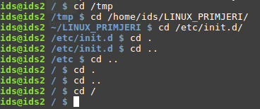
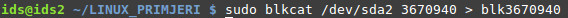
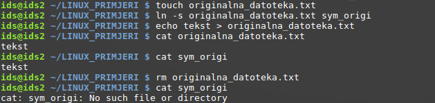

**Razvoj EXT4 datotečnog sustava**
----------------------------------

Originalna, prva verzija EXT datotečnog sustava je stvorena prema
tadašnjem MINIX datotečnom sustavu (koji se koristio na istoimenom MINIX
operacijskom sustavu, autor je Andrew S. Tanenbaum, ujedno poznat kao
autor mnogih kvalitetnih knjiga iz područja računalnih znanosti).

Nakon prepoznavanja određenih nedostataka, stvoren je EXT2 datotečni
sustav, koji je i danas popularan na mnogim računalima.

Ubrzo je stvoren EXT3 datotečni sustav, koji zadržava kompatibilnost sa
EXT2, no omogućava i slijedeće nove značajke : Dnevnik zapisa (eng.
Journal), Mogućnost proširenja veličine datotečnog sustava (čak i u
"online" modu) , Hash-tree indeksiranje za velike direktorije.

Zadnja iteracija EXT datotečnih sustava je EXT4.

| Sam povijesni razvoj općenitih datotečnih sustava moguće je pogledati
  u video zapisu na slijedećoj poveznici:
| https://www.youtube.com/watch?v=SMcVdZk7wV8

EXT4 datotečni je zadržao razinu kompatibilnosti sa prethodnim EXT3
datotečnim sustavom, no dodane su mnoge nove mogućnosti koje podižu
razinu performansi i stabilnosti samo sustava.

**Struktura EXT4 datotečnog sustava**
-------------------------------------

Prilikom stvaranja datotečnog sustava na particiji, sektori (osnovni i
najmanji dijelovi mogući za zapis na disk) se grupiraju u logičke
cjeline koje se zovu blokovi (eng. blocks). U terminologiji Microsoft
datotečnih sustava, sektori se isto grupiraju u blokove,no oni se zovu
klasteri (eng. clusters). Ti blokovi se naknadno grupiraju u grupe
blokova. Osnovna, pojednostavljena struktura EXTx datotečnih sustava,
prikazana je na slijedećem crtežu:

|image0|

Veličina blokova se prikazuje u bajtovima, te ona može biti:

-  Za Ext2 sustave: 1KB, 2KB, 4KB i 8KB

-  Za Ext3: Isto kao i Ext2

-  Za Ext4: Od 1KB do 64KB

Veličina blokova direktno utječe na :

-  Maksimalnu veličinu datotečnog sustava

-  Maksimalnu veličinu datoteke

-  Performanse

Što se tiče performansi, dobro je problematiku objasniti na slijedećem
primjeru.

Datoteka veličine 1MB (1048576 bajtova) nalazi se na dva datotečna
sustava, jedan sa veličinom blokova 4KB i drugi sa veličinom od 64KB.

U prvom primjeru, datoteka će biti podijeljena na 256 dijelova (
1048576/4096), te će za učitavanje datoteke biti potrebno minimalno 256
I/O operacija (često se gleda kroz IOPS vrijednosti, odnosno
**I**\ nput/Output **O**\ perations **P**\ er **S**\ econd).

U drugom primjeru datotečnog sustava, datoteka će biti podijeljena na 16
blokova (1048576/65536), te će za učitavanje datoteke biti potrebno
minimalno 16 I/O operacija, što je u teoriji skok u performansama čak 16
puta za ovaj proces.

Naravno, na datotečnim sustavima se nalaze datoteke različitih veličina,
no primjer jasno pokazuje odnos performansi na veličinu blokova, te je
potrebno razmisliti o njoj ako će se na sustavu pretežno nalaziti
datoteke veće, odnosno manje veličine.

Drugi problem o kojem je potrebno voditi računa je iskoristivost
prostora na disku. U teoretskom primjeru, možemo zamisliti datotečni
sustav podijeljen na blokove veličine 64KB, na kojem se pretežno nalaze
datoteke veličine 20KB. S obzirom da je sa stajališta datotečnog sustava
blok od 64KB najmanja moguća jedinica za I/O operacije, za svaku
datoteku od 20KB imamo 44KB praznog prostora koji nije moguće
iskoristiti za bilo što drugo, odnosno cijeli blok mora biti rezerviran
za tu datoteku. Takav problem naziva se unutarnja fragmentacija (eng.
internal fragmentation).

**NAPOMENA:** Iako se ne radi u temi teksta, dobro je osnovno objasniti i
drugi koncept fragmentacije, vanjska fragmentacija (eng. external
fragmentation). Sa razine datotečnog sustava, radi se o konceptu gdje
postoje slobodni blokovi za zapisivanje, no nije ih moguće iskoristiti
na način da datoteka bude sekvencijalno zapisana na njih. Naime,
slobodni blokovi nisu u nizu, već su na različitim dijelovima, te se na
taj način i zapisuju podaci datoteke. Na kraju procesa, datoteka je
fragmentirana, te čitanje sadržaja te datoteke je usporeno na klasičnim
tvrdim diskovima (s obzirom da brzina I/O operacija ovisi i o položaju
glave na ploči tvrdog diska). Na SSDovima, problem performansi je
drastično smanjen zbog tehnologije rada takvih tipova memorije.

Isto tako, defragmentacija je postupak u kojem operacijski sustav
preslaguje blokove na datotečnom sustavu, kako bi slobodni blokovi
uvijek bili u nizu, te sama fragmentacija smanjena na minimum.

Naravno, raznim algoritmima se pokušava zaobići cijeli problem vanjske
fragmentacije (često se govori općenitim nazivom „fragmentacija“), no ta
tema je vrlo kompleksna te neće biti taknuta u ovom tekstu.

|image1|

http://lsi.vc.ehu.es/pablogn/docencia/manuales/UCLACS111/scribe/12/fragmentation.png

**Grupe blokova**
-----------------

Nakon što je particija podijeljena na blokove, oni se grupiraju u grupe
blokova (eng. Block Groups), što je i prikazano u gornjem crtežu. Sve
grupe blokova su jednake veličine. Svaka grupa blokova ima svoju
definiranu strukturu za upravljanje datotekama, što je odmak od npr.
NTFS datotečnim sustavima u kojima postoji jedna MFT (eng. Master File
Table) tablica za cijelu particiju. Iako se ne može direktno
uspoređivati, sam koncept grupe blokova bi podrazumijevao da svaka grupa
ima svoju MFT tablicu (i ostale kritične strukture). Implementacijom
grupe blokova, cilj je bio postići :

-  Zadržati lokalnost/blizinu između pokazivača datoteke i njenog
   stvarnog sadržaja

-  Povećati pouzdanost datotečnog sustava spremanjem kopija kritičnih
   podataka u ostale grupe blokova (SuperBlock, Group Descriptors)

-  

Osnovna struktura grupe blokova EXTx (u ovom primjeru EXT4) je prikazana
na slijedećem crtežu :

|image2|

\* - Prvih 1024B svake particije je rezervirano za Boot Code, taj
prostor se ne koristi od strane datotečnog sustava. Ovisno o veličini
blokova na particiji, Boot Sector (često spominjan termin,iako se realno
radi o 2 sektora, no terminologija je ostala zbog povijesnih razloga) će
se nalaziti u zasebnom bloku, ili u istom bloku sa SuperBlock
strukturom. U drugom slučaju, SuperBlock počinje odmah nakon tih 1024B.
U prikazanom primjeru, može se uočiti kako datotečni sustav sa veličinom
bloka od 1024B, počinje gledati od prvog bloka (blokovi se počinju
brojati od nule), a to je ujedno i pozicija SuperBlock strukture. Iako
su trenutno najčešće veličine blokova 4096B (u uvjetima standardne
veličine particija, te korištenja standardnih postavki prilikom
stvaranja datotečnog sustava),

|image3|

Svaka grupa blokova se sastoji od slijedećih dijelova:

-  SuperBlock\*

-  Group Descriptors\*

-  Reserved GDT (eng. Group Descriptors Table) Blocks\*\*

-  Data Blocks Bitmap

-  Inodes Bitmap

-  Inodes Table

-  Data Block

\*SuperBlock i Group Descriptors strukture su se zbog važnosti, za
uspješnu inicijalizaciju datotečnog sustava, u prvoj reviziji EXT2
datotečnog sustava kopirale na početak svake grupe blokova. U drugoj
reviziji je implementirana opcija Sparse SuperBlock značajka
(sparse\_super) u kojoj se kopije (uz original na nultom bloku) spremaju
samo na prvom bloku, te lokacijama blokovima višekratnika brojeva 3,5 i
7. Primjer stvaranja datotečnog sustava sa i bez Sparse Superblock
značajke je vidljiv na slijedećoj slici (može se uočiti velika razlika u
broju kopija):

|image4|

\*\*Reserved GDT (eng. Group Descriptors Table) Blocks struktura je dio
EXT4 verzije datotečnog sustava, te nije standardni dio ranijih verzija.

**Superblock**
--------------

U SuperBlock području nalaze se informacije o konfiguraciji datotečnog
sustava. Nalazi se uvijek na 1024B od početka particije, te je
rezervirana veličina od 1024B za to područje. U tom području su
definirane informacije kritične za ispravno učitavanje datotečnog
sustava prilikom podizanja operacijskog sustava. Neke od tih informacija
su :

-  Veličina blokova (s\_log\_block\_size, \_\_le32 – **Little Endian
   način zapisa, 32 bita**)

-  Broj blokova po grupi (s\_blocks\_per\_group, \_\_le32)

-  Ukupan broj inodeova (s\_inodes\_count, \_\_le32)

-  Broj slobodnih inodeova (s\_free\_inodes\_count, \_\_le32)

-  Ukupan broj blokova (s\_blocks\_count\_lo, \_\_le32)

-  Broj slobodnih blokova (s\_free\_blocks\_count\_lo, \_\_le32)

-  Oznaka volumena\* (s\_volume\_name[16], char – **Maksimalno 16
   znakova u imenu**)

-  Lokacija direktorija zadnjeg učitavanja volumena
   (s\_last\_mounted[64], char)

-  UUID volumena (s\_uuid[16], char)

-  Podržane značajke datotečnog sustava (s\_feature\_compat,
   s\_feature\_incompat, s\_feature\_ro\_compat)

-  Itd...

Kompletan opis cijele SuperBlock strukture je opisana na slijedećoj
poveznici :
`https://ext4.wiki.kernel.org/index.php/Ext4\_Disk\_Layout#The\_Super\_Block <https://ext4.wiki.kernel.org/index.php/Ext4_Disk_Layout>`__

S obzirom na važnost SuperBlock strukture, stvaraju se kopije na više
mjesta na datotečnom sustavu (prethodno opisana metoda), no prilikom
podizanja operacijskog sustava, čita se isključivo ona verzija na nultom
bloku.

Iako je rezervirano 1024B za zapise unutar strukture, sama količina
zapisa ovisi o verziji (i dodatno reviziji) datotečnog sustava (EXT2,
EXT3,EXT4) na toj particiji.

**Deskriptori grupe**
---------------------

Navedena struktura, za razliku od SuperBlock dijela sadrži informacije o
konfiguracijama pojedinih grupa. Jednako kao i u slučaju SuperBlock
strukture, Group Descriptors se kopira u svaku grupu blokova (eng. Block
Groups), osim ako nije uključena značajka "sparse\_super". U tom slučaju
vrijede pravila kao i za SuperBlock. Na početku grupe blokova koje
nemaju kopiju SuperBlock i Group Descriptors struktura, nalazi se
slijedeća struktura po redoslijedu ( uglavnom Data Block Bitmap, iako to
nije uvijek slučaj, jer je lokacija konfigurabilna i adresa se nalazi u
Group Descriptors strukturi).

Group Descriptors sadrži parametre svih grupa blokova, a to su :

-  Lokacija Data Block Bitmap strukture

-  Lokacija Inode Block Bitmap strukture

-  Lokacija Inode Table strukture

-  Broj slobodnih blokova

-  Broj slobodnih inodeova

-  Broj alociranih inodeova za direktorije unutar grupe blokova

-  Još neke dodatne informacije ili rezerviran prostor za buduću
   nadogradnju

Veličina jedne Group Descriptor stavke unutar tablice je 32B, odnosno
64B ako je aktivirana 64bitna podrška na EXT4 datotečnom sustavu.

**Praktičan primjer**

U svrhu prikaza informacija Group Descriptors strukture, stvorena je
prazna datoteka od 100MB te je na nju postavljen EXT4 datotečni sustav
(mkfs.ext4 alat, veličina bloka je 4k).

Prvo će biti predstavljene informacije o datotečnom sustavu pomoću alata
fsstat (dio grupe alata unutar sleuthkit paketa, instalirati sa naredbom
"apt-get install sleuthkit"). Informacije koje nemaju nikakvu vrijednost
vezane uz ovaj primjer su izrezane iz izlaznog rezultata (/cut linije).
Nakon fsstat izlaza, bit će prikazan ispis kompletne Group Descriptors
strukture u originalnom obliku koji je zapisan na disk. Bojama su
označene poveznice između izlazne informacije fsstat aplikacije i
originalnog zapisa na disku ( u heksadecimalnom obliku, little endian
način zapisa). Na kraju će biti pojedinačno izvučena sva polja jedne
stavke Group Descriptor strukture.

NAPOMENA: S obzirom da je veličina datoteke 100MB, a veličina jednog
bloka 4KB, dovoljna je jedna grupa blokova za alokaciju svih blokova na
ovom datotečnom sustavu. Samim time, Group Descriptor struktura ima samo
jednu stavku (s obzirom da se nalazi samo jedna grupa blokova). Veličina
te stavke je 32B, no rezerviran je cijeli blok za strukturu (4096B), te
će ostatak te strukture biti izrezan (/cut linija), jer je ispunjen
nulama.

FSSTAT IZLAZNE INFORMACIJE (i prikaz korištenja aplikacije u prvoj
liniji)

ids@ids2 ~/LINUX\_PRIMJERI $ fsstat disk\_image\_100M

FILE SYSTEM INFORMATION

--------------------------------------------

File System Type: Ext4

Volume Name:

Volume ID: d0342eb32c739ab934523487c8ced4b

``**/cut **``

Source OS: Linux

Dynamic Structure

Compat Features: Journal, Ext Attributes, Resize Inode, Dir Index

InCompat Features: Filetype, Extents, Flexible Block Groups,

Read Only Compat Features: Sparse Super, Large File, Huge File, Extra
Inode Size

Journal ID: 00

Journal Inode: 8

METADATA INFORMATION

--------------------------------------------

Inode Range: 1 - 25601

Root Directory: 2

Free Inodes: 25589

Inode Size: 128

CONTENT INFORMATION

--------------------------------------------

Block Groups Per Flex Group: 16

Block Range: 0 - 25599

Block Size: 4096

Free Blocks: 23760

BLOCK GROUP INFORMATION

--------------------------------------------

Number of Block Groups: 1

Inodes per group: 25600

Blocks per group: 32768

Group: 0:

Block Group Flags: [INODE\_ZEROED]

Inode Range: 1 - 25600

Block Range: 0 - 25599

Layout:

Super Block: 0 - 0

Group Descriptor Table: 1 - 1

Group Descriptor Growth Blocks: 2 - 7

Data bitmap: 8 - 8

Inode bitmap: 24 - 24

Inode Table: 40 - 839

Uninit Data Bitmaps: 8 - 23

Uninit Inode Bitmaps: 24 - 39

Uninit Inode Table: 40 - 12839

Data Blocks: 12840 - 25599

Free Inodes: 25589 (99%)

Free Blocks: 23760 (92%)

Total Directories: 2

Stored Checksum: 0x8E0F

**Prikaz fizičkog zapisa group descriptor strukture**

(samo prvih 32B, zatim 64B kao dokaz da je ostatak strukture prazan, te
je ostatak izrezan iz prikaza)

Izlazni rezultat je podijeljen na 3 stupca : adrese (offset,
heksadecimalni oblik), originalni zapis (heksadecimalni oblik, little
endian način zapisa, 16B u jednoj liniji), te zapis u ASCII obliku.

ids@ids2 ~/LINUX\_PRIMJERI $ dd if=disk\_image\_100M bs=4096 skip=1
count=1 \| xxd

0000000:0800 0000 1800 0000 2800 0000 d05c f563 ........(....\\.c

0000010:0200 0400 0000 0000 0000 0000 f563 0f8e .............c..

0000020:0000 0000 0000 0000 0000 0000 0000 0000 ................

0000030:0000 0000 0000 0000 0000 0000 0000 0000 ................

0000040:0000 0000 0000 0000 0000 0000 0000 0000 ................

0000050:0000 0000 0000 0000 0000 0000 0000 0000 ................

Od cijelog bloka veličine 4kB, prikazano je samo prvih 96B, s obzirom da
je nakon 32. bajta blok ispunjen nulama. Temeljem izlaznih podataka,
može se zaključiti kako se na datotečnom sustavu nalazi samo jedna grupa
blokova.

Koristeći službenu referencu za iščitavanje značenja sadržaja Group
Descriptors strukture ( poveznica na kraju poglavlja), ispod teksta je
prikazan zapis u originalnom obliku (little endian ili LE,
heksadecimalni zapis), zatim transformacija sadržaja u standardan oblik
za čitanje s lijeva nadesno (big endian ili BE, i dalje heksadecimalan
zapis). Treću stavku čini sadržaj izmijenjen iz heksadecimalnog u
decimalni tip, te na kraju slijedi opis, odnosno značenje samog sadržaja
, te njegova veličina.

08000000 - 00000008 - 8 - Data Blocks Bitmap Location

18000000 - 00000018 - 24 - Inode Blocks Bitmap Location

28000000 - 00000028 - 40 - Inode Table Bitmap Location

D05C - 5CD0 - 23760 - Free Blocks Count

F563 - 63F5 - 25589 - Free Inodes Count

0200 - 0002 - 2 - Number of directories

0F8E - 8E0F - 36367 - Group Descriptor Checksum

U samom izlaznom rezultatu fsstat naredbe može se primijetiti kako je
aktivirana značajka Flexible Block Groups, te polja Uninit Data Bitmaps,
Uninit Inode Bitmaps, Uninit Inode Table. Ti termini biti će ukratko
objašnjeni kasnije u posebnom poglavlju. Detaljnije informacije je
moguće naći na poveznici na kraju poglavlja.

https://ext4.wiki.kernel.org/index.php/Ext4_Disk_Layout#Block_Group_Descriptors

**Rezervirani blokovi GD tablice**
----------------------------------

Prilikom novog stvaranja datotečnog sustava, nakon Group Descriptors
tablice rezervira se i određeni broj blokova za buduće proširenje
veličine tog datotečnog sustava. Ti blokovi se nalaze između Group
Descriptors tablice i Data Block Bitmap bloka. U standardnoj postavci,
moguće je proširiti datotečni sustav sa faktorom do otprilike 1024 puta
od originalne veličine. Podržava li sustav proširenje pokazuje je li
aktivirana značajka Resize Inode. Radi se o specijalnom tipu Inodea u
kojem su zapisane lokacije blokova za proširenje (
`https://ext4.wiki.kernel.org/index.php/Ext4\_Disk\_Layout#Special\_inodes <https://ext4.wiki.kernel.org/index.php/Ext4_Disk_Layout>`__).

**Primjer:**

U slijedećem primjeru ponovno je prikazan izlazni rezultat naredbe
**fsstat** za sliku EXT4 datotečnog sustava, te su označeni bitni
dijelovi.

ids@ids2 ~/LINUX\_PRIMJERI $ fsstat disk\_image\_100M

FILE SYSTEM INFORMATION

--------------------------------------------

File System Type: Ext4

Volume Name:

Volume ID: d0342eb32c739ab934523487c8ced4b

``**/cut **``

Source OS: Linux

Dynamic Structure

Compat Features: Journal, Ext Attributes, Resize Inode, Dir Index

InCompat Features: Filetype, Extents, Flexible Block Groups,

Read Only Compat Features: Sparse Super, Large File, Huge File, Extra
Inode Size

Group: 0:

Block Group Flags: [INODE\_ZEROED]

Inode Range: 1 - 25600

Block Range: 0 - 25599

Layout:

Super Block: 0 - 0

Group Descriptor Table: 1 - 1

Group Descriptor Growth Blocks: 2 - 7

``**/cut**``

Moguće je uočiti kako je aktivna značajka "Resize Inode", te je
rezervirano dodatnih 6 blokova za buduće proširenje datotečnog sustava i
to odmah u nastavku nakon Group Descriptor tablice (iako je na prvi
pogled samo 6 rezerviranih blokova daleko od faktora povećanja 1024x,
kasnije u tekstu će biti objašnjena procedura i krajnji rezultat).

Nadalje, upotrebom **debugfs** aplikacije moguće je uočiti detalje
specijalnog Inodea sa brojem 7 (proučiti specijalne Inodeove).

| ids@ids2 ~/LINUX\_PRIMJERI $ debugfs disk\_image\_100M
| debugfs 1.42.12 (29-Aug-2014)
| debugfs: stat <7>
| Inode: 7 Type: regular Mode: 0600 Flags: 0x0
| Generation: 0 Version: 0x00000000
| User: 0 Group: 0 Size: 4299210752
| File ACL: 0 Directory ACL: 0
| Links: 1 Blockcount: 56
| Fragment: Address: 0 Number: 0 Size: 0
| ctime: 0x591d7d95 -- Thu May 18 12:55:17 2017
| atime: 0x591d7d95 -- Thu May 18 12:55:17 2017
| mtime: 0x591d7d95 -- Thu May 18 12:55:17 2017
| BLOCKS:
| (DIND):840, (IND):2, (IND):3, (IND):4, (IND):5, (IND):6, (IND):7
| TOTAL: 7
| (END)
| Detalji statistike Inodea pod brojem 7 prikazuju koje sve blokove
  zauzima , te se oni podudaraju sa brojem blokova koji su rezervirani
  za daljnje proširenje datotečnog sustava, vidljivo u prošlom izlaznom
  rezultatu **fsstat** naredbe.

Izračun trenutne veličine datotečnog sustava , i maksimalne veličine
moguće je dobiti korištenjem varijabli Group Descriptor size, Block Size
te Group Descriptor Blocks i Reserved Group Descriptors Blocks.

I dalje će se koristiti slika od 100MB sa EXT4 datotečnom sustavom kao
primjer. S obzirom da nije aktivna značajka 64bit, veličina jedne Group
Descriptor stavke je 32 bajta. Veličina jednog bloka je 4096B (moguće
provjeriti u prethodnom praktičnom primjeru za Group Descriptors
poglavlje).

Group\_Des\_Size = 32B

Block\_Size = 4096B

Group\_Des\_Bl\_Size = 1

Res\_Group\_Des\_Bl\_Size = 6

Number\_Blocks\_Per\_Block\_Group = Broj blokova po jednoj grupi blokova
= 8\* Block\_Size = 32768

Objašnjenje: Block Bitmap blok je binarna tablica statusa alokacije svih
blokova unutar jedne grupe blokova. Veličina same grupe blokova zapravo
ovisi o veličini jednog bloka. S obzirom da Bitmap tablica jedne grupe
blokova uvijek zauzima jedan blok, broj blokova koji je moguće
adresirati je 8\*Block\_Size (množi se sa 8 s obzirom da se radi o
binarnoj tablici, odnosno neki blok na datotečnom sustavu ima samo dva
stanja – alociran/slobodan).

U ovom slučaju, veličina bloka je 4096B, te je moguće alocirati 32768
blokova unutar jedne grupe blokova.

Iz toga je moguće izračunati samu veličinu jedne grupe blokova:

Block\_Group\_Size = Veličina jedne grupe blokova = 32768 \* 4096B =
134217728B = 128MB

(broj blokova unutar grupe se množi sa veličinom jednog bloka)

Za Group Descriptors tablicu rezerviran je jedan blok ( 4096B). Bez
obzira što se u tablici nalazi trenutno samo jedna grupa blokova ( jer
128B zadovoljava ukupnu veličinu od 100MB datotečnog sustava), prije
izračuna ukupnog povećanja datotečnog sustava (aktiviranjem rezerviranih
GDT blokova), dobro je izračunati faktor povećanja kada bi se samo
originalni blok koristio za sve nove Group Descriptore ( odnosno
dodavanjem novih grupa blokova).

Moguće proširenje originalne veličine od 100MB korištenjem originalnog
Group Descriptors bloka (1 blok).

Group\_Descriptors\_per\_Block = Block\_Size / Group\_Des\_Size = 4096 /
32 = 128

Original\_Total\_Group\_Descriptors = Group\_Des\_Bl\_Size \*
Group\_Descriptors\_per\_Block = 1\* 128 = 128

Max\_Original\_Size = Original\_Total\_Group\_Descriptors \*
Block\_Group\_Size = 128 \* 128 = 16384MB = 16GB

Increment\_Factor\_1 = Max\_Original\_Size / Original\_Size = 16384 /
100 = 163x

Max\_Total\_Group\_Descriptors = (Group\_Des\_Bl\_Size +
Res\_Group\_Des\_Bl\_Size) \* Group\_Descriptors\_per\_Block =
(6+1)\*128 = 896

Max\_FileSystem\_Size = Max\_Total\_Group\_Descriptors \*
Block\_Group\_Size = 896 \* 128 = 114688MB = 112GB

**Increment\_Factor\_2 = Max\_FileSystem\_Size / Original\_Size = 114688
/ 100 = 1146x**

Iz gornjeg izračuna je vidljivo kako je stvarno moguće originalnu
veličinu stvorenog datotečnog sustava povećati za otprilike 1024 puta.
Ovdje je potrebno napomenuti ograničenje gdje zbroj originalnih GDT
blokova i rezerviranih GDT blokova ne može biti veći od 1024 blokova.

**Indeks čvor** 
---------------

Svakoj datoteci/direktoriju na datotečnom sustavu je dodijeljen Inode
(eng. Index NODE). Inode predstavlja strukturu na disku koja upućuje na
sam sadržaj neke datoteke (odnosno upućuje na podatkovne blokove te
datoteke). U samom Inodeu se nalaze određeni metapodaci o datoteci na
koju upućuje (vrijeme stvaranja, modificiranja, veličina, lokacija na
datotečnom sustavu...).

Uprocesu stvaranja datotečnog sustava (podjela particije na blokove,
stvaranje osnovnih struktura...), stvara se i tablica Inodeova, gdje
njihov broj ovisi o zadanom omjeru broj\_bajtova/Inode. Drugim riječima,
za svaki broj bajtova na datotečnom sustavu bit će stvoren jedan Inode.
Sam omjer može se vidjeti u konfiguracijskoj datoteci alata **mke2fs**
(/etc/mke2fs.conf):

[defaults]

...

blocksize = 4096

inode\_size = 256

inode\_ratio = 16384

[fs\_types]

ext3 = {

features = has\_journal

}

ext4 = {

features =
has\_journal,extent,huge\_file,flex\_bg,uninit\_bg,dir\_nlink,extra\_isize

auto\_64-bit\_support = 1

inode\_size = 256

}

...

big = {

inode\_ratio = 32768

}

huge = {

inode\_ratio = 65536

}

news = {

inode\_ratio = 4096

}

Iz navedenog primjera mogu se primijetiti predložene vrijednosti omjera
ovisno o situacijskom korištenju datotečnog sustava. Ako je datotečni
sustav predodređen za pohranu velikog broja datoteka male veličine, ili
se planira stvarati puno simboličkih poveznica (ovo ne vrijedi za
fizičke poveznice, kasnije objašnjeni pojmovi u dokumentu), potrebno je
osigurati dovoljan broj Inodeova kako ne bi došlo do iscrpljenja istih.
S druge strane, ako se na datotečnom sustavu planiraju pohranjivati
velike datoteke, potrebno je prilagoditi omjer (npr. na svakih 1MB ili
4MB jedan Inode), kako ne bi došlo do iscrpljenja podatkovnih blokova.
Preporučena vrijednost omjera prilikom stvaranja novog EXT4 datotečnog
sustava je konzervativnih 16KB po jednom Inodeu.

Pritom treba imati na umu kako to ne znači da Inode može adresirati samo
16KB neke datoteke, već se radi isključivo o mehanizmu raspodjele
Inode/Byte prilikom stvaranja sustava.

**Bitno je napomenuti kako nije moguće stvoriti dodatne slobodne
Inodeove ( recimo, u zamjenu za podatkovne blokove) nakon stvaranja
EXT2/3/4 datotečnih sustava. U slučaju iscrpljenosti Inodeova, potrebno
je ili proširiti sam datotečni sustav, ili premjestiti datoteke na neki
novi sustav prilagođen za takav tip/veličinu datoteka. Prilikom
proširivanja postojećeg datotečnog sustava, omjer broja Inodeova i
bajtova se ne mijenja.**

Struktura Inodea je detaljno opisana u prilogu na kraju dokumenta.

**Praktičan primjer : Iscrpljenje podatkovnih blokova/Inode struktura**

Bez obzira koliko se slobodnih blokova dodijeljenih za podatke/sadržaj
(eng. Data Blocks) datoteka nalazi u sustavu, broj slobodnih Inodeova je
bitna stavka za provjeru slobodnog prostora. Drugim riječima, onog
trenutka kada se iscrpi broj slobodnih Inodeova, više ne postoji
mogućnost stvaranja novih datoteka na datotečnom sustavu, odnosno smatra
se da ne postoji više slobodnog prostora (iako postoje slobodni
podatkovni blokovi). Koncept će biti prikazan u slijedećem primjeru,
gdje će se datoteka od 100MB sa EXT4 datotečnim sustavom postaviti u
direktorij /mnt/100M. Nakon toga će se provjeriti broj slobodnih
podatkovnih blokova i broj slobodnih Inodeova. U prvom testiranju,
datotečni sustav će se popuniti jednom velikom datotekom od 89MB
(4096B\*23000), kako bi se prikazala iskorištenost podatkovnih blokova u
odnosu na Inodeove. U drugom testiranju (nakon što je datoteka
obrisana), stvoriti će se visok broj simboličkih linkova (s obzirom na
malu veličinu istih) kako bi se prikazala iskorištenog Inodeova u odnosu
na podatkovne blokove.

Dobro je imati na umu fragilnost ravnoteže između iskorištenosti
podatkovnih blokova naspram broja Inodeova.

Situacije u kojima postoji rizik od iscrpljenosti Inodeova su najčešće :

-  Stvaranje velikog broja direktorija

-  Stvaranje velikog broja datoteka malih veličina

-  Stvaranje velikog broja simboličkih linkova

**ids@ids2 ~/LINUX\_PRIMJERI $ sudo chown ids /mnt/100M**

**ids@ids2 ~/LINUX\_PRIMJERI $ mkdir /mnt/100M**

mkdir /mnt/100M

**ids@ids2 ~/LINUX\_PRIMJERI $ mount disk\_image\_100M /mnt/100M/**

mount: only root can do that

**ids@ids2 ~/LINUX\_PRIMJERI $ sudo !!**

sudo mount disk\_image\_100M /mnt/100M/

**ids@ids2 ~/LINUX\_PRIMJERI $ cd /mnt/100M/**

**ids@ids2 /mnt/100M $ ls**

lost+found

**ids@ids2 /mnt/100M $ df /mnt/100M/**

Filesystem 1K-blocks Used Available Use% Mounted on

/dev/loop0 95088 48 87872 1% /mnt/100M

**ids@ids2 /mnt/100M $ df -i /mnt/100M/**

Filesystem Inodes IUsed IFree IUse% Mounted on

/dev/loop0 25600 11 25589 1% /mnt/100M

**Može se uočiti kako je na datotečnom sustavu trenutno iskorišteno 48
podatkovnih blokova (1%) te 11 Inodeova (1%).**

**Slijedeći korak će biti stvaranje jedne velike datoteke nešto manje od
ukupne veličine datotečnog sustava.**

**ids@ids2 /mnt/100M $ dd if=/dev/zero of=/mnt/100M/95MBfile bs=4096
count=23000**

dd: failed to open ‘/mnt/100M/95MBfile’: Permission denied

**ids@ids2 /mnt/100M $ sudo !!**

sudo dd if=/dev/zero of=/mnt/100M/95MBfile bs=4096 count=23000

23000+0 records in

23000+0 records out

94208000 bytes (94 MB) copied, 0.352804 s, 267 MB/s

**ids@ids2 /mnt/100M $ df /mnt/100M/**

Filesystem 1K-blocks Used Available Use% Mounted on

/dev/loop0 95088 92060 0 100% /mnt/100M

**ids@ids2 /mnt/100M $ df -i /mnt/100M/**

Filesystem Inodes IUsed IFree IUse% Mounted on

/dev/loop0 25600 12 25588 1% /mnt/100M

**ids@ids2 /mnt/100M $ sudo rm 95Mbfile**

**Iz gornjeg primjera je vidljivo kako su iscrpljeni svi podatkovni
blokovi (100% zauzeće) dok je iskorišten samo jedan dodatan Inode za
datoteku. Datoteka je na kraju obrisana.**

**U slijedećem primjeru će se stvoriti velik broj simboličkih linkova
koji upućuju na direktorij "lost+found".**

**ids@ids2 for i in {1..25595};do ln -s lost+found/ mirko$i;echo
$i;done**

1

2

.

.

25589

ln: failed to create symbolic link ‘mirko25590’: No space left on device

25590

**ids@ids2 /mnt/100M $ df /mnt/100M/;df -i /mnt/100M/**

Filesystem 1K-blocks Used Available Use% Mounted on

/dev/loop0 95088 772 87148 1% /mnt/100M

Filesystem Inodes IUsed IFree IUse% Mounted on

/dev/loop0 25600 25600 0 100% /mnt/100M

**U ovom primjeru moguće je uočiti kako je broj podatkovnih blokova
neznatno porastao no, s druge strane, iscrpili su se svi Inodeovi, te
više nije moguće stvarati nove datoteke na datotečnom sustavu.**

**Fizičke i simboličke poveznice**
----------------------------------

Nakon što je obrađeno prethodno područje, potrebno je pojasniti dva
bitna koncepta implementirana u EXT datotečne sustave, a to su :

- Fizičke poveznice ( eng. hard links)

- Simboličke poveznice (eng. soft links)

Koncepti će biti pojašnjeni kroz slijedeći primjer, a to je ispis
sadržaja korijenskog direktorija:

|image5|

Između ostalih opcija naredbe "ls" za ispis sadržaja direktorija,
korištena je i opcija -i (prikaz i broja indeksa svake datoteke, odnosno
Inode vezan uz samu datoteku).

Kao što je već rečeno, na EXT datotečnim sustavima sve je prikazano kao
datoteka (čak i direktoriji i uređaji) i svaka datoteka ima dodijeljen
svoj broj indeksa (eng. Inode). Naime, prilikom stvaranja datoteke,
slobodan nedodijeljen Inode se povezuje sa tom datotekom (koju još u
ovom trenutku zapravo definira isključivo sadržaj, recimo tekst neke
tekstualne datoteke, bez imena). U samom Inodeu se nalaze metapodaci o
toj novostvorenoj datoteci (vlasnik datoteke, veličina, vremena
pristupa/izmjene/stvaranja...). Ono što se ne nalazi u nijednom od
navedenih pojmova (datoteka, Inode) je bitna stavka za korisnike
sustava, a to je **ime datoteke**. Ime datoteke se stvara kao stavka u
nekom direktoriju. Ta stavka se u osnovi sastoji od dvije stvari : ime
datoteke i Inode. Tek je završetkom tog procesa stvorena poveznica (eng.
link) između samog sirovog sadržaja datoteke, dodijeljenog joj indeks
broja, te mogućnošću pristupa toj datoteci preko imena koje se nalazi u
određenom direktoriju.

Vraćajući se na gornji primjer na slici, svijetloplavom bojom je
označena jedna stavka direktorija. Ime te stavke je jedna točka "." ,
što je zapravo specijalno ime direktorija koje upućuje na samog sebe.
Drugim riječima, s obzirom da je naredba za ispis sadržaja direktorija
pokrenuta iz korijenskog direktorija (koji je na vrhu same hijerarhije
direktorija, odnosno ne postoji prethodni direktorij iznad njega),
stavka sa imenom točka "." zapravo upućuje na isti taj korijenski
direktorij. Slijedeća stavka u direktoriju ima ime od dvije točke "..",
što je još jedno specijalno ime direktorija koje upućuje na prethodni
direktorij u hijerarhiji. Kako je već rečeno da ne postoji prethodni
direktorij iznad korijenskog direktorija, stavka sa imenom dvije točke
".." će ponovno upućivati na isti taj korijenski direktorij. Prilikom
stvaranja svakog novog direktorija na datotečnom sustavu automatski će
se stvoriti i navedene dvije stavke.

Za pojašnjenje, prikazano je kretanje kroz direktorije koristeći pune
putanje direktorija (ovaj proces se popularno naziva kretanje kroz
strukturu direktorija korištenjem **pune/apsolutne putanje**), i zatim
koristeći navedene dvije stavke u direktoriju (ovaj proces se popularno
naziva kretanje kroz strukturu direktorija korištenjem **relativnih
putanji**).

|image6|

Prva tri primjera sa slike prikazuju premještanje radnog direktorija
korištenjem **pune**,odnosno **apsolutne** **putanje**, te je moguće
primijetiti kako je u jednom koraku prođeno više direktorija u
strukturi.

Slijedeći primjer u radnom direktoriju putanje /etc/init.d prikazuje
kako se korištenjem naredbe za izmjenu direktorija (naredba **cd**) i
argumentom sa imenom točka ".", nije promijenila lokacija direktorija.
Nakon toga, višekratnom uporabom naredbe za izmjenu direktorija i
argumentom sa imenom dvije točke "..", u svakom koraku se radni
direktorij promijenio za jedan korak iznad u hijerarhiji, sve do
korijenskog direktorija "/". Zadnja tri primjera pokazuju kako upotreba
argumenata "." ili ".." ne mijenja samu lokaciju radnog direktorija,
odnosno jednaka je kao i u primjeru kada se koristi apsolutna putanja sa
navedenim argumentom imena korijenskog direktorija "/".

| Vraćajući se na primjer stavke korijenskog direktorija sa imenom točka
  "." označene u svijetloplavom pravokutniku, brojka 2 u prvom stupcu
  (stupac je označen crvenom bojom za sve stavke u direktoriju) označava
  broj indeksa ( eng. Inode) dodijeljen toj datoteci (podsjetnik: sve je
  datoteka). Time je stvorena poveznica između sadržaja datoteke i
  Inodea sa metapodacima o toj datoteci. Takva poveznica službeno se
  naziva **čvrsta poveznica** (eng. **Hard Link**), prvi dio teme ovoga
  poglavlja.
| Čvrsta poveznica je veza između sirovog sadržaja datoteke (podsjetnik
  : bez imena datoteke,samo sadržaj ) i dodijeljenog Inodea toj
  datoteci.

Dodatni termin usko vezan uz čvrste poveznice je njihov broj (eng. Hard
Link Count). Naime, moguće je stvarati nove datoteke na različitim
direktorijima i sa različitim imenima, koje će upućivati na isti Inode,
a time i isti sadržaj. Svaka stvorena datoteka na datotečnom sustavu ima
obvezno minimalno jednu čvrstu poveznicu.

Broj čvrstih poveznica je u gornjem primjeru označen zelenom bojom, no
prije pojašnjenja tog primjera, bolje je koncept objasniti prvo na
jednostavnijem.

|image7|

Kao što je vidljivo na slici, stvorena je nova prazna datoteka imena
"svjetske\_tajne.txt". Sam sadržaj datoteke (u ovom slučaju ga nema) se
nalazi u nekom podatkovnom bloku na datotečnom sustavu, dodijeljen joj
je 929568. Inode iz Inode tablice ( time je stvorena čvrsta poveznica),
te je na kraju procesa i stvorena stavka direktorija s imenom
"svjetske\_tajne.txt" koja upućuje na taj Inode. Vidljivo je i kako je
trenutan broj čvrstih poveznica prema toj datoteci samo jedan.

Pomoću naredbe za stvaranje poveznica između datoteka "ln" (standardne
vrijednosti podrazumijevaju stvaranje fizičkih poveznica, no moguće je
stvaranje i simboličkih) stvorit će se dvije poveznice na postojeću
datoteku "svjetske\_tajne.txt". Prikazom sadržaja direktorija (opcija za
prikaz Inode brojeva uključena) moguće je uočiti kako obje novostvorene
datoteke upućuju na jednak Inode pod brojem 929568. Dodatno, može se
primijetiti kako je broj čvrstih poveznica prema toj datoteci povećan sa
1 na 3, što odgovara broju novostvorenih datoteka.

|image8|

Trenutno su datoteke bez sadržaja te im je ukupna veličina ukupno 0
bajta. Razlog tomu je što ime datoteke nije vezano uz veličinu te
datoteke već ulazi u prostor direktorija u kojem se nalazi (primijetiti
rezerviranih 4KB za trenutno radni direktorij, tema će biti obrađena
kasnije u tekstu), dok su metapodaci definirani u prostoru koji zauzima
Inode povezan sa tom datotekom.

Nakon upisa nekog tekstualnog sadržaja u datoteku „sve\_o\_svijetu.txt“
moguće je primijetiti kako se veličina mijenja za sve 3 datoteke,
zajedno sa drugim metapodacima (npr. uočiti vrijeme izmjene). Postupak
upisa sadržaja je u donjem primjeru još jednom ponovljen, no ovaj puta
za drugu datoteku, te se isto može uočiti utjecaj na sve datoteke.

Drugim riječima, stvaranje čvrstih poveznica na neku datoteku stvara
nove datoteke koje upućuju na isti sadržaj.

|image9|

No, što se događa kad bi se izbrisala originalna datoteka prema kojoj su
stvorene dvije čvrste poveznice?

|image10|

Nakon brisanja originalne datoteke, dvije čvrste poveznice i dalje
ostaju, jedino se broj čvrstih poveznica smanjio za 1. Sadržaj datoteke
je i dalje vidljiv.

Prije brisanja i ostalih poveznica prema sadržaju datoteke, potrebno je
pogledati informacije iz samog Inodea vezanog uz datoteke, pod brojem
929568. U tu svrhu će se koristiti aplikacija „istat“ (dio „sleuthkit“
paketa , paketa alata otvorenog koda za digitalnu forenziku sustava za
pohranjivanje podataka).

|image11|

Između ostalih informacija , moguće je uočiti da je Inode alociran
(dodijeljen datoteci), te je broj poveznica ukupno 2, što odgovara
stvarnom stanju.

|image12|

Nakon brisanja i ostalih čvrstih poveznica prema Inodeu, uočava se kako
on više nije alociran, te je broj poveznica smanjen na nulu. Dodatno,
pojavljuje se nova stavka u odnosu na prošli pregled, a to je datum i
vrijeme brisanja datoteke (stavka Deleted). Uočiti kako vrijeme brisanja
nije zapisano u istoj preciznosti kao i ostale stavke (najveća
preciznost je u sekundama, dok ostale imaju preciznost u nanosekundama).

Često pitanje koje postavlja jest, koja je točno svrha čvrstih poveznica
na Linux kompatibilnim datotečnim sustavima? Prije samog odgovora sa
primjerima, bitno je reći kako je u arhitekturi EXT datotečnih sustava
ugrađen koncept čvrstih poveznica, odnosno svaka datoteka ima minimalno
jednu čvrstu poveznicu. Drugim riječima, implementacija već postoji i
dio je funkcionalnosti datotečnih sustava, bez obzira koristili ju
korisnici u druge svrhe.

Korisnik ima kolekciju filmova pohranjenu na lokalnom disku, te želi
sortirati te filmove po direktorijima sa odgovarajućim žanrom. Neki
filmovi ne spadaju u samo jedan žanr, nego u 3 ili više njih. Kako
korisnik ne bi kopirao isti film u više direktorija, te samim time
zauzimao dodatni prostor, u svaki direktorij koji odgovara žanru može se
stvoriti čvrsta poveznica sa istim imenom datoteke kao i originalna.
Time je ispunjen uvjet u kojem se filmovi nalaze u odgovarajućim
direktorijima, bez potrošnje dodatnog prostora na disku.

**Nedostatak čvrstih poveznica jest što su vezane isključivo za
datotečni sustav na kojem se nalaze, odnosno, čvrste poveznice se ne
mogu povezivati sa datotekama na drugom datotečnom sustavu ( drugoj
particiji).**

U primjeru je stvorena prazna datoteka od 100MB i na nju je postavljen
EXT4 datotečni sustav, te je montiran (eng. mount) unutar direktorija
/mnt/NETSHARED. Ispod na slici mogu se uočiti (označeno žutom bojom) dva
različita montirana datotečna sustava, jedan je već naveden, dok je
drugi montiran unutar korijenskog direktorija.

|image13|

Pokušaj stvaranja čvrste poveznice unutar /mnt/NETSHARED direktorija
koja upućuje na datoteku koja se nalazi na različitom datotečnom
sustavu, rezultirati će porukom o grešci, što je vidljivo na slici
ispod. Ono što je moguće odmah uočiti jest da se ne radi o nedostatku
privilegija korisnika u procesu, već o nemogućnosti stvaranja poveznica
između dva uređaja (eng. cross-device link).

|image14|

Razlog tog nedostatka leži u samom postupku stvaranja čvrstih poveznica.
Naime, kao što je već navedeno, svaka datoteka na datotečnom sustavu
sastoji se od 3 povezane komponente : sirovi sadržaj (npr. tekst
datoteke), stavka u direktoriju i indeks broj (eng. Inode). S obzirom da
je Inode vezan uz datotečan sustav, svaki datotečan sustav će imati
zasebnu bazu Inodeova. Drugim riječima Inode sa brojem npr. 378 na
jednom datotečnom sustavu će upućivati na različitu datoteku od Inodea
sa istim brojem na nekom drugom datotečnom sustavu.

**Simboličke poveznice**
------------------------

Simboličke poveznice isto upućuju na originalnu datoteku, no mehanizam
je drugačiji od čvrstih poveznica. Za razliku od čvrstih poveznica koje
dijele isti Inode sa originalnom datotekom, simboličke poveznice su nove
datoteke sa drugim dodijeljenim Inodeom (kao i kod svakog stvaranja
datoteke). Osnovne razlike u odnosu na čvrste poveznice su :

- Simbolička poveznica i originalna datoteka ne dijele isti Inode broj

- Simboličke poveznice mogu upućivati na datoteke koje se nalaze na
    različitom datotečnom sustavu (na drugoj particiji)

- Nakon brisanja originalne datoteke na koju upućuje simbolička
    poveznica, ona više nije dostupna

- Dodavanje simboličkih poveznica ne mijenja brojač čvrstih poveznica

- Mogu upućivati na direktorije

Razlika može biti prikazana i na način kao u donjoj slici:

Drugim riječima, simboličke poveznice najviše podsjećaju na termin
poveznica u svakodnevnom korištenju (eng. shortcut) jer samo ukazuju na
lokaciju željene datoteke.

U primjeru na slici ispod stvorena je simbolička poveznica (može se
koristiti već spomenuta aplikacija za stvaranje poveznica "ln" uz
upotrebu opcije "-s"). Simbolička poveznica je poseban tip datoteke te
je tako i označena u ispisu sadržaja direktorija (primijetiti slovo "L"
unutar žutog okvira, eng. Link).

Nadalje, može se primijetiti kako simbolička poveznica pod imenom
"SIMBOLIČKI" i Inode brojem 929994 upućuje na datoteku "hostname"
(unutar /etc direktorija) sa drugačijim Inode brojem 785066. U ovom
slučaju , veličina datoteke SIMBOLIČKI je 13 bajta (putanja
/etc/hostname zauzima ukupno 13 znakova).

|image15|

No, što se nalazi unutar simboličke poveznice, koji je sadržaj te
datoteke? Standardnim načinom (npr. aplikacijom "cat") će se uvijek
prikazati sadržaj datoteke na koju poveznica upućuje, što je i dokazano
u slijedećem primjeru. Za prikaz stvarnog sadržaja simboličke poveznice,
može se koristiti aplikacija "readlink".

|image16|

Detaljniji pregled karakteristika simboličke poveznice prikazati će
jednu zanimljivost, nije dodijeljen nijedan podatkovni blok za zapis
sadržaja te datoteke. Gdje je onda zapisana putanja odredišne datoteke?
Prema dosadašnjem pravilu,
(https://ext4.wiki.kernel.org/index.php/Ext4\_Disk\_Layout#Symbolic\_Links)
ako je putanja unutar duljine od 60 bajta, vrijednost će biti zapisana u
samom Inodeu. U suprotnom, alocirati će se zaseban podatkovni blok za
zapis sadržaja.

|image17|

**Praktičan primjer:**

Kako locirati i ispisati sadržaj nekog Inode broja?

Za primjer će se koristiti simbolička poveznica iz prošlog primjera sa
Inode brojem 929994.

S obzirom da je struktura datotečnog sustava raspodijeljena po grupama,
potrebno je saznati grupu u kojoj se nalazi Inode. Aplikacija
"**istat**" prikazuje i grupu blokova u kojoj se nalazi Inode, a ona je
pod brojem 113.

Detaljnu strukturu datotečnog sustava je moguće iščitati pomoću već
spomenute aplikacije "**fsstat**". Izlazni rezultat bit će spremljen u
datoteku "**fsstat\_sda2**" (**sda2** je uređaj na kojem se nalazi
datotečni sustav). Zatim će se upotrebom uzorka za pretraživanje (pomoću
"**grep**" aplikacije i korištenjem opcije **-n** za prikaz linije u
datoteci) prikazati linija u datoteci na kojoj se nalazi traženi filter.

Slijedeći korak je ispis sadržaja datoteke na ekran, počevši od nađene
linije, sve do završetka informacija koje se tiču detalja grupe blokova
113.

|image18|

Može se primijetiti kako se Inode broj 929994 stvarno nalazi unutar
ranga 923889-932064 koji pripada grupi 113.

Tablica svih Inodeova tog ranga je veličine 511 blokova (blok je
standardne veličine od 4096 bajtova) i nalazi se u rangu blokova
3670559-3671069. Ta dva ranga predstavljaju početni uvjet za pronalazak
lokacije željenog Inodea.

Prvo je potrebno saznati koji je Inode po redu unutar ranga, što se može
saznati tako da se oduzme traženi Inode sa početnim Inodeom u rangu (
929994 - 923889 ). Dobiva se rezultat 6105, to je redno mjesto u rangu.

Da bi se saznala točna lokacija, odnosno blok u kojem se nalazi,
potrebno je znati veličinu jednog Inodea, te veličinu bloka u datotečnom
sustavu. U ovom primjeru, s obzirom da se radi u EXT4 datotečnom
sustavu, standardna veličina jednog Inodea je 256B, dok je veličina
jednog bloka 4096B. Znači da se u Inode tablici, unutar jednog bloka
nalazi točno 16 Inodeova.

Redni broj 6105 se dijeli sa 16, kako bi se dobio broj blokova koji se
preskaču, a to je 381 preskočeni blok (381,5625) . Ostatak je 9
(0,5625\*16), što znači da se unutar 382. bloka na 10. mjestu nalazi
traženi Inode.

Potrebno je nadodati broj 381 početnom bloku Inode tablice ( 3670559 +
381), te se dobiva blok 3670940 u kojem se nalazi traženi Inode.

Taj blok se može spremiti u zasebnu datoteku uz pomoć aplikacije blkcat.

|image19|

Uz pomoć nekog hex editora potrebno je iščitati sadržaj spremljene
datoteke (radi lakšeg snalaženja, postaviti pregled od 16 bajta u jednoj
liniji). S obzirom da je traženi Inode 10. po redu u navedenom bloku, a
veličina Inodea je 256 bajta, traženi odmak (eng. offset) u datoteci je
2304 bajta (odnosno adresa 0x900 u heksadecimalnom obliku).

Između ostalih detalja, jasno se može uočiti upisana putanja odredišne
datoteke na koju upućuje ova simbolička poveznica.

|image20|

S druge strane, ako je poveznica veća od 60 bajta, traženi sadržaj se
sprema u zaseban podatkovni blok, što će biti prikazano za poveznicu
SIMBOLIČKI\_DUGI iz gornjeg primjera, veličine 80 bajta. Iz detaljnijeg
prikaza informacija Inodea 929995, može se uočiti kako je alociran
podatkovni blok 3679773 za zapis sadržaja datoteke. Korištenjem
aplikacija **dd** (s obzirom da se blokovi počinju brojati od nule, ne
smanjuje se vrijednost za preskakanje blokova za 1) i **xxd** (za prikaz
izlaznog rezultata u hexa obliku, umjesto u standardnom ASCII) može se
uočiti putanja datoteke na koju upućuje simbolička poveznica ( putanja
je izmišljena u svrhu prikaza veličine simboličke poveznice iznad 60
bajta).

|image21|

Što se događa ako se obriše originalna datoteka, a simbolička poveznica
ostane? Cijeli proces je prikazan u slijedećem primjeru (stvaranje
datoteke i poveznice, unos i prikaz sadržaja, te brisanje originalne
datoteke i pokušaj prikazivanja sadržaja preko poveznice), no u osnovi
simbolička poveznica ukazuje na nepostojeću datoteku

|image22|

**Za vježbu:**

Saznati na koju datoteku upućuje simbolička poveznica /sbin/mkfs.ext4 ,
te dokazati to prikazom sadržaja u samom Inodeu poveznice, ili
alociranom podatkovnom bloku. Prikazuje li se apsolutna ili relativna
putanja odredišne datoteke? Zašto? Opisati proces izračuna.

**Za vježbu2:**

|image23|

Proučiti radnje na gornjoj slici, te na temelju upisanih naredbi i
izlaznih rezultata odgovoriti:

- Koje izmjene i karakteristike ima kopirana simbolička poveznica
    (Inode, Veličina datoteke, Prava pristupa)? Što se može zaključiti?

- Koje izmjene i karakteristike ima premještena simbolička poveznica
    (Inode, Veličina datoteke, Prava pristupa)? Što se može zaključiti?

- Upućuje li premještena simbolička poveznica na ispravnu putanju
    odredišne datoteke? Zašto?

**Pitanja:**

Nakon obrađenog područja čvrstih poveznica, proučiti ponovno sliku sa
početka poglavlja te odgovoriti :

1.  Zašto direktorij /usr ima ukupno 10 čvrstih poveznica?

2.  Koliko čvrstih poveznica ima /etc direktorij?

3.  Koji je Inode broj korijenskog direktorija?

4.  Koji direktoriji imaju dodijeljen Inode pod brojem 1? Zašto?

5.  Nabrojati par primjera prednosti čvrstih poveznica.

6.  Koji je nedostatak čvrstih poveznica? Detaljno objasniti razlog
    nedostatka.

7.  Zašto premještanje datoteke sa veličinom od 10GB u neki drugi
    direktorij (na istom datotečnom sustavu) traje jako kratko?

8.  Koje su osnovne razlike između simboličkih i čvrstih poveznica?

9.  Koja se vrsta poveznica u praksi češće koristi?

10. Gdje je zapisan podatak simboličke poveznice veličine manje 60B, a
    gdje od veće ?

11. Što se događa sa simboličkom poveznicom ako se obriše odredišna
    datoteka?

http://blog.adityapatawari.com/2013/03/all-about-inodes-hard-links-and-soft.html

https://opensource.com/article/17/5/introduction-ext4-filesystem

http://www.grymoire.com/Unix/Inodes.html

**Sadržaj direktorija**
-----------------------

Direktorij u EXT datotečnim sustavima je zapravo datoteka u koju su
zapisane stavke , odnosno objekti unutar direktorija. Svaka stavka
sadrži slijedeće informacije:

- Inode broj na koji upućuje stavka direktorija

- Ukupna duljina stavke

- Duljina imena stavke

- Tip datoteke (pod uvjetom da je aktivna "filetype" značajka u
    datotečnom sustavu)

- Ime datoteke

Zapisi u direktorij izvršeni su na jedan od dva načina :

- Linearni način zapisa

- Indeksirani način zapisa (eng. Hash tree , mora biti aktivna
    "dir\_index" značajka u datotečnom sustavu)

Prije detaljnog objašnjenja strukture zapisa direktorija, dobro je
proučiti izlazni rezultat prikaza sadržaja nekog direktorija (slika
ispod).

|image24|

Kako i gdje su zapravo organizirani prikazani podaci? Iz navedenog
primjera može se vidjeti kako svaka stavka sadrži slijedeće informacije:

-  Inode broj

-  Vrsta datoteke (npr. direktorij, simbolička poveznica, regularna
   datoteka...)

-  Prava pristupa (Vlasnik, Grupa, Ostali)

-  Broj čvrstih poveznica

-  Vlasnik datoteke

-  Grupa koje je vlasnik član

-  Veličina datoteke

-  Datum zadnje izmjene

-  Vrijeme zadnje izmjene

-  Ime datoteke (te dodatno putanja odredišne datoteke za simboličke
   poveznice)

Sve informacije su zapisane u dvije lokacije: Inode strukturu (označeno
zelenom bojom) i stavku direktorija (označeno žutom bojom). Dakle, sama
stavka nekog direktorija se sastoji od poveznice između Inode broja i
imena datoteke. Jedino mjesto gdje se spominje ime datoteke (između
spomenute veze Inode broja, sadržaja datoteke i stavke direktorija) jest
u samoj stavci unutar direktorija.

**Napomena:**

Ovisno o podržava li datotečni sustav značajku "filetype" u samu stavku
direktorija se ujedno sprema i tip datoteke. U suprotnom, spremaju se
samo ime datoteke i Inode broj. Je li značajka aktivna na datotečnom
sustavu može se vidjeti postupkom prikazanom na slijedećem primjeru:

|image25|

Ovisno o podršci za prikaz tipa datoteke, mijenja se i izgled same
strukture stavke direktorija. Prepoznaju se dva tipa: ext4dir\_entry i
ext4\_dir\_entry\_2 (sa podrškom za prikaz tipa datoteke).

Strukture su opisane u datoteci ext4.h (eng. Header file). Mogu se
uočiti dvije strukture (ext4\_dir\_entry i ext4\_dir\_entry\_2). S
obzirom da je maksimalna veličina imena datoteke ukupno 255 znakova, a u
prvoj verziji strukture je bilo dodijeljeno 2 bajta za ime (\_le16, 16
bita), u drugoj verziji je veličina varijable smanjena na 1 bajt
(dovoljno sa maksimalnu veličinu imena). Stvorena je dodatna mogućnost
nove varijable veličine 1 bajt koja služi za spremanje tipa datoteke u
stavku direktorija.

|image26|

Poveznica :
https://git.kernel.org/pub/scm/linux/kernel/git/stable/linux-stable.git/tree/fs/ext4/ext4.h?h=v4.13.4#n1908

**Linearni način zapisa u direktorij**
--------------------------------------

S obzirom da je direktorij datoteka kao i svaka druga na datotečnom
sustavu, dodijeljuje mu se Inode te potrebni podatkovni blokovi za zapis
sadržaja. Iako se radi o datoteci, jednostavno nije moguće pokušati na
standardan način (npr. upotrebom **cat** aplikacije) vidjeti neki
tekstualni neformatirani sadržaj direktorija. Razlog tomu je korištenje
različitih funkcija za čitanje. Naime, aplikacije kao cat za pristup
datotekama koriste **read()** funkciju (ili neku varijaciju tipa
**safe\_read()** ), dok se za prikaz sadržaja direktorija koristi
**readdir()** (koju koristi aplikacija **ls**, standardni dio
**cureutils** paketa).

**Za vježbu:**

https://github.com/coreutils/coreutils/blob/master/src/ls.c

https://github.com/coreutils/coreutils/blob/master/src/cat.c

Proučiti izvorni kod aplikacija ls i cat sa navedenih poveznica, te
potražiti na koji način pristupaju datotekama, odnosno direktorijima.
Koje funkcije se koriste u procesu?

Jedini drugi način je direktan pristup podatkovnom bloku, te
interpretirati zapisani sadržaj. Za primjer će se koristiti
**LINEAR\_DIRECTORY** direktorij sa sadržajem prikazanim na slici ispod.

|image27|

Može se iščitati kako je direktoriju dodijeljen Inode 929997, te pomoću
**istat** aplikacije prikazuju se detalji Inode strukture. Direktoriju
je dodijeljen jedan podatkovni blok pod brojem 3679779.

|image28|

Upotrebom **blkcat** aplikacije, navedeni blok se sprema u zasebnu
datoteku, te se sadržaj prikazuje nekim hex editorom (u ovom slučaju
**ghex**). S obzirom da je ostatak podatkovnog bloka prazan, nije
prikazan na slici.

|image29|

S obzirom da datotečni sustav ima aktiviranu podršku "filetype" za
spremanje tipa datoteke u strukturu stavke direktorija, ona će biti
slijedeće strukture:

.. +-------+------------+-------------------------+------------------------------------------------------------+
.. | 0x0   | \_\_le32   | inode                   | Number of the inode that this directory entry points to.   |
.. +=======+============+=========================+============================================================+
.. | 0x4   | \_\_le16   | rec\_len                | Length of this directory entry.                            |
.. +-------+------------+-------------------------+------------------------------------------------------------+
.. | 0x6   | \_\_u8     | name\_len               | Length of the file name.                                   |
.. +-------+------------+-------------------------+------------------------------------------------------------+
.. | 0x7   | \_\_u8     | file\_type              | File type code, one of:                                    |
.. |       |            |                         |                                                            |
.. |       |            |                         | +-------+--------------------------+                       |
.. |       |            |                         | | 0x0   | Unknown.                 |                       |
.. |       |            |                         | +=======+==========================+                       |
.. |       |            |                         | | 0x1   | Regular file.            |                       |
.. |       |            |                         | +-------+--------------------------+                       |
.. |       |            |                         | | 0x2   | Directory.               |                       |
.. |       |            |                         | +-------+--------------------------+                       |
.. |       |            |                         | | 0x3   | Character device file.   |                       |
.. |       |            |                         | +-------+--------------------------+                       |
.. |       |            |                         | | 0x4   | Block device file.       |                       |
.. |       |            |                         | +-------+--------------------------+                       |
.. |       |            |                         | | 0x5   | FIFO.                    |                       |
.. |       |            |                         | +-------+--------------------------+                       |
.. |       |            |                         | | 0x6   | Socket.                  |                       |
.. |       |            |                         | +-------+--------------------------+                       |
.. |       |            |                         | | 0x7   | Symbolic link.           |                       |
.. |       |            |                         | +-------+--------------------------+                       |
.. +-------+------------+-------------------------+------------------------------------------------------------+
.. | 0x8   | char       | name[EXT4\_NAME\_LEN]   | File name.                                                 |
.. +-------+------------+-------------------------+------------------------------------------------------------+

Potrebno je samo pratiti dokumentaciju te iščitavati sadržaj prema njoj.

CD300E00->0x 000E30CD = 929997

0C00->0x 000C = 12

01->0x 01 = 1

02-> 0x 02 = Directory

2E->0x 2E = .

000000->Ostatak do kraja stavke

Zaključak, radi se o prvoj stavci direktorija, koji upućuje na samog
sebe. Direktoriji "." i ".." su uvijek prve dvije stavke u svakom
direktoriju.

Primjer datoteke disk\_image\_100M

E1300E00->0x000E30E1 = 930017

1800->0x 0018 = 24

0F->0x 0F = 15

01->0x 01 = Regular File

0x 6469736B5F696D6167655F3130304D = disk\_image\_100M

00->Ostatak do kraja stavke

Prikazani primjeri dokazuju uspješnu vezu između podataka zapisanih u
sam podatkovni blok nekog direktorija i izlaznog rezultata neke
aplikacije za prikaz sadržaja direktorija.

**Prikaz Inode strukture linearnog direktorija**

|image30|

**Za vježbu:**

Na gore prikazani način pronaći i zapisati informacije za slijedeće
stavke:

**Direktorij ".."**

**Datoteka "fsstat\_sda2"**

**Direktorij "SIMLINKOVI"**

**Indeksirani način zapisa u direktorij**
-----------------------------------------

Linearni način zapisa predstavlja određene probleme u performansama kada
se radi o velikoj količini datoteka unutar nekog direktorija. Svaka
operacija nad stavkama unutar direktorija (stvaranje,
brisanje,otvaranje) podrazumijeva linearno pretraživanje ciljane stavke.
Drugim riječima, za pregled sadržaja datoteke Datoteka09.txt, potrebno
je prilikom pretraživanja prvo proći kroz datoteke
Datoteka01.txt-Datoteka08.txt linearnim redoslijedom. Povećanjem broja
datoteka unutar direktorija, cijena izvođenja operacija je sve veća.
Matematički gledano, cijena pretraživanja za X stavaka u direktoriju će
uvijek biti ista, bez obzira na kojoj poziciji se ta stavka nalazi.
Drugim riječima, za 10 stavaka u direktoriju, očekuje se izvršavanje 10
koraka u pretraživanju (jer ta stavka stvarno može biti na zadnjem
mjestu).

|image31|

Kao što je već prikazano u prethodnom poglavlju, struktura linearnih
zapisa izgleda kao prema slijedećem crtežu.

|image32|

IZVOR:
http://www.geeksforgeeks.org/wp-content/uploads/gq/2016/10/Linear-Search.png

http://www.geeksforgeeks.org/linear-search-vs-binary-search/

Kako bi se došlo do stavke J, potrebno je proći sve stavke od A-J
linearnim putem. Ovdje se postavlja pitanje brisanja postojećih ili
dodavanja novih stavaka u linearni zapis. Što napraviti u slučaju
brisanja stavke D, ostaviti prazninu ili presložiti cijeli zapis? Što
napraviti ako se želi dodati ponovno obrisana stavka, treba li ponovno
presložiti zapis kako bi stavka sjela u redoslijed, ili ju dodati na
kraj zapisa? Postoje različite optimizacije i implementacije rješenja
koje se bave ovim pitanjima.

No, bez obzira na optimizacije, i dalje se radi o rješenju koje je
neučinkovito za veliki broj zapisa. Jedno od predloženih rješenja je
uvađanje tzv. binarnog pretraživanja. Osnova binarnog pretraživanja je
korištenje isključivo dvije odluke - lijevo/desno, odnosno veće/manje.
Algoritam je u tom smislu jednostavan, i kao što će se pokazati u ovom
primjeru učinkovitiji od klasičnog linearnog algoritma.

U nekom polju od A-X, sa ciljem pretraživanja stavke J, prvi korak je
skok na polovicu tog polja. Sa te pozicije, gleda se je li stavka J veća
ili manja u vrijednosti od te točke ( u ovom slučaju slovo L), te se
radi odluka kreće li pretraživanje dalje ulijevo ili desno. S obzirom da
je J manje od L, skok ide ulijevo, i to ponovno na polovicu ovog puta
manjeg raspona polja ( A-L ) na slovo F. Ponavljaju se identične radnje
kako bi se došlo do slova J. Primjećuje se osjetno smanjenje potrebnih
koraka do dostizanja cilja u odnosu na linearno pretraživanje.

|image33|

Prije nastavka, treba imati na umu da linearno pretraživanje ima svoju
primjenu, i to na :

1. Poljima gdje stavke nisu sortirane (umjesto ABCDE ->ACDEB)

2. Mali broj stavaka u polju (ne postoji jasna granica, te ovisi o samim
   implementacijama zapisa)

3. Stavke u strukturi su povezane (eng. linked list), te nije moguće
   nasumično pretraživanje (C je vezan uz B koji je vezan za A)

   Itd...

Drugim riječima, postoje razne situacije u kojima se koristi linearno
pretraživanje, odnosno u kojima prednost imaju neki drugi oblici ili
tipovi algoritama. Za svaku implementaciju je potrebno testiranje kako
bi se odabralo optimalno rješenje.

Algoritam za binarno pretraživanje je samo način pretraživanja podataka
koji su i dalje zapravo linearno zapisani. Da bi se stvorila optimalna
struktura zapisa, potrebno promijeniti sam način zapisa objekata (recimo
datoteka u direktoriju) u ukupnoj strukturi. Tako je u odnosu na
linearan zapis, stvorena struktura stabla (eng. tree structure, stablo
je postavljeno naopako, korijen je na vrhu), u prvom primjeru
konkretnije binarna struktura stabla.

U prikazu strukture stabla, crvenom bojom je jasno označen put
pretraživanja do stavke J.

Prije objašnjenja specifičnosti binarne strukture stabla, dobro je
objasniti par osnovnih pojmova (nisu svi pojmovi spomenuti) koji
definiraju svaku općenitu strukturu stabla :

-  Čvor - Dio stabla koji ima minimalno jednu vezu prema roditelju i/ili
   djetetu

-  Korijenski čvor (eng. root) - Vrh stabla, ima vezu isključivo prema
   djeci

-  Unutarnji čvor (eng. internal node) - Dio stabla koji je povezan sa
   roditeljem i minimalno jednim djetetom

-  List čvor (eng. leaf node, external node) - Krajnji čvor u strukturi,
   nema djece, isključivo veza prema roditelju

-  Roditelj - Hijerarhijski iznad djeteta, Korijenski čvor je jedini
   isključivo roditelj ( nije ujedno i dijete)

-  Dijete - Hijerarhijski ispod roditelja, List čvor je jedino
   isključivo dijete ( nije ujedno i roditelj)

-  Razina - Ovisno o početnom broju, vertikalna udaljenost nekog čvora
   od korijenskog čvora. Korijenski čvor može početi kao razina 0 ili
   razina 1, te je prvo dijete u razini 1 , odnosno 2.

-  Visina stabla - Ukupni broj razina nekog stabla

-  Dubina stabla - Udaljenost nekog čvora od korijenskog čvora. Stablo
   koje se sastoji samo od korijenskog čvora ima dubinu 0. Stablo sa
   jednim čvorom djetetom ima dubinu 1.

-  Ključ - Vrijednost koja se može dodijeliti nekom čvoru , koristi se
   kao argument prilikom pretraživanja strukture stabla

Nakon definiranih pojmova, mogu se navesti određene specifičnosti
binarnog stabla u odnosu na neko općenito:

-  Sadrži korijenski čvor, u razini 0 može biti samo jedan korijenski
   čvor

-  Svaki unutarnji čvor može imati najviše dvoje djece (uređeno stablo)

Iako strukture stabla nisu tema ovog dokumenta, a samo područje je
iznimno kompleksno, pokušava se obraditi minimum potrebnog sadržaja kako
bi se moglo nastaviti sa obradom teme.

Nešto kompleksniji tip strukture stabla od binarnog je B-tree stablo
(slovo B u imenu ne označava binarno, odnosno samo značenje tog slova
nije jasno definirano). Za početak, u odnosu na binarno stablo, B-tree
dozvoljava da čvor sadrži više od dvoje djece, te se automatski
balansira struktura. Pojam balansiranja podrazumijeva da, prilikom unosa
novih stavki (ili brisanja postojećih), stablo pokušava zadržati
minimalnu ukupnu visinu.

Nebalansirano i balansirano stablo

B-tree struktura zapisa (odnosno njegove varijacije, kao B+ Tree ili
HashTree) je implementirana u mnoge popularne baze podataka ili
datotečne sustave kao što su : HFS+ (Apple), NTFS (Microsoft), Ext4
(Linux), Btrfs ( Linux).

S obzirom da čvorovi unutar stabla B-tree strukture smiju sadržavati
više od dvoje djece, smanjuje se ukupna visina stabla ( u odnosu na
binarnu strukturu), te se štedi potreban prostor u zamjenu za nešto
kompleksniji algoritam. S obzirom da u jedan čvor može stati više od
dvoje djece, koristi se jedan ili više od jednog ključa koji je
dodijeljen tom čvoru za odluke. Prilikom definiranja strukture, mora se
definirati minimalan i maksimalan broj ključeva u jednom čvoru. Primjer
B-tree stabla čiji čvorovi imaju više od jednog djeteta prikazan je na
slijedećoj slici. Koristi se isti rang slova koji je korišten u
strukturi binarnog stabla.

Prvenstveno je moguće primijetiti kako je drvo razgranatije, ali je
smanjen za jednu cijelu razinu stabla. Dodatno je moguće primijetiti
kako se u jednom čvoru nalazi najviše 4 djeteta ( broj **D**\ jece se
izračunava tako da se broju **K**\ ljučeva nekog čvora **X** doda broj
1, odnosno **D(x)=K(x)+1** ), a minimalno jedan ključ,odnosno dva
djeteta. Čvorovi u binarnim stablima imaju najviše dvoje djece, odnosno
jedan ključ po čvoru.

Nakon obrade dvije općenite strukture stabala (**binarno** stablo i
kompleksnija **b-tree** struktura stabla), potrebno je vratiti se na
samu implementaciju indeksiranog načina zapisa u direktorije na EXT4
datotečnom sustavu. Službeni naziv implementacije je **Htree** (skraćeno
od **Hash** **Tree**). Na razvoju koda primjene za EXT2 datotečnog
sustava je originalno radio autor Daniel Phillips (2001. – izvor:
https://www.kernel.org/doc/ols/2002/ols2002-pages-425-438.pdf). Prijenos
koda (eng. port) za EXT3 sustav je razvijen od strane Christopher Lia i
Andrew Mortona (2002.). Za oba EXT2 (iako osnovni EXT2 kod neće
koristiti tu funkcionalnost) i EXT3 sustava je potrebno uključiti
korištenje indeksiranja direktorija prilikom stvaranja datotečnog
sustava, dok je na EXT4 ta opcija standardno uključena.

Struktura Htree je vrlo slična B-tree stablu, osim što se umjesto
originalnih imena datoteka koriste njihove **hash** vrijednosti za
pronalazak njihove lokacije u stablu. U slijedećim primjerima biti će
prikazane situacije u kojima bi se za navedene datoteke koristio
**linearni** način zapisa, **b-tree** struktura, te na kraju i **htree**
stablo.

U linearnom načinu zapisa nekog direktorija, samom direktoriju je
dodijeljen jedan podatkovni blok (uobičajena veličina je 4KB), te se
datoteke dodaju jedna iza druge (sam fizički zapis u blok je već
objašnjen u prošlom poglavlju). Ispod je prikazan pojednostavljeni način
linearnog zapisa u podatkovni blok. U slučaju da datotečni sustav ne
podržava indeksirani način zapisa, nakon što se prvi podatkovni blok
popuni zapisima, direktoriju se dodijeljuje novi podatkovni blok, te se
zapisi nastavljaju linearno.

Ako datotečni sustav podržava indeksirani način zapisa, nakon što se
podatkovni blok direktorija popuni (linearnim zapisima), aktivira se
značajka **indeksiranja**, te se automatski stvara struktura stabla.
Prilikom stvaranja te strukture, dodijeljuju se dodatni podatkovni
blokovi koji će imati funkciju čvorova u strukturi. Ovisno o broju novih
datoteka (odnosno zauzeću prostora prema veličini imena, jer prostor
direktorija zauzimaju stavke imena), dodijeljuju se potrebni podatkovni
blokovi za strukturu stabla. U donjem primjeru su alocirana dodatna tri
bloka za strukturu stabla. Prvi blok (označen sa imenom Root) je
prenamijenjen iz bloka za linearni zapis datoteka u Korijenski indeks
(eng. root index). U njemu su, prema pravilima B-tree strukture,
zapisani ključevi koji su povezani na krajnje/list čvorove. U svakom
list čvoru zapisane su datoteke linearnim načinom zapisa. U osnovnoj
B-tree verziji struktura bi izgledala otprilike ovako :

**Htree** stablo u odnosu na prethodni primjer izgleda vrlo slično, osim
što se oznakama čvorova dodijeljuju **hash** ključevi.

Za svako ime datoteke se stvara **hash** ključ. Ako je vrijednost tog
ključa unutar raspona hash vrijednosti čvorova, datoteka će se zapisati
u taj čvor. Dakle, datoteke se više ne raspoređuju prema imenu, već
prema hash vrijednosti.

.. +------------------------+----------------------------------------+
.. | Čvor/Podatkovni blok   | Hash vrijednost (samo primjer broja)   |
.. +========================+========================================+
.. | 1                      | 0x00000000 (početna vrijednost)        |
.. +------------------------+----------------------------------------+
.. | 2                      | 0x053f08c4                             |
.. +------------------------+----------------------------------------+
.. | 3                      | 0x0b3ba35f                             |
.. +------------------------+----------------------------------------+

.. +------------------+----------------------------------------+
.. | Ime datoteke     | Hash vrijednost (samo primjer broja)   |
.. +==================+========================================+
.. | Datoteka01.txt   | 0x08bb6a0c                             |
.. +------------------+----------------------------------------+
.. | Datoteka02.txt   | 0x0b6e2090                             |
.. +------------------+----------------------------------------+
.. | Datoteka03.txt   | 0x0707ad70                             |
.. +------------------+----------------------------------------+
.. | Datoteka04.txt   | 0x0388d349                             |
.. +------------------+----------------------------------------+
.. | Datoteka05.txt   | 0x0741579c                             |
.. +------------------+----------------------------------------+
.. | Datoteka06.txt   | 0x03093eb5                             |
.. +------------------+----------------------------------------+
.. | Datoteka07.txt   | 0x0128148c                             |
.. +------------------+----------------------------------------+
.. | Datoteka08.txt   | 0x04b1d00d                             |
.. +------------------+----------------------------------------+
.. | Datoteka09.txt   | 0x08414db8                             |
.. +------------------+----------------------------------------+
.. | Datoteka10.txt   | 0x0f7f6b3e                             |
.. +------------------+----------------------------------------+
.. | Datoteka11.txt   | 0x0eee0dcb                             |
.. +------------------+----------------------------------------+
.. | Datoteka12.txt   | 0x0dfcffa6                             |
.. +------------------+----------------------------------------+

Prema gornjim podacima, stvara se struktura hash stabla, odnosno
**Htree** struktura.

Koraci prilikom pretraživanja neke datoteke su slijedeći :

1. Pročitaj sadržaj prvog bloka datoteke direktorija (eng. Index Root)

2. Izračunaj hash vrijednost datoteke (Datoteka11.txt -> 0x9f2ceffc...)

3. Odluči koji list čvor pretraživati (Hash vrijednost ranga odabranog
   list čvora u sebi sadrži i hash vrijednost odredišne datoteke)

4. Ako nađeni čvor nije list čvor, pretraživanje se nastavlja u nižoj
   razini strukture stabla

5. Nakon što je odredišni list čvor nađen (u kojem se nalazi tražena
   datoteka), pretraga u tom bloku se nastavlja linearno

DODATAK: Upotreba hash vrijednosti objekata za izgradnju strukture
podataka neizbježno za sobom povlači popularan problem hash kolizije.
Radi se o događaju kada dva objekta u nekom istom području/tablici imaju
identičnu hash vrijednost. Postoje različiti mehanizmi koji se brinu za
rješavanja takvih problema.

Tako i u Htree strukturi, ako slučajno datoteka nije nađena u krajnjem
list čvoru, postoji mogućnost da se ta datoteka nalazi u slijedećem list
čvoru. S obzirom na kompleksnost, ovo područje neće biti obrađeno u
dokumentu.

Prilikom stvaranja novog praznog direktorija, iako EXT4 datotečni sustav
podržava indeksiranje, ta opcija još neće biti uključena. Direktoriju će
se prvo dodijeliti jedan podatkovni blok (4096B), te će svi zapisi biti
raspoređeni linearnom metodom. U donjem primjeru je prikazan sirov
sadržaj nekog direktorija u kojem se nalazi deset datoteka
(Datoteka1.txt - Datoteka10.txt). Na slici nije prikazan cijeli blok iz
razloga što je ostatak prostora prazan. Metoda linearnog pristupa i
zapisa se koristi sve dok se ne popuni cijeli blok zapisima. Crvenim
okvirom su označeni zapisi za direktorije "." i "..". Nakon njih kreću
zapisi za datoteke.

**Prije Indeksiranja**

Nakon što se zapisima popuni dodijeljeni blok, ako datotečni sustav
podržava mehanizam indeksiranja, odnosno Htree strukturu, direktoriju se
dodijeljuje minimalan potreban broj blokova za Htree stablo. Prvi blok
(koji je bio popunjen linearnim zapisima) mijenja funkciju i strukturu,
te postaje DX\_ROOT (Index Root). Prvo se može primijetiti promjena u
odnosu na gornju sliku. Radi kompatibilnosti , zapisi označenih
direktorija i dalje ostaju, no duljina zapisa direktorija ".." je
promijenjena u 4084 bajta (vidljivo u označenom okviru, vrijednost
0x0FF4, odnosno sve do kraja bloka (prvi zapis je duljine 12 bajta,
ukupno 4096 bajta). Razlog tomu je za slučaj ako bi se podigao EXT2/EXT3
(bez podrške pregleda/upravljanja Htree strukture) datotečni sustav na
particiji sa navedenim direktorijem, kako se ne bi izmijenila Htree
struktura sa pokušajem linearnog zapisa. U tom slučaju će se nakon
ispisa "." i ".." stavki preskočiti cijeli blok, te će se slijedeći blok
normalno pretraživati linearnim algoritmom.

Nakon dvije stavke navedenih direktorija, slijedi struktura koja opisuje
detalje stvorene Htree strukture :

-  4 rezervirana bajta za eventualne kasnije nadogradnje

-  Verziju Hash funkcije ( 1 bajt, u ovom slučaju Half MD4 tip Hash
   funkcije)

-  Duljina polja za informacije o stablu (1 bajt, u ovom slučaju duljina
   informacije je 8 bajta)

-  Dubina stabla (1 bajt, u ovom slučaju dubina je nula, odnosno, sve
   datoteke zapisane su u čvorovima odmah ispod Root čvora, dakle radi
   se o list čvorovima)

-  Nekorištena zastavica (1 bajt, za eventualne kasnije nadogradnje)

-  Maksimalan broj čvorova (2 bajta, u ovom slučaju maksimalno 508
   čvorova)

-  Stvaran broj čvorova (2 bajta, u ovom slučaju 4 čvora)

-  Broj podatkovnog bloka unutar direktorija sa izračunatom hash
   vrijednosti = 0 (4 bajta, u ovom slučaju dodijeljen je prvi blok)

-  Nastavak svih daljnjih čvorova koji postoje u stablu (svaki čvor ima
   svoju strukturu od 8 bajta)

   NAPOMENA : Podatkovni blok unutar nekog direktorija je zapravo
   relativna adresa u odnosu na početak samog direktorija. Dakle prvi
   podatkovni blok direktorija će imati adresu 0, no njegova apsolutna
   adresa ovisi o datotečnom sustavu.

Struktura informacije svakog čvora je ukupne duljine 8 bajta koja se
sastoji od 4 bajta za izračunatu hash vrijednost čvora, te dodijeljenom
bloku unutar direktorija. Na slici ispod su prikazana 3 dodatna čvora :

-  0x47c60174 hash vrijednost čvora, 4. Blok unutar direktorija (počinje
   se brojati od nule)

-  0x7a4e6c3e hash vrijednost čvora, 2. Blok unutar direktorija

-  0xb5cb4252 hash vrijednost čvora, 3. Blok unutar direktorija

**Nakon Indeksiranja**

Na temelju gornjih informacija, može se zaključiti kako direktorij iz
primjera zauzima ukupno 5 blokova (nulti blok za Root Index blok, prvi
blok za čvor sa hash vrijednošću 0, te dodatna tri bloka). S obzirom da
je navedena dubina ovog stabla 0, znači da su svi čvorovi zapravo i list
čvorovi povezani na Root Index blok, i u njima su raspoređene sve
datoteke. Na slijedećoj slici se može vidjeti ukupna veličina tog
direktorija (5 blokova po 4096 bajta).

|image34|

Detalji inodea dodijeljenog tom direktoriju otkrivaju dodatne
informacije. Vidljivo je koji su podatkovni blokovi dodijeljeni (imati
na umu da se ovdje radi o apsolutnim adresama tih blokova, za razliku od
relativnih u odnosu na direktorij), te da je aktivna zastavica opcije
"Hash Indexed Directory".

|image35|

**Prikaz Inode strukture indeksiranog direktorija**

Na slijedeće dvije slike može se primijetiti razlika između standardnog
linearnog direktorija i direktorija sa podrškom za indeksiranje, odnosno
onog sa Htree strukturom. Na odmaku (eng. offset) adrese 0x20 (na
slikama 0xD20 i 0xF20) nalazi se struktura u koju se zapisuju različite
zastavice za neki Inode.

|image36|

|image37|

Mogu se primijetiti na oba primjera jedna ista aktivna zastavica, te na
drugom primjeru i jedna dodatna zastavica.

Prema dokumentaciji EXT4 , konkretno detalji strukture jednog Inodea
zastavice imaju slijedeću funkciju:

.. +-----------+---------------------------------------------------+
.. | 0x1000    | Directory has hashed indexes (EXT4\_INDEX\_FL).   |
.. +===========+===================================================+
.. | 0x80000   | Inode uses extents (EXT4\_EXTENTS\_FL).           |
.. +-----------+---------------------------------------------------+

Drugim riječima, prvi direktorij je zaista standardan linearan
direktorij, dok drugi direktorij koristi Htree strukturu.

**Za vježbu:**

1.  Stvoriti direktorij proizvoljnog imena

2.  U tom direktoriju stvoriti deset datoteka proizvoljnog imena (no
    prve tri datoteke neka se zovu : Primjer1.txt, Primjer2.doc,
    Primjer3.png)

3.  Pronaći fizički podatkovni blok stvorenog direktorija, te ga
    spremiti u datoteku. Ispisati i opisati detalje **Primjer3.png**
    datoteke (prema strukturi stavaka direktorija). Od ukupnog broja
    stavaka u direktoriju, koja je točno stavka po redu navedena
    datoteka?

4.  Zapisati duljinu zapisa stavke **Primjer2.doc** datoteke.

5.  Obrisati **Primjer3.png** datoteku. Ponovno zapisati duljinu zapisa
    stavke Primjer2.doc datoteke. Što se dogodilo sa duljinom? Probaj
    zaključiti zašto.

6.  Stvoriti novu datoteku imena **Novi\_Primjer.mp3**. Gdje je zapisana
    stavka novostvorene datoteke? Je li još uvijek zapisana
    **Primjer3.png** stavka datoteke? Zaključi u kojoj bi se situaciji
    zapis prepisao.

7.  Koliko je još bajtova u podatkovnom bloku direktorija neiskorišteno
    ( Pomoć : Koja je duljina posljednje stavke direktorija? )

8.  Saznati Inode broj direktorija, te zapisati vrijednost zastavice
    EXT4\_INDEX\_FL (hashed indexes directory). Pomoć : Detalje je
    moguće saznati "**istat**" naredbom

9.  Stvoriti potreban broj novih datoteka proizvoljnog imena kako bi se
    prepunio podatkovni blok i pojavila potreba za dodjelom novog.

10. Pomoću "**istat**" naredbe , saznati koji su novi podatkovni blokovi
    dodijeljeni direktoriju. Ponovno zapisati vrijednost zastavice
    EXT4\_INDEX\_FL (hashed indexes directory).

11. Prema strukturi Htree stabla, iscrtati stablo čvorova kao prema
    primjeru u poglavlju (bez datoteka, samo dodijeljeni blokovi).

https://www.kernel.org/doc/ols/2002/ols2002-pages-425-438.pdf

https://www.netbsd.org/gallery/presentations/hrishikesh/2017\_AsiaBSDCon/abc2017ext4\_final\_paper.pdf

**Fleksibilne grupe blokova**
-----------------------------

Radi se o još jednoj značajki implementiranoj od četvrte verzije EXT
datotečnoj sustava. Za početak, potrebno je vratiti se na osnovnu
organizaciju tvrdog diska (ovdje se prvenstveno misli na standardne
rotirajuće diskove, a ne SSD) i EXT4 datotečnog sustava na njemu.
Minimalna veličina zapisa na tvrdi disk je veličine sektora (tehnički
točniji termin je **logički blok**, no neće se koristiti kako ne bi
došlo da zamjene sa minimalnim zapisom na EXT4 datotečnom sustavu), a
najčešće se radi o 512B.

To je prva organizacija zapisa na medij. Sektori se adresiraju LBA (eng.
Logical Block Addressing, otuda naziv logički blok) mehanizmom, te je
prva adresa 0. Prije stvaranja datotečnog sustava, potrebno je prvo
podijeliti tvrdi disk na jednu ili više particija, ovisno o svrsi
korištenja. Datotečni sustav se instalira ne jednu od tih particija.
Prilikom stvaranja datotečnog sustava, particija (koja se sastoji od
određenog broja sektora) se prvo podijeli na više blokova jednakih
veličina. Uobičajena veličina jednog bloka na EXT4 datotečnom sustavu je
4KiB, no moguće je odabrati i neku drugu veličinu bloka. Ti se blokovi
zatim grupiraju u **grupe blokova**. Kao što je već prethodno
objašnjeno, sa 4KiB veličinom blokova, u jednoj **grupi blokova** se
nalazi ukupno **32768** blokova. Svaka grupa blokova ima svoju strukturu
(group descriptors, inode table, inode bitmap, block bitmap...).

Na slici ispod je prikazana korelacija između sektora (plava), blokova
(ljubičasta) i grupe blokova (narančasta).

|image38|

U EXT4 verziji datotačnog sustava implementirana je dodatna razina
apstrakcije, gdje se grupe blokova dodatno ujedinjuju u posebne
strukture pod imenom **fleksibilne grupe blokova**.

Prilikom ujedinjavanja, sve strukture svake grupe blokova se isto
ujedinjavaju i postavljaju na početak prve grupe blokova. Kao rezultat
toga, u jednoj fleksibilnoj grupi blokova, samo prva grupa blokova će
sadržavati opisnu strukturu za sve ostale grupe, dok će ostatak
fleksibilne grupe biti ispunjen podatkovnim blokovima.

Na slici ispod su prikazani pojedinačni blokovi (ljubičasta), grupe
blokova sa posebno označenim dijelom za strukturu (narančasta sa žutom),
te u donjem redu fleksibilna grupa blokova sa posebno označenim dijelom
za strukturu (zelena sa žutom).

|image39|

NAPOMENA: Iako se u fleksibilnoj grupi blokova struktura svake grupe
premješta na početak fleksibilne grupe, to pravilo ne vrijedi za kopije
SuperBloka i Group Descriptors tablice. One ostaju na početku
namijenjene grupe.

Na slijedećoj slici je detaljnije prikazana struktura svake grupe
blokova, pod uvjetom da nije uključena **sparse superblock** opcija
(SuperBlock i GDT strukture se ne spremaju u svaku grupu blokova).

|image40|

Izvor slika :
https://www.dfrws.org/sites/default/files/session-files/pres\_afeic\_-\_advanced\_forensic\_ext4\_inode\_carving.pdf

Prema gornjoj strukturi, na slijedećoj slici je prikazan primjer osam
grupa blokova, bez uključene opcije fleksibilne grupe blokova.

|image41|

Te zatim isti primjer, no ovaj put je uključena opcija fleksibilne grupe
blokova:

|image42|

Moguće je primijetiti kako se SuperBlock i GDT strukture i dalje nalaze
na početku svake grupe blokova, no Inode i Block Bitmap, te Inode
tablica su premještene na početak prve grupe blokova.

Time se oslobađa prostor u ostalim grupama za podatkovne blokove, što
povećava kontinuitet alociranih blokova za datoteke. Određeni problem u
kontinuitetu predstavljaju SuperBlock i GDT strukture, no **sparse
superblock** u određenoj mjeri rješava tu situaciju.

|image43|

http://wiki.lustre.org/images/e/e0/Dilger_Workshop_LUG_09.pdf

http://www.nongnu.org/ext2-doc/ext2.html

http://www.read.cs.ucla.edu/111/2006fall/notes/lec14

http://www.slashroot.in/understanding-file-system-superblock-linux

https://unix.stackexchange.com/questions/4402/what-is-a-superblock-inode-dentry-and-a-file

https://ext4.wiki.kernel.org/index.php/Ext4_Disk_Layout

http://www.thegeekstuff.com/2011/05/ext2-ext3-ext4

https://www.tecmint.com/linux-file-system-explained/

http://www.linfo.org/filesystem.html

https://www.ibm.com/developerworks/library/l-anatomy-ext4/

https://digital-forensics.sans.org/blog/2010/12/20/digital-forensics-understanding-ext4-part-1-extents

https://selvamvasu.wordpress.com/2014/08/01/inode-vs-ext4/

https://events.linuxfoundation.org/slides/2010/linuxcon_japan/linuxcon_jp2010_fujita.pdf

https://www.dfrws.org/sites/default/files/session-files/paper-an_analysis_of_ext4_for_digital_forensics.pdf

**Primjer stvaranja datotečnog sustava na datoteci**
----------------------------------------------------
|image44|

Alati : dd, mkfs, tune2fs, debugfs, fsstat

**Prilog - Detaljna Inode struktura (EXT4)**
--------------------------------------------

0000100: ed41 0000 0010 0000 b073 5359 ed16 1c59 .A.......sSY...Y

0000110: ed16 1c59 0000 0000 0000 1700 0800 0000 ...Y............

0000120: 0000 0800 2400 0000 0af3 0100 0400 0000 ....$...........

0000130: 0000 0000 0000 0000 0100 0000 1124 0000 .............$..

0000140: 0000 0000 0000 0000 0000 0000 0000 0000 ................

0000150: 0000 0000 0000 0000 0000 0000 0000 0000 ................

0000160: 0000 0000 0000 0000 0000 0000 0000 0000 ................

0000170: 0000 0000 0000 0000 0000 0000 0000 0000 ................

0000180: 1c00 0000 7cbc 2caa 7cbc 2caa 8c8d dac1 ....\|.,.\|.,.....

0000190: 5c25 1459 0000 0000 0000 0000 0000 0000 \\%.Y............

00001a0: 0000 0000 0000 0000 0000 0000 0000 0000 ................

00001b0: 0000 0000 0000 0000 0000 0000 0000 0000 ................

00001c0: 0000 0000 0000 0000 0000 0000 0000 0000 ................

00001d0: 0000 0000 0000 0000 0000 0000 0000 0000 ................

00001e0: 0000 0000 0000 0000 0000 0000 0000 0000 ................

00001f0: 0000 0000 0000 0000 0000 0000 0000 0000 ................

Za primjer prvog opisa preuzeta je Inode stavka root direktorija ( / )
na aktivnom Linux sustavu, koji se nalazi na EXT4 datotečnom sustavu. S
obzirom da je aktivirana značajka "Extra Inode Size" (nova značajka
podržana od EXT4 verzije datotečnog sustava), Inode stavke mogu preći
standardnu veličinu od 128B (veličina Inodeova u EXT2 i EXT3 verzijama).
Sama veličina jednog Inodea je zapisana u SuperBlock strukturi
(prikazano u slijedećem primjeru), no potrebno je razlikovati
rezerviranu veličinu za kompletnu Inode stavku, te potrebnu veličinu za
zapis samih (meta)podataka. Prema slijedećem primjeru, veličina Inode
strukture je 256B, a ukupna potrebna veličina za podatke je 128B
(originalna veličina) + 28B (dodatna potrebna veličina), odnosno 156B.
Iz tog razloga, preuzeta je ukupna veličina Inode stavke iz tablice od
256 bajta.

ids@ids2 ~/LINUX\_PRIMJERI $ sudo tune2fs -l /dev/sda2

/cut

Inode size: 256

Required extra isize: 28

/cut

Size, Little-Endian HEX, Big-Endian HEX, DEC/BIN/STRING

**Sigurnosne postavke, tip datoteke**

.. +--------------------------------------------+----------------------------------------+
.. | 0x1                                        | S\_IXOTH (Others may execute)          |
.. +============================================+========================================+
.. | 0x2                                        | S\_IWOTH (Others may write)            |
.. +--------------------------------------------+----------------------------------------+
.. | 0x4                                        | S\_IROTH (Others may read)             |
.. +--------------------------------------------+----------------------------------------+
.. | 0x8                                        | S\_IXGRP (Group members may execute)   |
.. +--------------------------------------------+----------------------------------------+
.. | 0x10                                       | S\_IWGRP (Group members may write)     |
.. +--------------------------------------------+----------------------------------------+
.. | 0x20                                       | S\_IRGRP (Group members may read)      |
.. +--------------------------------------------+----------------------------------------+
.. | 0x40                                       | S\_IXUSR (Owner may execute)           |
.. +--------------------------------------------+----------------------------------------+
.. | 0x80                                       | S\_IWUSR (Owner may write)             |
.. +--------------------------------------------+----------------------------------------+
.. | 0x100                                      | S\_IRUSR (Owner may read)              |
.. +--------------------------------------------+----------------------------------------+
.. | 0x200                                      | S\_ISVTX (Sticky bit)                  |
.. +--------------------------------------------+----------------------------------------+
.. | 0x400                                      | S\_ISGID (Set GID)                     |
.. +--------------------------------------------+----------------------------------------+
.. | 0x800                                      | S\_ISUID (Set UID)                     |
.. +--------------------------------------------+----------------------------------------+
.. | These are mutually-exclusive file types:   |                                        |
.. +--------------------------------------------+----------------------------------------+
.. | 0x1000                                     | S\_IFIFO (FIFO)                        |
.. +--------------------------------------------+----------------------------------------+
.. | 0x2000                                     | S\_IFCHR (Character device)            |
.. +--------------------------------------------+----------------------------------------+
.. | 0x4000                                     | S\_IFDIR (Directory)                   |
.. +--------------------------------------------+----------------------------------------+
.. | 0x6000                                     | S\_IFBLK (Block device)                |
.. +--------------------------------------------+----------------------------------------+
.. | 0x8000                                     | S\_IFREG (Regular file)                |
.. +--------------------------------------------+----------------------------------------+
.. | 0xA000                                     | S\_IFLNK (Symbolic link)               |
.. +--------------------------------------------+----------------------------------------+
.. | 0xC000                                     | S\_IFSOCK (Socket)                     |
.. +--------------------------------------------+----------------------------------------+

2B - ED41 – 41ED - 100000111101101

ids@ids2 / $ ls -alh

total 104K

drwxr-xr-x 23 root root 4.0K May 17 11:25 .

Prema tablici sa zastavicama i ispisu samih detalja korijenskog
direktorija, moguće je vidjeti kako se informacije poklapaju ( Tip
datoteke je Direktorij, Vlasnik ima RWX prava, Grupa ima RX prava,
Ostali imaju RX prava, ostale zastavice nisu aktivirane)

**Donjih 16 bita korisničkog ID broja (UID) vlasnika**

2B - 0000 - 0000 -

**Donjih 32 bita broja veličine datoteke u bajtima**

4B - 0010 0000 - 0000 1000

**Zadnje vrijeme pristupa u sekundama od referentnog vremena (vrijeme
epohe Linuxa, 00:00:00 UTC 1.1.1970)**

4B - B073 5359 - 5953 73B0

**Zadnje vrijeme izmjene Inode stavke u sekundama od referentnog
vremena**

4B - ED16 1C59 - 591C 16ED

**Zadnje vrijeme izmjene sadržaja datoteke u sekundama od referentnog
vremena**

4B - ED16 1C59 - 591C 16ED

**Vrijeme postavljanja statusa "deleted" u sekundama od referentnog
vremena**

4B - 0000 0000 - 0000 0000

S obzirom da je ovdje vrijednost 0, radi se o Inodeu koji se koristi
(aktivan je), odnosno datoteka na koju upućuje se ne smatra obrisanom

**Donjih 16 bita ID broja grupe (GID)**

2B - 0000 - 0000

**Broj čvrstih linkova (eng. Hard Link Count)**

2B - 1700 - 0017

Vrijednost je 23, te je iz primjera vidljivo kako je stvarno stvoreno 23
čvrste poveznice (eng. hard links).

ids@ids2 / $ ls -alh

total 104K

drwxr-xr-x 23 root root 4.0K May 17 11:25 .

**Donjih 32 bita broja blokova**

4B - 0800 0000 - 0000 0008

**Zastavice Inode stavke**

Inode flags. Any of:

.. +--------+---------------+---------------+-------------------------+--------------------------------------------------------------------------------+
.. | Offset | Variable Type | Variable Name | Flag Value              | Description                                                                    |
.. +========+===============+===============+=========================+================================================================================+
.. |        |               |               |    0x1                  | This file requires secure deletion (EXT4\_SECRM\_FL). (not implemented)        | 
.. |        |               |               +-------------------------+--------------------------------------------------------------------------------+
.. |        |               |               |    0x2                  | This file should be preserved, should undeletion be desired (EXT4_UNRM_FL).    |
.. |        |               |               |                         | (not implemented)                                                              | 
.. |        |               |               +-------------------------+--------------------------------------------------------------------------------+
.. |        |               |               |    0x4                  | File is compressed (EXT4\_COMPR\_FL). (not really implemented)                 | 
.. |        |               |               +-------------------------+--------------------------------------------------------------------------------+ 
.. |        |               |               |    0x8                  | All writes to the file must be synchronous (EXT4\_SYNC\_FL).                   |
.. |        |               |               +-------------------------+--------------------------------------------------------------------------------+	
.. |        |               |               |    0x10                 | File is immutable (EXT4\_IMMUTABLE\_FL).                                       |
.. |        |               |               +-------------------------+--------------------------------------------------------------------------------+
.. |        |               |               |    0x20                 |File can only be appended (EXT4_APPEND_FL).                                     |
.. |        |               |               +-------------------------+--------------------------------------------------------------------------------+
.. |        |               |               |    0x40                 | The dump(1) utility should not dump this file (EXT4\_NODUMP\_FL).              |
.. |        |               |               +-------------------------+--------------------------------------------------------------------------------+
.. |        |               |               |    0x80                 |Do not update access time (EXT4\_NOATIME\_FL).                                  |
.. |        |               |               +-------------------------+--------------------------------------------------------------------------------+
.. |        |               |               |    0x100                |Dirty compressed file (EXT4\_DIRTY\_FL). (not used)                             |                                                                                                                                                                                                                                                                                   
.. |        |               |               +-------------------------+--------------------------------------------------------------------------------+
.. |        |               |               |    0x200                |File has one or more compressed clusters (EXT4\_COMPRBLK\_FL). (not used)       |                                                                                                                                                                                                                                                             
.. |        |               |               +-------------------------+--------------------------------------------------------------------------------+
.. |        |               |               |    0x400                |Do not compress file (EXT4\_NOCOMPR\_FL). (not used)                            |                                                                                                                                                                                                                                                                                  
.. |        |               |               +-------------------------+--------------------------------------------------------------------------------+
.. |        |               |               |    0x800                |Encrypted inode (EXT4\_ENCRYPT\_FL). This bit value previously was              |
.. |        |               |               |                         |EXT4\_ECOMPR\_FL (compression error), which was never used.                     |                                                                                                                                
.. |        |               |               +-------------------------+--------------------------------------------------------------------------------+
.. |        |               |               |    0x1000               |Directory has hashed indexes (EXT4\_INDEX\_FL).                                 |                                                                                                                                                                                                                                                                                       
.. |        |               |               +-------------------------+--------------------------------------------------------------------------------+
.. |        |               |               |    0x2000               |AFS magic directory (EXT4\_IMAGIC\_FL).                                         |                                                                                                                                                                                                                                                                                               
.. |        |               |               +-------------------------+--------------------------------------------------------------------------------+
.. |        |               |               |    0x4000               |File data must always be written through the journal (EXT4\_JOURNAL\_DATA\_FL). |                                                                                                                                                                                                                                                       
.. |        |               |               +-------------------------+--------------------------------------------------------------------------------+
.. |  0x20  |    _le32      |    i_flags    |    0x8000               |File tail should not be merged (EXT4\_NOTAIL\_FL). (not used by ext4)           |
.. |        |               |               +-------------------------+--------------------------------------------------------------------------------+
.. |        |               |               |    0x10000              |All directory entry data should be written synchronously (see dirsync)          |
.. |        |               |               |                         |(EXT4\_DIRSYNC\_FL).                                                            |
.. |        |               |               +-------------------------+--------------------------------------------------------------------------------+
.. |        |               |               |    0x20000              |Top of directory hierarchy (EXT4\_TOPDIR\_FL).                                  |                                                                                                                                                                                                                                                                                        
.. |        |               |               +-------------------------+--------------------------------------------------------------------------------+
.. |        |               |               |    0x40000              |This is a huge file (EXT4\_HUGE\_FILE\_FL).                                     |                                                                                                                                                                                                                                                                                           
.. |        |               |               +-------------------------+--------------------------------------------------------------------------------+
.. |        |               |               |    0x80000              |Inode uses extents (EXT4\_EXTENTS\_FL).                                         |                                                                                                                                                                                                                                                                                               
.. |        |               |               +-------------------------+--------------------------------------------------------------------------------+
.. |        |               |               |    0x200000             |Inode stores a large extended attribute value in its data blocks                |
.. |        |               |               |                         |(EXT4\_EA\_INODE\_FL).                                                          |                                                                                                                                                                                                                          
.. |        |               |               +-------------------------+--------------------------------------------------------------------------------+
.. |        |               |               |    0x400000             |This file has blocks allocated past EOF (EXT4\_EOFBLOCKS\_FL). (deprecated)     |
.. |        |               |               +-------------------------+--------------------------------------------------------------------------------+
.. |        |               |               |    0x1000000            |Inode is a snapshot (EXT4\_SNAPFILE\_FL). (not in mainline)                     |                                                                                                                                                                                                                                                                           
.. |        |               |               +-------------------------+--------------------------------------------------------------------------------+
.. |        |               |               |    0x4000000            |Snapshot is being deleted (EXT4_SNAPFILE_DELETED_FL). (not in mainline)         |
.. |        |               |               +-------------------------+--------------------------------------------------------------------------------+
.. |        |               |               |    0x8000000            |Snapshot shrink has completed (EXT4_SNAPFILE_SHRUNK_FL). (not in mainline)      |
.. |        |               |               +-------------------------+--------------------------------------------------------------------------------+
.. |        |               |               |    0x10000000           |Inode has inline data (EXT4_INLINE_DATA_FL).                                    |
.. |        |               |               +-------------------------+--------------------------------------------------------------------------------+
.. |        |               |               |    0x20000000           |Create children with the same project ID (EXT4_PROJINHERIT_FL).                 |
.. |        |               |               +-------------------------+--------------------------------------------------------------------------------+
.. |        |               |               |    0x80000000           |Reserved for ext4 library (EXT4_RESERVED_FL).                                   |
.. |        |               |               +-------------------------+--------------------------------------------------------------------------------+
.. |        |               |               |    0x4BDFFF             |User-visible flags.                                                             |
.. |        |               |               +-------------------------+--------------------------------------------------------------------------------+
.. |        |               |               |    0x4B80FF             |User-modifiable flags. Note that while EXT4_JOURNAL_DATA_FL and EXT4_EXTENTS_FL | 
.. |        |               |               |                         |can be set with setattr, they are not in the kernel's EXT4_FL_USER_MODIFIABLE   |
.. |        |               |               |                         |mask, since it needs to handle the setting of these flags in a special manner   |
.. |        |               |               |                         |and they are masked out of the set of flags that are saved directly to i_flags. |
.. +--------+---------------+---------------+-------------------------+--------------------------------------------------------------------------------+

4B - 0000 0800 - 0008 0000

Polje se poklapa sa zastavicom koja govori da Inode koristi "Extents"
način adresiranja podatkovnih blokova ( nešto kasnije o razlici između
direktnog/indirektnog adresiranja blokova i "Extents" načina)

**Podaci ovisni o operacijskom sustavu (GNU Linux, GNU Hurd, MASIX)**

S obzirom da se proučava datotečni sustav na Linux distribuciji, gleda
se Linux polje

**Verzija Inode stavke**

4B - 2400 0000 - 0000 0024

Verzija Inode stavke (osim u slučaju kad je aktivirana zastavica
EA\_INODE u Superblock strukturi, provjeriti službenu dokumentaciju u
toj situaciji). Verzija se inkrementira za jedan prilikom svake izmjene
Inode stavke.

Primjer:

ids@ids2 / $ ls -alh

total 104K

drwxr-xr-x 23 root root 4.0K May 17 11:25 .

Iz primjera je vidljivo kako direktorij ima 23 čvrste poveznice (eng.
hard links), te s obzirom da se počinje sa verzijom 1, krajnja verzija
je 24. PROUČITI ZAŠTO BROJ ODGOVARA, A ZAPISAN JE U HEX OBLIKU ????

**Mapa blokova ili Extent tree (pogledati Contents of inode.i\_block)**

60B - 0AF3 0100 0400 0000 0000 0000 0000 0000 0100 0000 1124 0000 0000
0000 0000 0000 0000 0000 0000 00000000 0000 0000 0000 0000 0000 0000
0000 0000 0000

**Verzija datoteke (koristi se za NFS datotečni sustav)**

4B - 0000 0000 - 0000 0000

**Donjih 32 bita za prošireni blok atributa (npr. ACL, access control
list)**

4B - 0000 0000 - 0000 0000

**Gornjih 32 bita za veličinu direktorija/datoteke**

4B - 0000 0000 - 0000 0000

**Adresa fragmenta (zastarjelo)**

4B - 0000 0000 - 0000 0000

**Podaci ovisni o operacijskom sustavu (GNU Linux, GNU Hurd, MASIX)**

S obzirom da se proučava datotečni sustav na Linux distribuciji, gleda
se Linux polje

12B - 0000 0000 0000 0000 0000 0000 - 0000 0000 0000 0000 0000 0000

12B se dijele na 6 polja od po 2 bajta.

2B - Gornjih 16 bita broja blokova - 0000

2B - Gornjih 16 bita za prošireni blok atributa (npr. ACL, access
control list) - 0000

2B - Gornjih 16 bita korisničkog ID broja vlasnika - 0000

2B - Gornjih 16 bita ID broja grupe - 0000

2B - Donjih 16 bita Inode provjere sume - 0000

2B - Trenutno se ne koristi - 0000

**Dodatna potrebna veličina Inode stavke**

2B - 1C00 - 001C

Potrebna dodatna veličina Inode stavke u odnosu na originalnu od 128B.
0x1C u HEX obliku je pretvoreno u DEC oblik vrijednosti 28. Znači ukupna
veličina spomenutog Inodea je 128+28 = 156B.

**Gornjih 16 bita Inode provjere sume**

2B - 0000 - 0000

**Dodatni bitovi za preciznije vrijeme izmjene Inode stavke**

4B - 7CBC 2CAA - AA2C BC7C

**Dodatni bitovi za preciznije vrijeme izmjene sadržaja datoteke**

4B - 7CBC 2CAA - AA2C BC7C

**Dodatni bitovi za preciznije vrijeme pristupa**

4B - 8C8D DAC1 - C1DA 8D8C

**Vrijeme stvaranja datoteke u sekundama od referentnog vremena**

4B - 5C25 1459 - 5914 255C

**Dodatni bitovi za preciznije vrijeme stvaranja datoteke**

4B - 0000 0000 - 0000 0000

**Gornjih 32 bita za verziju**

4B - 0000 0000 - 0000 0000

**ID Projekta**

4B - 0000 0000 - 0000 0000

IZRAČUNI

Napomena: Gornji + Donji brojevi se ne zbrajaju, već samo spajaju

Korisnički ID broja vlasnika ( Gornji + Donji)

0000 + 0000 = 0x00000000 = 0

UID Vlasnika datoteke je 0.

Prema primjeru, vlasnik direktorija je Root korisnik koji pripada Root
grupi (za slijedeći primjer izračun GID broja).

ids@ids2 / $ ls -alh

total 104K

drwxr-xr-x 23 root root 4.0K May 17 11:25 .

Provjeru UID i GID brojeva za korisnike i njihovih primarnih grupa
moguće uvidjeti iz /etc/passwd datoteke.

ids@ids2 / $ cat /etc/passwd

root:x:0:0:root:/root:/bin/bash

Prva nula predstavlja UID korisnika , dok druga predstavlja GID (
referenca : https://linux.die.net/man/5/passwd)

Iz primjera je vidljivo kako root korisnik ima UID i GID vrijednost 0
(što je uglavnom slučaj kod svih root korisnika)

ID broja primarne grupe korisnika ( vlasnika direktorija)

0000 + 0000 = 0x00000000 = 0

GID Vlasnika datoteke je 0.

Detaljno obrazloženje je napisano u prošlom primjeru, ovaj izračun je
samo potvrda.

Broj blokova

0000 + 0000 0008 = 0x000000000008 = 8

Vrijednost proširenog bloka atributa (npr. ACL, access control list)

0000 + 0000 0000 = 0x000000000000 = 0

Vrijednost Inode provjere sume

0000 + 0000 = 0x00000000 = 0

Veličina datoteke u bajtima

0000 0000 + 0000 1000 = 0x0000000000001000 = 4096

Veličina datoteke je 4096B. S obzirom da je tip datoteke direktorij, to
je standardna veličina za ovaj primjer.

Zadnje vrijeme pristupa u sekundama od referentnog vremena

5953 73B0 = 1498641328s = 17345,386 dana

Referentno vrijeme je 1.1.1970. te se tom datum trebaju zbrojiti svi
dani/sati/minute i sekunde kako bi se dobilo precizno vrijeme pristupa.

Zadnje vrijeme izmjene Inode stavke u sekundama od referentnog vremena

591C 16ED = 1495013101s

Zadnje vrijeme izmjene sadržaja datoteke u sekundama od referentnog
vremena

591C 16ED = 1495013101s

Vrijeme stvaranja datoteke u sekundama od referentnog vremena

5914 255C = 1494492508s

NAPOMENA : Prilikom izračuna vremena, potrebno je imati na umu kako se
radi o 32 bitnom broju koji može imati pozitivan/negativan predznak.
Zbog podrške za predznak 2^32 ,broj 4294967296 se dijeli na pola te
zapravo podržava maksimalno 2147483648 sekundi od referentnog vremena
(1.1.1970.), te je granica 2038. godina kada će se broj preliti u novo
brojanje.

Više o Unix vremenu na slijedećoj poveznici :
https://en.wikipedia.org/wiki/Unix_time

A o zanimljivom članku vezanom uz materiju na slijedećoj poveznici :
https://www.wired.com/2001/09/unix-tick-tocks-to-a-billion/

**EXTENT TREE**

60B - 0AF3 0100 0400 0000 0000 0000 0000 0000 0100 0000 1124 0000 0000
0000 0000 0000 0000 0000 0000 00000000 0000 0000 0000 0000 0000 0000
0000 0000 0000

Extent strukture velike su po 12 bajta, no prvih 12 bajta zauzima
zaglavlje extent struktura, što znači da preostaje 4 extent struktura (
12B\*5 = 60B, ukupna veličina polja).

**EXTENT HEADER**

Čarobni broj 0xF30A

2B - 0AF3 - F30A

Broj extent stavaka nakon zaglavlja

2B - 0100 - 0001 = 1

Ukupni broj extent stavaka koje mogu slijediti nakon zaglavlja

2B - 0400 - 0004 = 4

Dubina extent stabla

2B - 0000 - 0000 = 0

Generation ID ( ne koristi se u Ext4 sustavima)

4B - 0000 0000 - 00000000 = 0

**PRVO EXTENT POLJE**

Broj logičkog bloka

4B - 0000 0000 - 00000000

Broj blokova u extentu

2B - 0100 - 0001

Gornjih 16 bitova fizičke adrese bloka

2B - 0000 - 0000

Donjih 32 bita fizičke adrese bloka

4B - 1124 0000 - 00002411

KRAJNJA FIZIČKA ADRESA BLOKA

0000 + 00002411 = 0x000000002411 = 9233

Prema izračunu, potrebno kako bi se došlo do sadržaja root direktorija,
potrebno je učitati fizički blok 9233 na datotečnom sustavu.

ids@ids2 / $ sudo dd if=/dev/sda2 bs=4096 count=1 skip=9233 \| xxd

0000000: 0200 0000 0c00 0102 2e00 0000 0200 0000 ................

0000010: 0c00 0202 2e2e 0000 0b00 0000 1400 0a02 ................

0000020: 6c6f 7374 2b66 6f75 6e64 0000 01fe 0300 lost+found......

0000030: 0c00 0302 6269 6e00 01fd 0500 0c00 0402 ....bin.........

0000040: 626f 6f74 01fc 0700 0c00 0302 6465 7600 boot........dev.

0000050: 01fa 0b00 0c00 0302 6574 6300 01f9 0d00 ........etc.....

0000060: 0c00 0402 686f 6d65 01f8 0f00 0c00 0302 ....home........

0000070: 6c69 6200 01ff 0100 1000 0502 6c69 6236 lib.........lib6

0000080: 3400 0000 01f7 1100 1000 0502 6d65 6469 4...........medi

0000090: 6100 0000 01f6 1300 0c00 0302 6d6e 7400 a...........mnt.

00000a0: 02fe 0300 0c00 0302 6f70 7400 02fd 0500 ........opt.....

00000b0: 0c00 0402 7072 6f63 02ff 0100 0c00 0402 ....proc........

00000c0: 726f 6f74 02fc 0700 0c00 0302 7275 6e00 root........run.

00000d0: 02fa 0b00 0c00 0402 7362 696e 02f9 0d00 ........sbin....

00000e0: 0c00 0302 7372 7600 02f8 0f00 0c00 0302 ....srv.........

00000f0: 7379 7300 02f7 1100 0c00 0302 746d 7000 sys.........tmp.

0000100: 02f6 1300 0c00 0302 7573 7200 03fc 0700 ........usr.....

0000110: 0c00 0302 7661 7200 0c00 0000 1400 0a07 ....var.........

0000120: 696e 6974 7264 2e69 6d67 0000 0d00 0000 initrd.img......

0000130: 1000 0707 766d 6c69 6e75 7a00 82fb 1100 ....vmlinuz.....

0000140: c40e 0702 2e63 6f6e 6669 6700 7d2d 0000 .....config.}-..

0000150: b40e 1201 2e69 736d 6f75 6e74 2d74 6573 .....ismount-tes

0000160: 742d 6669 6c65 0000 0000 0000 0000 0000 t-file..........

0000170: 0000 0000 0000 0000 0000 0000 0000 0000 ................

0000180: 0000 0000 0000 0000 0000 0000 0000 0000 ................

0000190: 0000 0000 0000 0000 0000 0000 0000 0000 ................

Slijedi ispis sadržaja korijenskog direktorija:

ids@ids2 / $ ls -alhi

total 104K

2 drwxr-xr-x 23 root root 4.0K Jun 30 11:43 .

2 drwxr-xr-x 23 root root 4.0K Jun 30 11:43 ..

261633 drwxr-xr-x 2 root root 4.0K May 11 11:16 bin

392449 drwxr-xr-x 3 root root 4.0K May 11 11:23 boot

1178498 drwx------ 3 root mdm 4.0K May 11 11:06 .config

3 drwxr-xr-x 14 root root 3.3K Jun 12 13:43 dev

784897 drwxr-xr-x 140 root root 12K May 17 11:34 etc

915713 drwxr-xr-x 3 root root 4.0K May 11 10:55 home

12 lrwxrwxrwx 1 root root 31 May 11 10:48 initrd.img ->
/boot/initrd.img-3.16.0-4-amd64

1046529 drwxr-xr-x 22 root root 4.0K May 11 10:55 lib

130817 drwxr-xr-x 2 root root 4.0K May 11 11:14 lib64

11 drwx------ 2 root root 16K May 11 10:48 lost+found

1177345 drwxr-xr-x 2 root root 4.0K Jan 16 17:35 media

1308161 drwxr-xr-x 4 root root 4.0K Jun 12 13:43 mnt

261634 drwxr-xr-x 4 root root 4.0K Jan 16 18:05 opt

1 dr-xr-xr-x 164 root root 0 May 12 12:22 proc

130818 drwx------ 6 root root 4.0K Jun 12 13:55 root

7458 drwxr-xr-x 29 root root 960 May 13 07:35 run

784898 drwxr-xr-x 2 root root 12K May 11 11:29 sbin

915714 drwxr-xr-x 2 root root 4.0K Jan 16 17:35 srv

1 dr-xr-xr-x 13 root root 0 May 18 12:15 sys

1177346 drwxrwxrwt 11 root root 4.0K Jul 4 11:19 tmp

1308162 drwxr-xr-x 10 root root 4.0K Jan 16 17:34 usr

523267 drwxr-xr-x 11 root root 4.0K Jan 16 18:19 var

13 lrwxrwxrwx 1 root root 27 May 11 10:48 vmlinuz ->
boot/vmlinuz-3.16.0-4-amd64

Prvo što je moguće uočiti je razlika u redoslijedu imena
direktorija/datoteka između dva rezultata. Naredba ls će sa standardnim
postavkama sortirati imena po abecednom redoslijedu, dok se u samom
fizičkom bloku imena upisuju onim redoslijedom kako su stvorene
datoteke/direktoriji na datotečnom sustavu.

**Literatura:**
---------------

`https://digital-forensics.sans.org/blog/2010/12/20/digital-forensics-understanding-ext4-part-1-extents# <https://digital-forensics.sans.org/blog/2010/12/20/digital-forensics-understanding-ext4-part-1-extents>`__

https://digital-forensics.sans.org/blog/2011/03/14/digital-forensics-understanding-ext4-part-2-timestamps

https://digital-forensics.sans.org/blog/2011/03/28/digital-forensics-understanding-ext4-part-3-extent-trees

https://digital-forensics.sans.org/blog/2011/04/08/understanding-ext4-part-4-demolition-derby

https://digital-forensics.sans.org/blog/2011/08/22/understanding-ext4-part5-large-extents

https://digital-forensics.sans.org/blog/2017/06/07/understanding-ext4-part-6-directories

http://www.academia.edu/6303025/Digital_Forensic_Understanding_Ext4_On_the_basis_of_kevin_D_Fairbanks_research_paper_Analysis_of_ext4_for_digital_forensic_Submitted_to_Respected_Sir_Zafar_Qasim_Advance_Operating_System_M.E_CS_Fall_2013_By

http://www.marshall.edu/forensics/files/RusbarskyKelsey_Research-Paper-Summer-2012.pdf

http://www.deer-run.com/~hal/CEIC-EXT4-Bit-By-Bit.pdf

http://dfrws.org/sites/default/files/session-files/pres-an_analysis_of_ext4_for_digital_forensics.pdf

.. |image0| image:: media/image1.png
   :width: 6.27119in
   :height: 0.77083in
.. |image1| image:: media/image2.png
   :width: 4.50625in
   :height: 2.80486in

.. |image3| image:: media/image4.png
   :width: 3.77473in
   :height: 2.39415in
.. |image4| image:: media/image5.png
   :width: 6.15079in
   :height: 1.61458in

.. |image7| image:: media/image8.png
   :width: 5.41667in
   :height: 0.95833in

.. |image9| image:: media/image10.png
   :width: 6.30000in
   :height: 2.17364in

.. |image12| image:: media/image13.png
   :width: 6.30000in
   :height: 3.48733in
.. |image13| image:: media/image14.png
   :width: 6.29653in
   :height: 2.34236in
.. |image14| image:: media/image15.png
   :width: 6.30000in
   :height: 0.29029in

.. |image17| image:: media/image19.png
   :width: 4.82569in
   :height: 3.17431in

.. |image20| image:: media/image22.png
   :width: 6.30000in
   :height: 2.97772in
.. |image21| image:: media/image23.png
   :width: 6.30000in
   :height: 4.51189in

.. |image23| image:: media/image25.png
   :width: 6.30000in
   :height: 3.76923in
.. |image24| image:: media/image26.png
   :width: 6.30000in
   :height: 2.83970in
.. |image25| image:: media/image27.png
   :width: 6.26667in
   :height: 1.69167in

.. |image27| image:: media/image29.png
   :width: 5.28125in
   :height: 1.12500in
.. |image28| image:: media/image30.png
   :width: 6.06250in
   :height: 2.98958in

.. |image31| image:: media/image33.png
   :width: 6.30000in
   :height: 1.95923in
.. |image32| image:: media/image34.png
   :width: 6.30000in
   :height: 1.66672in

.. |image34| image:: media/image44.png
   :width: 6.30000in
   :height: 0.34077in

.. |image37| image:: media/image47.png
   :width: 6.30000in
   :height: 1.84997in

.. |image39| image:: media/image50.png
   :width: 6.30000in
   :height: 0.40371in

.. |image42| image:: media/image53.png
   :width: 3.15000in
   :height: 0.61500in
.. |image43| image:: media/image54.png
   :width: 3.15000in
   :height: 0.61500in
.. |image44| image:: media/image55.png
   :width: 6.22916in
   :height: 3.97109in
