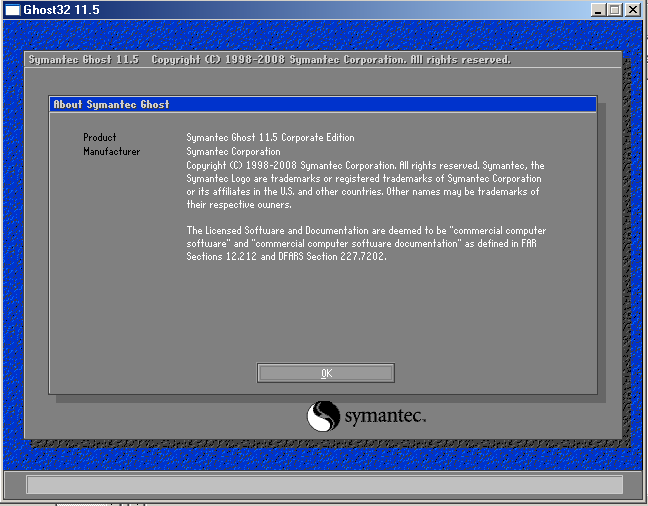

UPUTE ZA OSNOVNO POSTAVLJANJE RAČUNALA
==================================================

Provjeriti nalazi li se na USB pogonu potrebni direktorij sa pričuvnom kopijom MBR-a za navedeni razred (u primjeru je prikazan sadržaj direktorija za 3H razred)

|image0|

Pokrenuti batch skriptu koja počinje sa slovom H i nastavlja sa brojem (u primjeru je H21). Računalo će se automatski ponovno pokrenuti.

|image1|

Nakon što se računalo ponovno pokrenulo, odabrati Hirens BootCD (unutar Other OS and Tools izbornika), te zatim odabrati Mini WindowsXP opciju. Pričekati da se učita operacijski sustav.

|image2|

Pokrenuti Network Setup aplikaciju sa radne površine, te pričekati da se instaliraju upravljački programi i pokrenu svi servisi. Na gornjem dijelu prozora se uvjeriti da je odabrana RealTek mrežna kartica, te kliknuti na Renew tipku. Proces će potrajati neko vrijeme. Na donjoj lijevoj strani prozora će biti prikazana poruka **Ready**. Klikom na tipku Info, provjeriti je li dodijeljena adresa (ili 192.168.70.xx ili 192.168.80.xx, ovisno o laboratoriju u kojem se nalazite). U slučaju da nije, ponovno kliknuti na tipku Renew i provjeriti na Info sve dok ne dobijete IP adresu.

|image3|

|image4|

Pokrenuti komandnu liniju (ikona se nalazi na Taskbaru), te upisati tekst sa slike

TEKST :

net use z: "\\192.168.70.252\Nastava\OS_IMAGES"

|image5|

Pokrenuti Windows Explorer aplikaciju (ikona se nalazi na Taskbaru), te uočiti da se pojavio mrežni disk sa oznakom slova Z: koji upućuje na mrežno dijeljeni direktorij

|image6|

**ZA SLIJEDEĆI KORAK POZVATI NASTAVNIKA DA PROVJERI PRIJE IZVRŠENJA OPERACIJE**

Prvo je potrebno formatirati v4x particiju sa slijedećim specifikacijama:

- NTFS tip datotečnog sustava

- Volume label je v4x (x zamijeniti sa razredom, odnosno za treće razrede prilagoditi i broj)

- Uključiti opciju Quick Format

U korijenskom direktoriju Z: particije kopirati direktorij Win7_W98_Image, te ga zalijepiti u korijenski direktorij prethodno formatirane v4x particije.

|image7|

|image8|

Unutar kopiranog direktorija na v4x particiji pokrenuti GHOST32.EXE aplikaciju.

|image9|

Nakon što se pokrenula Symantec Ghost aplikacija, sa tipkom enter zatvoriti početni ekran.

|image10|

Zatim u izborniku odabrati opcije Local->Partition->From Image

|image11|

Odabrati w98COMPLETE.GHO datoteku te potvrditi odabir sa enter tipkom

|image12|

U slijedećem prozoru će se prikazati osnovne informacije particije koja se nalazi u pričuvnoj kopiji (FAT32 datotečni sustav, ukupna veličina 258MB, zauzeće particije 15MB, oznaka particije H18). Potvrditi sa tipkom enter.

|image13|

Zatim je potrebno odabrati tvrdi disk particije na koju želimo zapisati navedenu pričuvnu kopiju. Odabrati onaj tvrdi disk sa početnim slovima u imenu ST (označava Seagate disk).
Na slijedećoj slici je prikazan samo primjer izgleda prozora. Potvrditi sa tipkom enter.

|image14|

Iz ponuđenog popisa particija, odabrati onu koja odgovara ukupnoj veličini particije iz pričuvne kopije, a to je 258MB (najčešće prva na popisu). Potvrditi sa tipkom enter. 

**ZA SLIJEDEĆI KORAK POZVATI NASTAVNIKA DA PROVJERI PRIJE IZVRŠENJA OPERACIJE**
Prije potvrde vraćanja pričuvne kopije, provjeriti sa nastavnikom jesu li prethodni koraci točno odrađeni.

|image15|

Nakon završetka vraćanja pričuvne kopije, odabrati opciju Continue. 

Za vraćanje pričuvne kopije win7COMPLETE.GHO ponoviti postupak Local->Partition->From Image, te Seagate tvrdi disk, no za ciljnu particiju odabrati onu veličine 20GB (najčešće druga na popisu) 

**ZA SLIJEDEĆI KORAK POZVATI NASTAVNIKA DA PROVJERI PRIJE IZVRŠENJA OPERACIJE**
Prije potvrde vraćanja pričuvne kopije, provjeriti sa nastavnikom jesu li prethodni koraci točno odrađeni.

Nakon završetka vraćanja pričuvne kopije, odabrati opciju Continue i zatim Exit kako bi izašli iz aplikacije. Ponovno pokrenuti računalo, bez priključenog USB pogona.

Odabrati Windows7 operacijski sustav u boot izborniku i pričekati učitavanje operacijskog sustava.
Prijaviti se kao korisnik **strippy** sa lozinkom **tsrb1234**. 

U traci za pretraživanje Start izbornika upisati Powershell, te u popisu desnim klikom miša odabrati Windows Powershell, te odabrati opciju "Run as administrator".

|image16|

Unutar PowerShell prozora naredbom **Get-ExecutionPolicy** provjeriti postavljenu sigurnosnu razinu, te sa **Set-ExecutionPolicy Unrestricted** smanjiti razinu i omogućiti izvršavanje skripti koje nisu potpisane digitalnim certifikatom. Sa slovom A odabrati **Yes to All** opciju i potvrditi tipkom enter.

Premjestiti se u direktorij radne površine naredbom **cd $env:userprofile\Desktop**, te pokrenuti skriptu **.\RunThisFirst.ps1** (znakovi .\ označavaju samo da se skripta nalazi u trenutnom direktoriju).

|image17|

Pratiti upute u skripti, ime računala treba biti mjesto radne stranice, ID laboratorija za prostoriju u kojoj se nalazite, te korisničko ime odgovara mjestu radne stanice. Računalo će se automatski ponovno pokrenuti sa novim postavkama.

**ZAPISATI UNESENU LOZINKU**. Preporuka je da lozinka bude jednaka korisničkom imenu, učenik je sam odgovoran za točnost i kasnije korištenje te lozinke.

|image18|

Prijaviti se kao korisnik **strippy** Na particiji v4x stvoriti novi direktorij **Transfer**. 

|image19|

Prema slici prekopirati navedene direktorije i datoteke sa radne površine u **Transfer** direktorij.

|image20|

Odjaviti se i prijaviti kao novostvoreni korisnik. Sve navedene direktorije i datoteke iz **Transfer** direktorija prekopirati na radnu površinu.

Otvoriti **HOME** direktorij, i uočiti datoteku **home.bat**. Pokretanjem navedene skripte, računalo se vraća na HOME particiju. Ne pokretati skriptu u ovom trenutku.

|image21|

Na radnoj površini uočiti skriptu **SPP i DOU VJEŽBE.bat**. Pokretanjem navedene skripte, stvaraju se mrežni diskovi sa vezom prema mrežno dijeljenim direktorijima sa popisom laboratorijskih vježbi. Skripta je dana kao primjer, te je poželjno prilagoditi potrebama razreda.

|image22|

U datoteci **Popis Instaliranih Aplikacija.txt** nalazi se popis početno instaliranih aplikacija.

U traci za pretraživanje Start izbornika upisati **cmd**, te u popisu desnim klikom miša odabrati **cmd** aplikaciju, te odabrati opciju "Run as administrator".

|image23|

U slučaju da se otvori prozor sa iznimno malom veličinom fonta, kliknuti na gornju lijevu ikonu u prozoru, odabrati opciju Properties, te izmijeniti veličinu fonta na način prikazan na slici.

|image24|

U novootvorenom prozoru komandne linije, upisati **bcdedit** te uočiti description polje za **Windows Legacy OS Loader**. To polje je potrebno prilagoditi. Koraci izmijene su prikazani na slijedećoj slici.

|image25|

Nakon uspješne izmjene, još jednom provjeriti postavke.

|image26|

U korijenskom direktoriju v4x particije stvoriti direktorij VIRTUALBOX.

|image27|

Pokrenuti Virtualbox aplikaciju i odabrati opciju **Mogućnosti**.

|image28|

Promijeniti zadani direktorij u kojem će se spremiti svi novi virtualni strojevi, te odabrati novostvoreni direktorij.

|image29|

|image30|

Promijeniti jezik aplikacije u engleski.

|image31|

Ugasiti VirtualBox aplikaciju i čekati daljnje upute.

.. |image5| image:: Tutorial/Tutorial07.PNG
   :width: 6.95833in
   :height: 3.9375in

.. |image7| image:: Tutorial/Tutorial09.PNG
   :width: 8.36458in
   :height: 6.26041in
.. |image8| image:: Tutorial/Tutorial10.PNG
   :width: 8.32291in
   :height: 3.59375in

.. |image15| image:: Tutorial/Tutorial17.PNG
   :width: 5.70833in
   :height: 2.44791in

.. |image19| image:: Tutorial/Tutorial23.png
   :width: 7.58333in
   :height: 2.54166in

.. |image21| image:: Tutorial/Tutorial25.png
   :width: 8.72916in
   :height: 2.52083in

.. |image29| image:: Tutorial/Tutorial33.png
   :width: 10.19791in
   :height: 5.82291in

