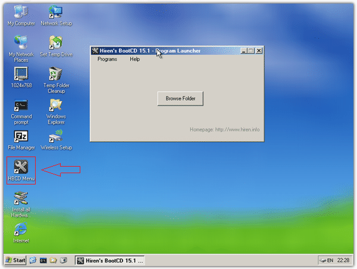
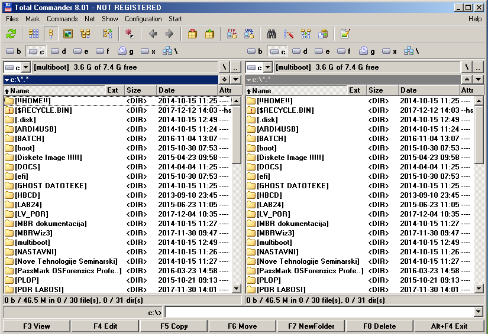

Osnove korištenja Total Commander aplikacije
============================================

Pokrenuti virtualno računalo sa priključenim USB pogonom (prema
prethodnim uputama). U **Multiboot** izborniku odabrati "**Other OS and
Tools**", te zatim "**Hiren's Boot CD**" stavku. Pojaviti će se
slijedeći izbornik te je u njemu potrebno odabrati "**Mini Windows XP**"
opciju. Radi se o "live" verziji Windows XP operacijskog sustava sa
integriranim raznim administrativnim alatima.

Nakon učitavanja "**Mini Windows XP**" sustava, pojaviti će se radna
površina. Sa radne površine pokrenuti **HBCD Menu** opciju. Otvoriti će
se izbornik preko kojega je moguće pokretati sve aplikacije podržane u
**Mini Windows XP** sustavu.

|image0|

Aktivirati **Programs** izbornik, te zatim **Browsers** **/** **File**
**Managers**. Unutar njega odabrati aplikaciju Total Commander.

|image1|

+\ |image2|

**Total Commander** je aplikacija iz kategorije **Upravitelja
datotekama** (eng. **File Manager** ), te se nudi kao zamjena
standardnim upraviteljima koji dolaze uz operacijske sustave, kao što je
**Windows Explorer**. Svoje idejne korijene vuče još od prvotne
implementacije PathMinder aplikacije (1984., Albert Nurick i Brittain
Fraley), te iznimno popularnog Norton Commandera (1986., John Socha) za
MS-DOS operacijske sustave.

Odlike koje se posebno ističu za aplikaciju su :

-  Podrška za dvije kartice (eng. Tab)

-  Podrška za korištenje naredbene linije iz aplikacije

-  Integrirana podrška za FTP protokol

-  Podrška za upravljanje različitim tipovima arhiviranih datoteka
   (kompresiranih i nekompresiranih, npr . TAR , 7ZIP, RAR...)

-  Podrška za dodatke različitih kategorija (eng. Plugins)

Struktura prozora aplikacije se može podijeliti na pet osnovnih dijelova
:

-  Traka izbornika sa popisom mogućnosti (tekstualan i grafički prikaz)

-  Popis uređaja za pohranu (moguć pristup lokalnim
   diskovima/particijama i mrežnim resursima)

-  Dva prozora za mogućnost istovremenog pristupa na dvije različite
   lokacije

-  Traka za upisivanje naredbi komandne linije

-  Kratice za najčešće korištene opcije aplikacije

**Zadaci za korištenje aplikacije**

Pokrenuti Total Commander

Sa Tab tipkom postaviti desni aktivni prozor i zapaziti promjenu.
Vratiti se na lijevi.

Sa ALT-F1 kombinacijom tipki postaviti C: aktivnu particiju na lijevom
prozoru (MULTIBOOT USB pogon). ALT-F2 kombinacija mijenja aktivnu
particiju na desnom prozoru (postaviti na B: ).

NAPOMENA: U Mini Windows XP okruženju, B: particiji je zapravo stvoren
RAMDRIVE tip uređaja koji je u potpunosti učitan u radnu memoriju. Kao
posljedica, sve promjene nad datotekama i direktorijima koje se zapisuju
na uređaj, ne pamte se nakon ponovnog pokretanja računala. Ostale
particije su podložne promjenama i potrebno je obratiti pozornost
prilikom izmjene nad datotekama i direktorijima.

Prebaciti se na aktivan prozor sa B: particijom i odabrati kombinaciju
tipki SHIFT-F4 za stvaranje nove datoteke. U ime datoteke upisati razred
(bez točke iza rednog broja) i trenutnu godinu, a kao ekstenziju upisati
tekstualni tip datoteke (npr. 3C2016.txt). Nije potrebno obraćati
pozornost na velika i mala slova. U posebni red upisati u datoteku par
imena učenika/učenica (bez dijakritičkih znakova) iza razreda te
spremiti izmjene (File -> Save ili kratica Ctrl-S) i izaći iz aplikacije
za uređivanje teksta. Uočiti veličinu datoteke. Koju vezu ima veličina
datoteke sa njenim sadržajem? Kolika je veličina jednog znaka?

Pozicionirati se nad novostvorenu datoteku te sa View ( opcija 3 na dnu
zaslona podrazumijeva F3 tipku) opciju pregledati sadržaj datoteke. Mogu
li se vršiti izmjene nad datotekom? Zašto?

Izaći iz aplikacije te odabrati Edit opciju. Koju tipka se koristi za tu
opciju? Može li se sad sadržaj datoteke mijenjati? Kojom aplikacijom je
učitana datoteka? Ispred imena svakog učenika upisati razred, spremiti
izmjene i izaći iz aplikacije. U elaboratu ostaviti samo ime učenika
autora dokumenta i datum te spremiti kao sliku za dokument.

NAPOMENA : Total Commander omogućava odabir standardnih aplikacija za
učitavanje datoteka različitog tipa. U ovom slučaju Notepad++ je odabran
za izmjenu tekstualnih datoteka. Moguće je izmijeniti standardan
preglednik/urednik kroz izbornik Configuration -> Options -> Operation
-> Edit/View.

Postaviti da jedan aktivan prozor bude na B: particiji a drugi na C:
particiji. Na C: particiji stvoriti novi direktorij (NewFolder opcija)
sa imenom POR\_PRIMJER.

Preimenovati direktorij (Move opcija) u POR\_TEST. Postaviti taj
direktorij kao radni direktorij.

Proučiti putanju direktorija ( C:\\POR\_TEST\\).

NAPOMENA : Opis putanje C: \\ POR\_TEST\\

C: - Slovo particije

\\ - Znak za granicu između dva direktorija ( Putanja C:\\ označava
korijenski direktorij)

POR\_TEST\\ - Ime direktorija sa dodanim znakom ograničenja

Prebaciti se na prozor sa aktivnom B: particijom, te koristeći tipku
Insert na tipkovnici odabrati prethodno stvorenu datoteku i **Temp**
direktorij. Odabrane objekte kopirati u POR\_TEST direktorij (Copy
opcija). Potvrditi da je postupak kopiranja uspješno izvršen. Vratiti se
u korijenski direktorij C: particije te premjestiti POR\_TEST direktorij
(**Move** opcija) u korijenski direktorij B: particije. Potvrditi da je
postupak premještanja uspješno izvršen.

Obrisati POR\_TEST direktorij (**Delete** opcija).

Postaviti korijenski direktorij B: particije kao aktivan direktorij, te
minimizirati prozor Total Commander aplikacije. Pokrenuti naredbeni
redak ili preko U komandnoj liniji pozivom na naredbu "dir" ispisati
sadržaj trenutno aktivnog direktorija i uočiti stvorenu datoteku. U
slučaju da ime datoteke nije stalo na ekran u popisu, moguće je
filtrirati izlazne rezultate korištenjem wildcard znaka zvjezdice (npr.
dir 3c\*). Potvrditi prikaz imena datoteke na zaslonu. Tipkom ESC
vratiti aktivan prozor Volkov Commandera.

Odabrati prethodno prikazanu datoteku u korijenskom direktoriju te joj
postaviti skriveni atribut. Radnju je moguće izvršiti ili pozivom
gornjeg izbornika (tipka ALT), Files , te na kraju opcije File
Attributes, ili korištenjem CTRL-A kratice. Navigacijskim tipkama
smjestiti pokazivač među tražene zagrade (Hidden) te sa razmaknicom
aktivirati atribut. Pozicionirati se na "Set" gumb i potvrditi izmjenu
sa Enter tipkom.

Minimizirati Volkov Commander aplikaciju te korištenjem filtera za
datoteku ponovno ispisati sadržaj direktorija. Prikazuje li se tražena
datoteka? Zašto?

Prema gornjoj proceduri, maknuti skriveni atribut, no postaviti atribut
samo za čitanje. Pokušati izmijeniti sadržaj datoteke. Je li izmjena
uspješno spremljena? Je li se dogodilo što drukčije u odnosu na
spremanje datoteke sa početka ove vježbe? Može li se izmijeniti ime
datoteke? Zašto?

Izaći iz aplikacije Volkov Commander (QUIT opcija) i ponovno pokrenuti
računalo (U VirtualBox aplikaciji standardna postavka je kombinacija
tipki desniCTRL+R). Odabrati Windows98 operacijski sustav, pokrenuti
Volkov Commander i potražiti radnu datoteku. Što se dogodilo? Zašto?

.. |image1| image:: media01/image2.png
   :width: 4.38542in
   :height: 3.13542in

