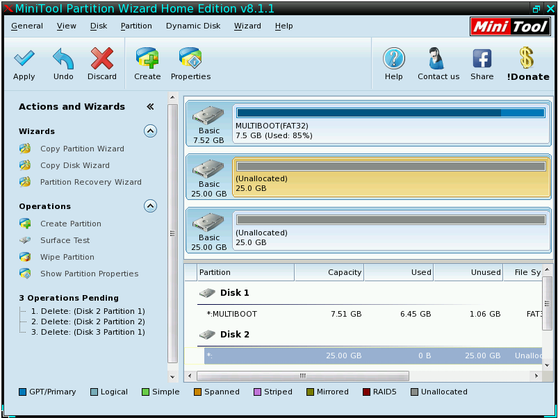

04 - Osnove korištenja Partition Wizard aplikacije
==================================================

|image0|

Stvaranje nove particije na nealociranom (praznom) prostoru tvrdog diska

NAPOMENA : - Nealocirani prostor se uobičajeno naziva i slobodan, odnosno
prazan prostor na tvrdom disku na kojem je moguće stvoriti nove
particije, no precizno rečeno, radi se isključivo samo o prostoru koji
nije definiran početnim i završnim adresama u particijskoj tablici
(Master Boot Record). S obzirom da particijska tablica standardnog MBR-a
podržava maksimalno 4 primarne particije, tvrdi disk na kojem se nalazi
više od 4 primarne particije će u svakom trenutku imati određen broj
nealociranih particija, no one i dalje postoje na disku. Ono što je
bitno za zapamtiti je da treba oprezno postupati prema nealociranom
prostoru, jer postoji vjerojatnost da se nalaze korisni podaci na njemu.
Kao primjer može se koristiti logička struktura diska u laboratorijima
računalstva u TŠRB gdje svaki sektor diska ima namjenu, i na svim
diskovima se nalazi preko 4 primarne particije, no u jednom trenutku se
u particijskoj tablici nalaze maksimalno 4 (alocirane su). Ne postoji
slobodan prostor na tim diskovima za stvaranje novih particija, već se
moraju koristiti isključivo adrese predodređene za određene razrede i
laboratorijske vježbe.

