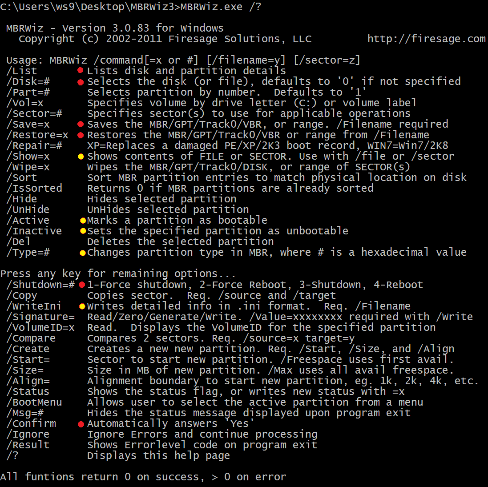
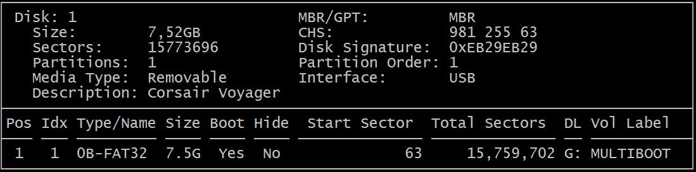
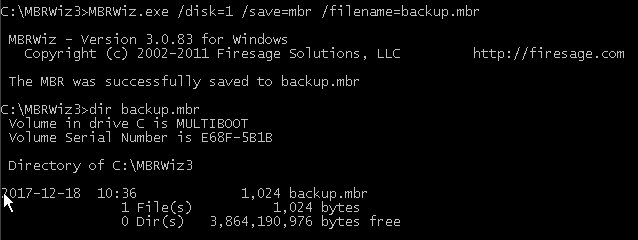
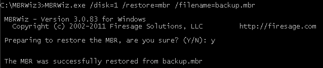
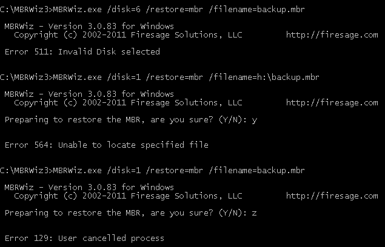
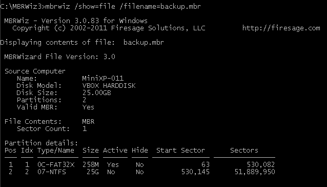
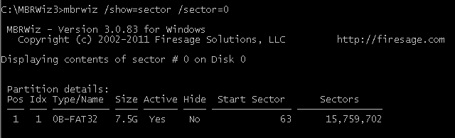
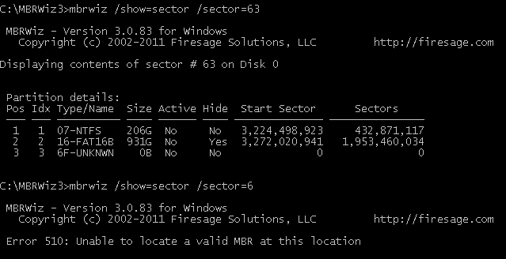
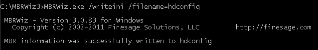
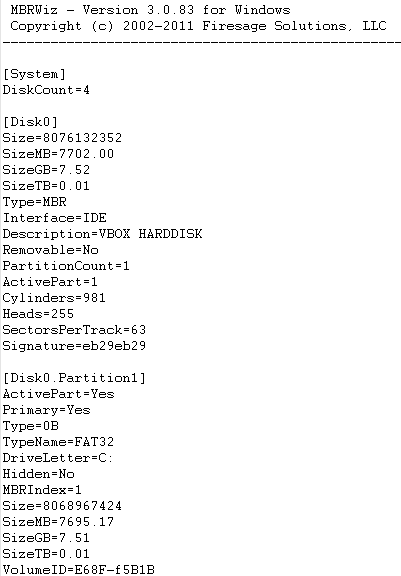

06 - Osnove korištenja MBRWizard aplikacije
===========================================

MBRWizard je aplikacija sa namjernom upravljanja raznim parametrima koji
se nalaze uglavnom u Master Boot Record području tvrdog diska.

Aplikacija se nalazi u direktoriju MBRWIZ3 na USB pogonu na slijedećoj
apsolutnoj putanji :

X:\\MBRWIZ3\\mbrwiz.exe (slovo X: zamijeniti sa potrebnim slovom USB
pogona)

Korištenje funkcije pomoći aplikacije postiže se unosom slijedeće
naredbe : mbrwiz.exe /?

MBRWizard aplikacija će se koristiti isključivo za spremanje informacija
koje se nalaze u Master Boot Recordu u neku datoteku i obrnuto. Proces
se uobičajeno naziva Spremanje ili Vraćanje MBRa

|image0|

Crveno ispunjeni krugovi predstavljaju opcije koje će se redovno
koristiti i potrebno im je znati značenje i pravilno ih upotrebljavati.
Krugovi ispunjeni žutom bojom predstavljaju ili informativne opcije
(Show, WriteIni), odnosno opcije za bržu izmjenu nekih opcija u
particijskoj tablici (Active, Type).

**IDENTIFIKACIJA DISKOVA I OSNOVNIH INFORMACIJA O PARTICIJAMA**

S obzirom da svaki tvrdi disk u računalu, a u ovom slučaju dodatno i USB
pogon što će se moći primijetiti, ima poseban MBR, bitno je prvo vidjeti
koje sve diskove aplikacija može prepoznati, i kako ih identificira.

NAPOMENA: u DOS ili Windows konzoli nije potrebno paziti na mala ili
velika slova (za razliku od Linux baziranih distribucija)

Naredba :

**mbrwiz /list**

Prepoznata su 3 tvrda diska, što i odgovara postavkama virtualnog stroja
( USB pogon i 2 virtualna tvrda diska), te se razlikuju u brojevima, što
predstavlja njihovu identifikaciju, te će se koristiti uz opciju
**/Disk** u kasnijem dijelu.

Bitno je prepoznati koji uređaj predstavlja USB pogon (uglavnom prema
ukupnoj veličini uređaja, kategorija Size), kako se slučajno ne bi
kopirao sadržaj MBR sa informacijama nekog tvrdog diska u MBR USB
pogona. U tom slučaju, USB će prestati funkcionirati te će se
onemogućiti pristup svim podacima na tom uređaju (aplikacije će pokušati
učitati particije sa krivim adresama iz particijske tablice)!

Kako bi se olakšala situacija, dobro je spremiti MBR USB pogona u
datoteku, te ju imati na nekom drugom pričuvnom USB pogonu (po
mogućnosti da isto ima mogućnost podizanja sustava). Druga metoda je
kopiranje cijelog sektora, te kopiranje sadržaja na prvi slijedeći
slobodan sektor uređaja.

Izlazni rezultat /List opcije prikazuje osnovne informacije o svakom
prepoznatom uređaju za pohranu, te zatim i detalje sadržaja particijske
tablice. Ispod će biti opisan svaki element izlaznog rezultata za USB
pogon iz slike gornjeg primjera ( Disk = 0 ).

Disk - Redni broj prepoznatog uređaja u sustavu (počinje se brojati od
nule).

Size - Ukupna veličina uređaja ( veličina je izračunata na temelju
ukupnog broja sektora, ovo nije reklamirana veličina proizvoda)

Sectors - Ukupan broj sektora na uređaju

Partitions - Broj particija u particijskoj tablici

Media Type - Tip uređaja (**Fixed** znači kako je uređaj spojen **SATA**
ili **IDE** kablom na matičnu ploču te nije namijenjen za često
iskapčanje iz računala. USB Pogon bi trebao imati **Removable** tip
uređaja)

Description - Opis uređaja, podatak se izvlači iz firmwarea uređaja
samog uređaja

MBR/GPT - Tip, odnosno struktura particijske tablice

CHS - Ukupan broj cilindara, glava i sektora na uređaju ( vrijednost se
koristi isključivo za starije,tzv. legacy, aplikacije)

Disk Signature - Jedinstven zapis/identifikacija uređaja, operacijski
sustavi ih koriste kako bi razlikovali jedan od drugog

Partition Order - Fizički raspored particija na disku

Interface - Način povezivanja uređaja sa računalom (npr. IDE, USB...)

Pos – Fizička pozicija particije na tvrdom disku

Idx – Pozicija stavke u particijskoj tablici ( ne mora odgovarati
fizičkoj poziciji na disku)

Type/Name – Tip datotečnog sustava koji bi se trebao nalaziti na
particiji, označen jednim bajtom u heksadecimalnom obliku i zatim
nazivom datotečnog sustava

Size – Ukupna veličina particije (Prikaz u MB ili GB se automatski
određuje prema veličini particije)

Boot – Bootable Flag bajt u stavci particijske tablice je aktiviran
(postavljena vrijednost 80 u heksadecimalnom obliku, često se zapisuje
kao 0x80 ili 80h)

Hide – Označava radi li se o sakrivenom tipu particije, govori
operacijskom sustavu treba li prikazati particiju korisniku

Start Sector – Početni sektor particije na tvrdom disku, prikazan u LBA
obliku

Total Sectors – Ukupan broj sektora koji particija zauzima na tvrdom
disku

DL - Drive Label, odnosno pridružena oznaka particiji ako je učitana od
strane operacijskog sustava

Vol Label - Volume Label, naziv učitane particije

NAPOMENA: Iako zadnji sektor particije nije prikazan, može se
jednostavno izračunati formulom

EndSector = StartSector+TotalSectors-1

NAPOMENA2: Može se primijetiti kako se za USB pogon prijavljuje kako se
radi o tvrdom disku povezanog preko IDE sučelja, te Fixed tipa medija.
Razlog tomu je zbog VirtualBox aplikacije. S obzirom da emulirani BIOS
VirtualBox aplikacije ne podržava nativno učitavanje sa USB pogona,
Virtual Machine USB Boot aplikacija konfigurira virtualni stroj tako da
stvori novi virtualni tvrdi disk, te ga poveže sa USB pogonom u
računalu. Iz tog razloga se USB pogon u virtualnom stroju prikazuje kao
tvrdi disk.

U pravilu, USB pogon bi trebao biti prikazan sa slijedećim
karakteristikama, kao prema slici ispod :

|image1|

**SPREMANJE PRIČUVNE KOPIJE MBRa TVRDOG DISKA (SAVE/BACKUP)**

U slučaju oštećivanja ili izmjene MBRa tvrdog diska (fizičko oštećenje,
maliciozni programi, nepažnja), dobro je imati pričuvnu kopiju kako bi
se moglo na jednostavan način pristupiti particijama i podacima na
disku. Već je spomenuto kako se u jednoj particijskoj tablici mogu
nalaziti maksimalno 4 primarne particije, no to ne ograničava ukupan
broj particija na disku. U logičkoj strukturi tvrdih diskova
(laboratoriji za računalstvo 3 i 4, nadimci "Cisco" i "MSAN", dokument
se nalazi na mrežno dijeljenom direktoriju) vidljivo je kako se na disku
nalazi mnogo više od 4 particija. U ovom dijelu dobro je definirati
pojam "radne particije". Radna particija se nalazi u particijskoj
tablici, odnosno, alocirana je. Sve ostale particije na disku su
nevidljive za operacijske sustave i općenite aplikacije, te se u
principu ne može pristupiti podacima na njima, i gleda ih se kao
**nealocirani** prostor.

Metodom spremanja pričuvnih kopija MBRa sa različitim kombinacijama
particija na tvrdom disku omogućava se korištenje više izoliranih radnih
okolina i nevezanih operacijskih sustava (svaki razred ima dodijeljen
svoj prostor na tvrdom disku koji je izoliran od ostalih razreda,
ponovno proučiti logičku strukturu tvrdog diska laboratorija).

Proces spremanja pričuvne kopije MBRa podrazumijeva kopiranje kompletnog
sadržaja prvog sektora na tvrdom disku te ispunu neke datoteke tim
sadržajem.

Prije spremanja, bitno je identificirati željeni tvrdi disk, što se
postiže sa **/List** opcijom, opisanom u prethodnom koraku.

NAPOMENA: Iako u računalu sa samo jednim tvrdim diskom (i bez USB pogona
u računalu!) nije potrebno specificirati disk (s obzirom da će biti
prikazan samo Disk:0, što je zadana vrijednost opcije **/Disk**,
proučiti opciju u pomoćnom izborniku aplikacije), dobra je praksa
**UVIJEK** koristiti /**Disk** opciju i ručno upisati željeni disk, u
tom slučaju se smanjuje broj nenamjernih štetnih posljedica.

**Naredba za spremanje drugog identificiranog tvrdog diska u sustavu (
USB pogon je prvi prijavljen, slika na prošloj stranici), ciljana
datoteka imena backup.mbr u korijenskom direktoriju C: particije** :

**mbrwiz /disk=1 /save=mbr /filename=c:\\backup.mbr**

|image2|

Može se primijetiti kako je aplikacija potvrdila uspješno spremanje u
datoteku, te je kasnije i provjereno postojanje i veličina datoteke.

U slučaju neispravne sintakse, ili krivo odabrane neke od opcija,
prikazat će se poruka o greški koja uglavnom upućuje u smjeru u kojem bi
se trebalo kretati za ispravljanje greške:

NAPOMENA : Primijetiti veličinu datoteke od 1024 bajta. S obzirom da je
veličina spremljenog MBR sektora samo 512 bajta, aplikacija ujedno
sprema neke dodatne informacije u datoteku, što se može primijetiti
prilikom korištenja opcije za prikaz detalja pričuvne kopije :

U heksadecimalnom pregledniku unutar crvenog pravokutnika se nalazi
prvih 512B spremljene datoteke, te se može uočiti sadržaj detalja o
računalu i disku s kojeg je spremljena pričuvna kopija. Drugih 512B
datoteke zauzima i sam Master Boot Record tvrdog diska.

Neki primjeri grešaka i neispravno upisanih naredbi :

1. Primjer : Neispravno korištenje **/save** opcije. Dozvoljene
   vrijednosti su **mbr**,\ **gpt**,\ **track0**,\ **vbr** ili
   **range**. Za potrebe laboratorijskih vježbi, u pravilu se uvijek
   koristi vrijednost **mbr**.

2. Primjer : Neispravno korištenje **/file** opcije, ona ne postoji.
   Opcija **/save** zahtijeva dodatnu opciju **/filename**.

3. Primjer : Odabrana nepostojeća particija za izlaznu datoteku.

4. Primjer : Odabran nepostojeći disk za spremanje MBR sadržaja.

**VRAĆANJE PRIČUVNE KOPIJE MBRA TVRDOG DISKA (RESTORE)**

Ovaj proces je nešto opasniji od prethodnog s obzirom da će krivo
vraćeni sadržaj datoteke uglavnom rezultirati nemogućnošću korištenja
tvrdog diska ili čak USB pogona.

**Jako je bitno u ovom procesu točno znati koji sadržaj se želi vratiti
i na koji tvrdi disk (MBR) se treba upisati! Još jednom, prije vraćanja
bitno je identificirati željeni tvrdi disk, što se postiže sa /List
opcijom.**

**Naredba za vraćanje sadržaja datoteke backup.mbr (korijenski
direktorij C: particije) na drugi identificiran tvrdi disk u sustavu
(ista situacija kao u primjeru za spremanje):**

**mbrwiz /disk=1 /restore=mbr /filename=c:\\backup.mbr**

|image3|

Aplikacija je prijavila uspješno obavljen proces. U slučaju da je
korisnik nepažnjom vratio krivi sadržaj na tvrdi disk, aplikacija će
vratiti istu poruku o uspješnosti, jer je uspješno izvršena tražena
radnja. Na odgovornosti korisnika je da zna koji sadržaj bi trebao biti
spremljen na koji ciljani uređaj.

Moguće greške :

|image4|

Prva dva primjera su identična kao i prilikom spremanja pričuvne kopije.
U zadnjem primjeru , prilikom potvrde vraćanja pričuvne kopije na tvrdi
disk, jasno se vidi upisano slovo z. Iako je korisnikova namjera bila
potvrditi sa Yes, na kodnoj stranici 437 (standardna u MS-DOS okruženju)
slova Z i Y su zamijenjena, te je potrebno obratiti pozornost na to.

Ako USB pogon ili tvrdi disk nisu prepoznati od strane računala, ili se
ne može podići operativni sustav sa njih : Uglavnom se radi o krivo
odabranoj datoteci za vraćanje , te je potrebno ponoviti proces sa
ispravnom datotekom.

**U situaciji kad je slučajno vraćen MBR tvrdog diska na USB pogon,
bitno je imati pričuvnu kopiju neispravnog USB pogona na nekom drugom
ispravnom, te je potrebno samo ponoviti proces sa ispravnom datotekom i
na ispravni uređaj. **

Ako ne postoji pričuvna datoteka za USB pogon, potrebno je ili ponovno
proći proces izrade Multiboot USB-a, ili se samostalno snaći nekim
drugim alatima za vraćanje sadržaja na USB-u (Partition recovery alati).

**Vraćanje pričuvne kopije MBRa tvrdog diska (RESTORE) sa automatskom
potvrdom i ponovnim pokretanjem računala**

U slučaju kad se želi vratiti pričuvnu kopiju MBRa na tvrdi disk bez
dodatne intervencije korisnika (potvrda Y tipkom) i automatskim ponovnim
pokretanjem računala nakon vraćanja, može se upisati naredba sa
slijedećim opcijama :

**mbrwiz /disk=1 /restore=c:\\backup.mbr /confirm /shutdown=4**

(Shutdown opcija podržava 4 različite vrijednosti, poželjno je koristiti
zadnje dvije, no u laboratoriju se isključivo koristi ona za ponovno
pokretanje računala bez prisile).

**Pregled sadržaja pričuvne kopije MBRa**

Nakon spremanja pričuvne kopije, sadržaj datoteke je moguće ispisati i
usporediti sa dokumentacijom kako bi se potvrdila ispravnost procesa. U
tu svrhu se koristi opcija **/show**, koja podržava dvije vrijednosti :
**file** ili **sector**. Vrijednost **file** se koristi kada se želi
prikazati sadržaj pričuvne kopije (u tom slučaju je obvezno korištenje
dodatne **/filename** opcije), dok se **sector** koristi kad se želi
prikazati sadržaj konkretnog sektora na nekom tvrdom disku.

Naredba:

**mbrwiz /show=file /filename=c:\\backup.mbr**

|image5|

Naredba za prikaz fizičkog sektora :

**mbrwiz /show=sector /sector=0**

|image6|

NAPOMENA : S obzirom da u varijanti ispisa sektora nije upisana opcija
sa kojeg se diska želi ispisati vrijednost sektora, standardno se
koristi disk=0. Dodatno, ova opcija zahtijeva ispravnu MBR strukturu za
prikaz, te je moguće prikazati samo sektore sa takvom strukturom
(uglavnom nulti sektor na disku).

Slijedeća dva primjera prikazuju neispravno korištenje opcije /sector. U
prvom primjeru odabran je 63. sektor na uređaju (u ovom slučaju radi se
o boot sectoru prve particije, odnosno prvom sektoru particije), te se
mogu primijetiti "čudne" vrijednosti. U drugom primjeru odabran je 6.
sektor na uređaju, koji je prazan, te je javljena poruka o grešci da se
ne može pronaći ispravna MBR struktura na toj lokaciji. U prvom primjeru
nije javljena poruka o grešci jer je aplikacija pronašla neki sadržaj,
no aplikacija nema u svom kodu validaciju (provjeravanje) ispravnosti
podataka.

|image7|

**ISPIS OSNOVNIH INFORMACIJA O TVRDIM DISKOVIMA I PARTICIJAMA U
RAČUNALU**

Naredba :

**mbrwiz /writeini /filename=hdconfig **

(nije korištena apsolutna ni relativna putanja već samo ime datoteke, te
će aplikacija stvoriti datoteku u radnom direktoriju)

|image8|

Datoteka se sprema u klasičnom tekstualnom obliku i može se pregledavati
bilo kojim tekst editorom ili preglednikom.

Spremaju se informacije o svim uređajima za pohranu u računalu (općenito
o tvrdim diskovima i detalji o svim particijama na njima), te su
ispisane sve informacije koje se prikazuju i upotrebom /List opcije.

Na slijedećoj slici djelomično je prikazan sadržaj hdconfig datoteke.

|image9|

