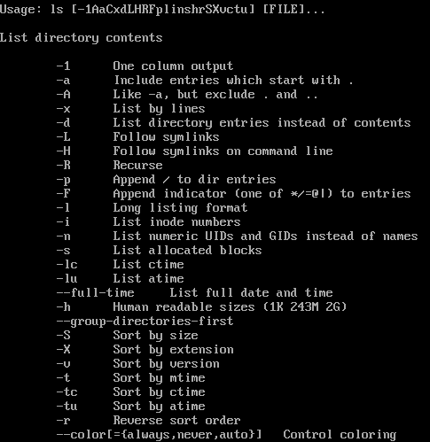

07 - Osnovno korištenje GNU/Linux operacijskog sustava (TinyCore distribucija)
==============================================================================

U ovom poglavlju bit će obrađeno područje osnovnih naredbi za
upravljanje direktorijima i datotekama (sadržaj je univerzalan za sve
GNU/Linux distribucije), te upravljanje paketima, odnosno instalacijom
softvera (sadržaj je vezan uz TinyCore distribuciju). Namjena obrađenog
sadržaja nije osnovno korištenje GNU/Linux sustava, već minimalan opis
potrebnih koraka za stvaranje "**dual-boot**" sustava između odabrane
GNU/Linux distribucije i Microsoft Windows 10 operacijskog sustava.

Razlog zašto se koristi TinyCore distribucija leži u tome što su
učenicima dodijeljene 3 particije na korištenje u laboratoriju veličina
256MB i 2x20GB, te je prva prethodno bila namijenjena za Microsoft
Windows 98 sustav. S obzirom da trenutno tehnički nije moguće mijenjati
strukturu tvrdih diskova na računalima u laboratoriju, bilo je potrebno
pronaći neku distribuciju čija će instalacija stati unutar 256MB
diskovnog prostora, te ima podršku instalacije na USB pogon pomoću YUMI
ili Rufus instalacijskog softvera.

U ovom poglavlju biti će objašnjeni osnovni koraci za :

-  snalaženje u strukturi direktorija

-  upravljanje datotekama (stvaranje, izmjena, brisanje)

-  upravljanje aplikacijama/modulima/paketima (sva tri pojma su u
   principu istoznačna, opisati će se instalacija i deinstalacija
   paketa)

-  spremanje i vraćanje pričuvne kopije Master boot zapisa (eng. Master
   Boot Record)

Nakon učitavanja MultiBoot izbornika s USB pogona, odabrati opciju Linux
Distributions, te u slijedećem izborniku odabrati
TinyCoreCorePlus-current distribuciju.

|image0|

|image1|

Pokrenuti će se novi podizbornik, u kojem je potrebno odabrati opciju
učitavanja sustava bez grafičke podrške i ostalih dodataka (mrežni
podsustav će biti aktivan).

|image2|

Nakon učitavanja sustava, pojavljuje se ljuska sa naredbenim retkom.
Prompt dio je detaljno objašnjen ispod

**tc@box:~$**

tc - Trenutno prijavljeni korisnik

box - Naziv računala

~ - Oznaka za home direktorij korisnika

Znakovi **@**,\ **:** i **$** nemaju neko posebno značenje osim
vizualnog.

Kao dokaz, na slijedećoj slici prikazani su rezultati slijedećih naredbi
:

-  hostname ( naziv hosta, odnosno računala)

-  whoami ("tko sam ja?", odnosno ispisuje trenutno prijavljenog
   korisnika)

-  cd (Change Directory, naredba služi za kretanje po strukturi
   direktorija)

-  pwd (Print Working Directory, naredba služi za ispis radnog
   direktorija)

-  ls (LiSt directory, naredba služi za ispis sadržaja nekog
   direktorija)

NAPOMENA: Naredbe cd i ls u gornjem primjeru dodatno upisan parametar
nakon samog imena naredbe. Parametar "/" u ovom slučaju definira
putanju, odnosno korijenski direktorij za traženu radnju naredbe.
Upotrebom naredbe **cd** za promjenu radnog direktorija i navedenog
parametra, rezultat će biti postavljanje korijenskog direktorija kao
radnog direktorija. Isto tako, naredba **ls** i unos istog parametra će
kao rezultat dati ispis sadržaja stavki korijenskog direktorija.

**Upravljanje direktorijima**

Ideja ovog poglavlja je samo shvatiti koncept direktorija (što on
predstavlja na datotečnom sustavu), te kroz praktične primjere prikazati
kretanje kroz putanju direktorija, te upravljanje njima (stvaranje novih
i brisanje postojećih direktorija). Na slici ispod prikazana je
struktura korijenskog direktorija TinyCore Linux distribucije. Sama
svrha svih prikazanih direktorija neće biti obrađena u ovom dokumentu,
odnosno biti će tema u slijedećim godinama obrazovanja.

Za početak, u donjem primjeru je prikazan rezultat već korištene naredbe
i dodatnog parametra za ispis sadržaja korijenskog direktorija.

|image3|

No, dodane su određene opcije same naredbe, koje mijenjaju ponašanje,
odnosno izgled krajnjeg rezultata. Opcije neke naredbe upisuju se na
način da se prvo upiše znak crte **-** , te nakon nje, slova neke
željene opcije. Kao što je vidljivo na donjoj slici, opcija **-alh** će
kao rezultat ispisati sve stavke , čak i one skrivene (datoteke u Linux
distribucijama nemaju poseban atribut za sakrivanje kao na Microsoft
sustavima, već se koristi točka kao prvi znak u imenu). Slijedeća dva
slova definiraju prikaz detalja svake stavke direktorija (a ne samo
ime), te zaokruživanje veličine datoteka na najbližu jedinicu (datoteka
od 1024 bajta će biti prikazana sa veličinom od 1KiB, standardno se
prikazuju sa veličinom u bajtima).

|image4|

Što je zapravo direktorij i koja je njegova svrha? S obzirom da se svrha
particije i datotečnog sustava na njoj može smatrati kao dio nekog
prostora za skladištenje podataka, dobro je povući analogiju i zamisliti
neku praznu prostoriju koja će predstavljati datotečni sustav. Ta
prostorija služi za spremanje bilo kakvih predmeta, od fotografija,
bilježnica, dvd medija, starih tenisica, itd. Kada bi se u toj
prostoriji nalazilo samo par predmeta, organizacija nije problem jer je
lako uočiti te predmete. No, nakon dodavanja većeg broja predmeta, može
se uočiti problem organizacije. Više nije jednostavno pronaći željenu
bilježnicu, novi predmeti se jedino mogu staviti na već postojeću
nepreglednu hrpu. Najčešći način organizacije ovog nereda je
implementacija kutija, i premještanje predmeta u te kutije. Na te kutije
se odmah zapisuju neke oznake koje će predstavljati kategoriju kojoj će
pripadati predmeti. Recimo, u kutiju natpisa "Fotografije" će se
stavljati sve fotografije unutar te prostorije. Sad je moguće
objašnjavati kompleksniju organizaciju prostora, no situacija objašnjava
analogiju kutije i direktorija, odnosno svrhu istog. Da se sve datoteke
ne bi nalazile u istom prostoru datotečnom sustavu, stvoren je koncept
direktorija za kvalitetniju organizaciju prostora.

Za upravljanje direktorijima koriste se tri najčešće naredbe :

-  **chdir** (ima jednaku funkciju kao i naredba **cd**) ili **cd**, za
   kretanje po strukturi direktorija

-  **mkdir** za stvaranje novih direktorija

-  **rmdir** za brisanje postojećih direktorija

Za kretanje po strukturi direktorija mogu se koristiti apsolutne i
relativne putanje. Za primjer, kada bi se htjelo iz korijenskog
direktorija postaviti **/tmp/tce/optional** (ovo je **apsolutna**
putanja **optional** direktorija) direktorij kao radni direktorij,
potrebno je upisati naredbu **cd** ili **chdir** te kao parametar
navesti željenu putanju. Drugi način je pojedinačno upisivati direktorij
po direktorij,sve do krajnjeg željenog direktorija. Za vraćanje u
prethodne direktorije se kao parametar koristi poseban naziv prethodnog
direktorija ".." (isti je naziv i na Microsoft sustavima). Kada putanja
u sebi ne sadrži točne nazive direktorija, već njen efekt ovisi o
poziciji radnog direktorija, takva putanja se zove **relativna**. Za
primjer, putanja "../../.." je relativna putanja jer je njen efekt
vraćanje za tri direktorija u hijerarhiji. Svi postupci su prikazani na
slijedećoj slici.

|image5|

Za stvaranje novih direktorija, koristi se naredba mkdir i željeno ime
direktorija. Na slici ispod prikazano je stvaranje novih direktorija, sa
naglaskom na razlikovanje imena sa malim/velikim slovima u njemu. Drugi
primjer prikazuje stvaranje strukture novih direktorija. Samo upisivanje
strukture nije dovoljno , već je potrebno dodati opciju koja će stvoriti
roditeljske direktorije po potrebi.

|image6|

Za brisanje postojećih direktorija, koristi se naredba rmdir i željeno
ime direktorija. Na slici ispod prikazano je osnovno korištenje naredbe.
Zatim je obrisan direktorij "**mirko**", te nakon njega svi direktoriji
koji počinju sa imenom **M** (korišten je wildcard znak \* za zamjenu
svih daljnjih znakova). U slijedećem koraku je bio pokušaj brisanja
strukture direktorija "prvi/drugi/treći", no pokazalo se kako je obrisan
samo zadnji "treći" direktorij u strukturi, dok su ostali direktoriji
bili netaknuti. U tu svrhu je potrebno koristiti opciju koja će
uključiti i brisanje roditeljske direktorije u strukturi (zadnji
primjer).

|image7|

**Upravljanje datotekama**

Svrha ovog poglavlja je objasniti smisao datoteke na datotečnom sustavu,
te prikazati postupke upravljanja njima (stvaranje, brisanje, izmjena).

Prvo je bitno shvatiti koncept datoteke. Kada bi se povukla analogija
prostorije iz prethodnog poglavlja, datoteka je zapravo svaki predmet u
toj prostoriji. Svaka fotografija ili bilježnica predstavljaju neku
zasebnu datoteku. Ono što je bitno (a posebno vrijedi za sve Linux
sustave) napomenuti jest da su i sve kutije (koje zapravo predstavljaju
direktorije) zapravo datoteke. Iz toga se može zaključiti da je sve na
Linux sustavu prikazano zapravo kao datoteka, pa čak i direktoriji.
Točnije , svaki objekt je prikazan kao datoteka (datoteke, direktoriji,
particije, tvrdi diskovi, procesi, itd.), te je iz te logike
populariziran termin „Everything is a file“ ( sve je datoteka).

Datoteke se dijele na više tipova :

-  Regularne datoteke

-  Direktoriji

-  Specijalne datoteke - blok datoteke (eng. block files), znakovne
   datoteke (eng. character files), cijevne datoteke (eng. pipe files),
   simboličke poveznice (eng. symbolic links) ,priključne datoteke (eng.
   socket files)

U glavnini poglavlja će biti obrađene regularne datoteke uz jednu
iznimku specijalne datoteke, blok datoteke. Potonja datoteka će biti
prikazana za prikazivanje sadržaja tvrdog diska i particije, kao dokaz
da se sve u Linux sustavu prikazuje kao datoteka. Zašto je uopće
relevantno spominjati takvu logiku sustava? Recimo da korisnik želi
vidjeti detalje o ugrađenom procesoru. Nije za to potrebno instalirati
specijalizirane aplikacije za prikaz informacija o sustavu, već je
dovoljno iščitati sadržaj datoteke **/proc/cpuinfo** (primjer : cat
/proc/cpuinfo). Za stvaranje datotečnog sustava treće particije tvrdog
diska, dovoljno je aplikaciji za formatiranje dodati parametar
**/dev/sda3** (primjer: mkfs.ext4 /de v/sda3). Za
prikazivanje/učitavanje sadržaja na cd-rom uređaju, potrebno je
aplikaciji pridodati kao parametar datoteku **/dev/cdrom** koja
predstavlja uređaj (primjer: mount /dev/cdrom).

Filozofija ovog tipa iznimno olakšava korištenje i administraciju
sustava.

Osnovne naredbe za upravljanje datotekama su :

-  **touch** za stvaranje novih praznih datoteka

-  **cp** za kopiranje datoteka

-  **mv** za premještanje datoteka

-  **rm** za brisanje datoteka

-  **cat** za ispis sadržaja datoteka na standardnom izlazu

-  **grep** za osnovno filtriranje prikaza sadržaja datoteka

-  **tar** za arhiviranje datoteka (sa mogućnošću kompresije)

-  **file** za prepoznavanje tipova datoteka

Ujedno će osnovno biti obrađen i jedan od ponuđenih tekstualnih editora
, Nano.

Za početak, kako se u postojećem direktoriju iz popisa može uočiti je li
neki objekt datoteka, te kojeg je tipa?

|image8|

Iz priložene slike, prvo slovo u prvom stupcu označava tip stavke u
nekom direktoriju. Ako je prvo slovo **d**, radi se o direktoriju. U
slučaju da je polje prazno (označava se sa crticom), radi se o
standardnoj datoteci. Ostala slova (b,p,l,c,s) označavaju kako se radi o
nekom tipu specijalne datoteke, te osim jednog primjera blok datoteke,
neće biti obrađene u dokumentu.

Iz gornjeg primjera, može se primijetiti kako se u popisu nalazi jedna
regularna datoteka, te jedna specijalna (konkretno,simbolička
poveznica). Ostale stavke predstavljaju direktoriji (primijetiti i
prisjetiti se svrhe dva direktorija na vrhu s imenima "**.**" i
"**..**").

Za stvaranje novih praznih datoteka, najčešće se koristi naredba
**touch** (iako joj to nije originalna namjena). U donjem primjeru,
stvorene su tri datoteke. Dvije datoteke dijele isto ime, no sa
različitim veličinama slova, što još jednom dokazuje osjetljivost Linux
sustava na mala/velika slova. Treća datoteka je stvorena bez ekstenzije,
što je dozvoljeno, jer su ekstenzije opisnog karaktera i ne utječu na
sadržaj ili funkcionalnost datoteke. Iz prikazanog je vidljivo kako su
sve tri datoteke prazne, odnosno zauzimaju nula bajta.

|image9|

U slijedećem primjeru prikazan je proces kopiranja i premještanja
datoteka. Prvo je stvoren direktorij BACKUP, te je u njega kopirana
datoteka s imenom **Datoteka.txt**. Za kopiranje se koristi naredba
**cp**, te se kao parametri navedu datoteke koje se žele kopirati i na
kraju direktorij kao odredišna lokacija kopija datoteka.

Nakon toga je datoteka s imenom **datoteka.txt** premještena u
direktorij BACKUP. Za premještanje se koristi naredba mv, te se kao
parametri navedu datoteke koje se žele premjestiti i na kraju direktorij
kao odredišna lokacija.

Za preimenovanje datoteka se koristi ista naredba kao i za premještanje,
jer se tehnički radi o istom procesu. U procesu preimenovanja koristi se
datoteka s imenom **bez\_ektenzije**.

|image10|

Naredba **tar** služi za arhiviranje datoteka. Sam koncept arhiviranja
podrazumijeva sabiranje više datoteka u jednu. U tom procesu se uz sam
sadržaj datoteka, spremaju i ostali atributi kao što su prava pristupa,
te vlasnici datoteka. Bitno je napomenuti da proces arhiviranja ne
podrazumijeva i kompresiju u svrhu očuvanja prostora za pohranu
podataka. No, aplikacija nudi podršku za korištenje zasebnih alata za
kompresiju, od koji su najpopularniji gzip i bzip2.

U slijedećem primjeru prikazane su opcije **tar** naredbe, te su zatim
arhivirane tri datoteke (Datoteka.txt, datoteka.txt i
sa\_ekstenzijom.EXT) u arhivsku datoteku imena **backup.tar**. Iako
ekstenzija **tar** nije nužna, dobra je praksa jasno označiti o kojem se
tipu datoteke radi.

Nakon arhiviranja, sa naredbom **rm** obrisane su originalne datoteke,
na dva različita načina. U prvom koraku nije korištena nijedna opcija,
te je bilo potrebno potvrditi brisanje datoteke. U drugom koraku je
odabrana opcija **-f** (eng. force, Never prompt) koja omogućava
prisilno brisanje datoteka bez daljnjih upita korisniku.

U zadnjem primjeru, ponovno je korištena **tar** naredba, no ovaj put za
raspakiravanje arhive.

|image11|

Na slici ispod su iz **/sbin** direktorija prekopirane neke aplikacije.
Zatim su arhivirane u 3 različite arhive. Jedna arhiva je bez
kompresije, dok su druge dvije kompresirane koristeći različite alate
(opcija **z** za gzip i **j** za bzip2). Ukupna veličina zasebnih
datoteka je otprilike 433KiB.

Nekompresirana arhiva je veličine 439KiB iz razloga što se, uz sadržaj
datoteka, spremaju i njihovi dodatni atributi.

Druge dvije arhive su kompresirane i veličine su 184KiB, odnosno 216KiB.
Čak se na malom uzorku može primijetiti razlika u veličinama datoteka.
Potrebno je napomenuti kako se radi o različitim algoritmima kompresije,
gdje jedan nije u svakoj situaciji bolji od drugog. Isto tako, kvaliteta
algoritma za kompresiju se ne odlikuje samo u postotku same kompresije,
već i u brzini procesa, no to nije tema ovog poglavlja.

|image12|

Virtualni stroj ne omogućava podizanje sustava sa tvrdog diska dok je
USB pogon priključen, te ga je potrebno privremeno maknuti iz
konfiguracije, kako bi se provjerila ispravnost instalacije Windows98
sustava.

Prvi korak je ugasiti virtualni stroj, te otići u Settings izbornik ,
kategorija Storage. Klikom na desnu tipku miša na VMUBDrive000.vmdk,
odabrati opciju Remove Attachment. Datoteka će ostati na disku,samo će
nestati iz konfiguracije, kasnije se jednostavno doda nazad u
konfiguraciju.

|image13|

Odspojiti USB pogon iz računala, te pokrenuti virtualni stroj. Trebala
bi se pojaviti ljuska MS Windows98 operacijskog sustava, kao potvrda
ispravne instalacije. Ponovno ugasiti virtualni stroj, i dodati nazad
VMUDrive000.vmdk datoteku. U Settings izborniku, kategorija Storage,
kliknuti na "Controller:SATA" i sa odabrati opciju za dodavanje tvrdog
diska na kontroler, te u slijedećem prozoru odabrati postojeći disk.

|image14|

Ući u direktorij sa imenom virtualnog stroja (obratiti pozornost gdje su
spremljeni virtualni strojevi na tvrdom disku), te odabrati i učitati
VMUDrive000.vmdk datoteku u konfiguraciju. Ponovno pokrenuti virtualni
stroj.

.. |image0| image:: SKmedia07/image1.png
   :width: 3.80942in
   :height: 2.75591in

.. |image3| image:: SKmedia07/image5.png
   :width: 5.08858in
   :height: 2.75591in

.. |image5| image:: SKmedia07/image7.png
   :width: 2.75591in
   :height: 1.85823in

.. |image8| image:: SKmedia07/image10.png
   :width: 7.07778in
   :height: 2.45486in
.. |image9| image:: SKmedia07/image11.png
   :width: 5.85833in
   :height: 3.33333in
.. |image10| image:: SKmedia07/image12.png
   :width: 5.17500in
   :height: 3.84167in
.. |image11| image:: SKmedia07/image13.png
   :width: 5.51181in
   :height: 6.35797in

.. |image14| image:: SKmedia07/image16.png
   :width: 6.92708in
   :height: 4.51042in
