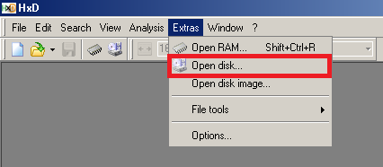
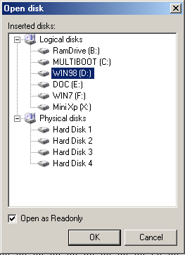
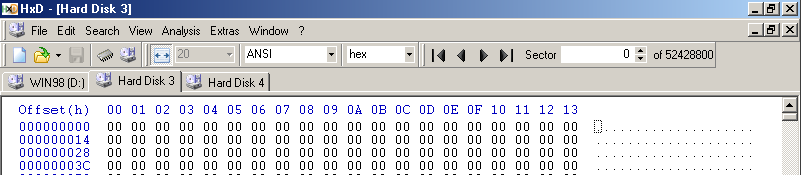
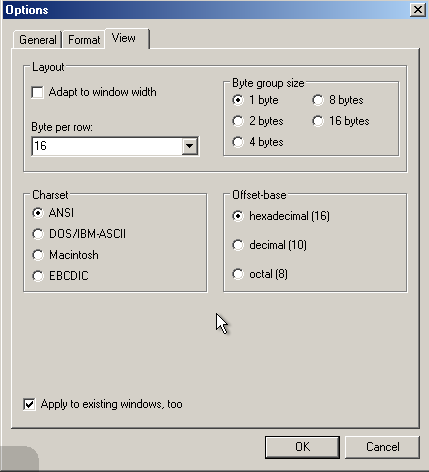
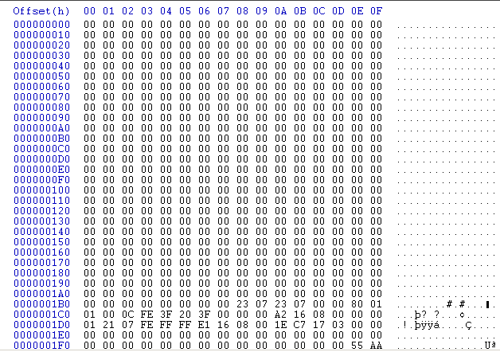
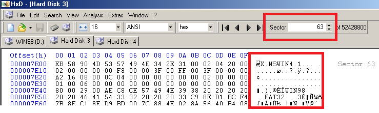
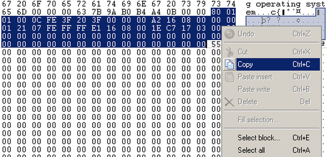
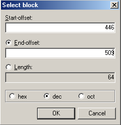
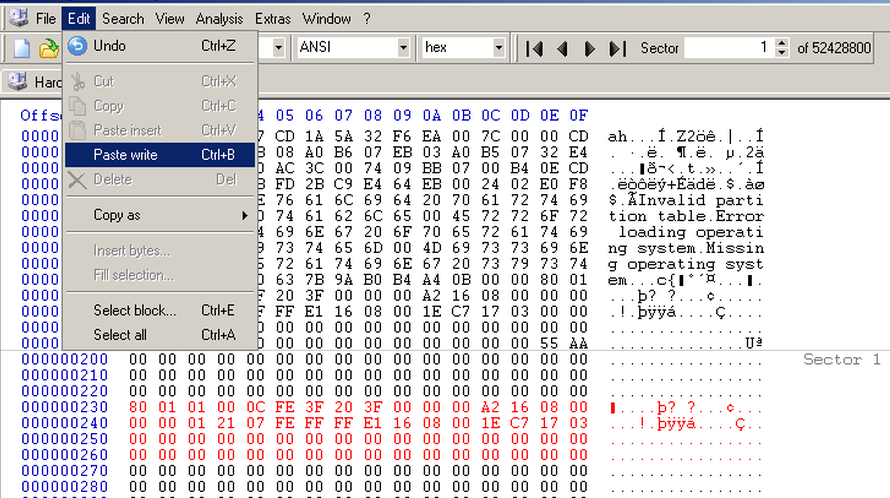
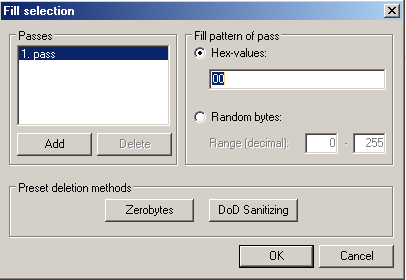

08 - Osnove korištenja HxD aplikacije
======================================

HxD je aplikacija koja uz značajke hex editora nudi i mogućnosti
pregleda i izmjene sadržaja tvrdog diska na razini sektora.

S obzirom da se radi o Windows aplikaciji, nudi standardizirano grafičko
sučelje. Na Multiboot USB pogonu može se naći u Hirens BootCD live
distribuciji, u kategoriji Editors/Viewers.

Za pristupanje tvrdom disku, potrebno je aktivirati izbornik Extras u
aplikaciji, te odabrati opciju Open Disk, kao što je prikazano na
slijedećoj slici:

|image0|

U slijedećem prozoru prikazani su svi mogući objekti koji se mogu
odabrati za pregled/izmjenu. Podijeljeni su u dvije kategorije : Logički
diskovi i Fizički diskovi. Logički diskovi predstavljaju particije na
nekom tvrdom disku, dok fizički diskovi predstavljaju cijeli uređaj. Sam
prikaz sadržaja je isti, nebitno radi li se o particiji ili tvrdom
disku, i moguće je i preko opcije fizičkog diska pristupiti prostoru
particije, no potrebno je znati početnu adresu te particije (
adresiranje opisano na prošloj stranici u kategoriji MBR).

U ovom primjeru na slici, mogu se vidjeti poznate oznake stvorenih
particija, uz dodatak RamDrive i MiniXP particija stvorenih od strane
Hirens BootCDa, te 4 fizička diska:

|image1|

Tvrdi diskovi su identificirani samo po broju, te nije moguće iz ovog
prozora sa sigurnošću odabrati željeni disk već je potrebno otvoriti sva
4 i proučiti detaljnije. Cilj je otvoriti tvrdi disk na kojem se nalazi
particije WIN98 i WIN7.

NAPOMENA: U principu je često moguće na temelju popisa particija logički
zaključiti koji tvrdi disk bi se trebao otvoriti , no potrebno je
poznavati strukturu diskova, a postupak nema garantirani uspjeh.

RamDrive bi trebao predstavljati Hard Disk1 u ovom slučaju , prema
usporedbi sadržaja

MultiBoot particija se nalazi na Hard Disk2 uređaju i predstavlja USB
pogon

WIN98 i WIN7 particije se nalaze na Hard Disk3 uređaju

DOC particija se nalazi na Hard Disk4 uređaju

Iz popisa je vidljivo kako se particija DOC nalazi između WIN98 i WIN7
particija te može doći do zabune sa korisničke strane, te je zbog toga
dobra praksa otvoriti sve fizičke uređaje i sadržaj particijskih tablica
usporediti sa dokumentacijom.

Standardno zadana vrijednost prikaza sadržaja u aplikaciji jest da se
broj prikazanih bajtova prilagođava širini prozora, što je potrebno
izmijeniti, jer je standardna širina linije prilikom pregleda sektora
tvrdih diskova 16B.

|image2|

Za to je potrebno u izborniku Extras odabrati opciju Options, zatim
karticu View, te u njoj isključiti opciju "Adapt to window width" i
ručno postaviti "Byte per row" opciju na vrijednost 16. Potom označiti
opciju "Apply to existing windows, too", i kliknuti na OK.

|image3|

**PROUČAVANJE PRVOG SEKTORA TVRDOG DISKA**

U ovom primjeru prikazat će se konkretni detalji particijske tablice
tvrdog diska, na kojem se nalaze WIN98 i WIN7 particije (u ovom
konkretnom slučaju Hard Disk 3)

|image4|

Nakon odabira prikazat će se kompletan prostor tvrdog diska, počevši od
prvog sektora. Sadržaj je prikazan u heksadecimalnom i tekstualnom
obliku (centralna dva stupca i desni stupac) koji je definiran adresama
(lijevi stupac) zapisanim u heksadecimalnom obliku. Svaka linija sadrži
točno 16B podataka sa ukupno 32 linije u sektoru (ukupno 512B).
Particijska tablica tvrdog diska počinje na adresi 0x1BE (u 0x1B0 liniji
predzadnji bajt), i u ovom slučaju može se prepoznati po oznaci 80.

Disk na koji nije instaliran nijedan operacijski sustav će u principu
imati prazan dio iznad particijske tablice, u kojem se inače treba
nalaziti programski kod (Master Boot Code) za odabir i učitavanje
aktivne particije (na kojoj se nalazi operacijski sustav).

Kao što je već spomenuto, početak particijske tablice nalazi se na
adresi 0x1BE, i u ovom slučaju počinje sa vrijednošću 80, što znači da
se radi o aktivnoj particiji (Podsjetiti se, opcija je postavljena
ranije u Partition Wizard aplikaciji), odnosno BootFlag zastavica je
aktivna(jedina druga ispravna vrijednost ovog bajta je 00, nijedna druga
vrijednost u principu nije dozvoljena).Ukupna veličina particijske
tablice je 64B, te sastoji se od 4 stavke, svaka po 16B, i svaka
predstavlja jednu primarnu particiju. U slučaju da je stavka kompletno
ispunjena nulama (kao što su u ovom primjeru stavke 3 i 4), znači da
nije ispunjen maksimum od 4 particije. U ovom primjeru, tvrdi disk ima
samo 2 definirane particije.

Raspisan sadržaj prve stavke particijske tablice

80 01 01 00 0C FE 3F 20 3F 00 00 00 A2 16 08 00

Raspisan sadržaj druge stavke particijske tablice

00 00 01 21 07 FE FF FF E1 16 08 00 1E C7 17 03

U primjeru će biti objašnjena prva stavka, za **vježbu samostalno
objasniti drugu**.

Prvi bajt predstavlja BootFlag, i s obzirom da je postavljen u
vrijednost 80, na particiji bi se trebao nalaziti neki operacijski
sustav, odnosno Master Boot Code će odabrati ovu particiju sa koje bi se
trebao podići OS.

Vrijednosti 010100 predstavljaju početne Cylinder,Head,Sector adrese i
zapisane su u CSH redoslijedu. Dodatnu komplikaciju stvara "little
endian" način zapisa u kojem je grupa bajtova zapisana na obrnut način,
i to bajt po bajt. Dakle 01 01 00 su zapravo 01(H) 01(S) 00(C) adresa.
Ujedno, bajt Sektora posuđuje 2 gornja bita za vrijednost cilindra, koja
u njemu predstavljaju 2 donja bita. Iako CHS uglavnom neće biti temelj
proučavanja, niti je potrebno u detalje znati izračun, u osnovi je dobro
znati što je CHS adresiranje, odnosno svrhu te metode.

0C predstavlja tip datotečnog sustava koji bi se trebao nalaziti na
particiji, u ovom slučaju ta vrijednost govori kako se radi o FAT32(LBA
tip) vrsti datotečnog sustava.

FE 3F 20 predstavljaju završne Cylinder, Head, Sector adrese i zapisane
su na identičan način kao i početne adrese.

3F 00 00 00 je početna LBA adresa, isto zapisana u "little endian"
načinu, te se ispravno čita na kao

00 00 00 3F, u heksadecimalnom zapisu. S obzirom da se nule na lijevoj
strani u ovom obliku ne čitaju, samo je potrebno vrijednost 3F
pretvoriti u decimalni oblik, a to je 3\*16\ :sup:`1` + 15\*16\ :sup:`0`
= 63. Znači početni sektor prve particije nalazi se na sektoru 63. To je
moguće odmah provjeriti u HxD aplikaciji tako da se odmah u Toolbaru
upiše zadana vrijednost sektora, te je moguće u desnom stupcu iščitati
stringove MSWIN4.1, WIN98 i FAT32, što naslućuje da se stvarno radi o
stvorenoj WIN98 particiji.

|image5|

I za kraj , vrijednost A2 16 08 00 predstavlja broj sektora koje ta
particija zauzima, te je opet potrebno obrnuti redoslijed zapisa, bajt
po bajt s desna nalijevo. Bitno je napomenuti da se obrće redoslijed
isključivo CIJELIH bajtova, dakle za primjer A2 se neće zapisati kao 2A.
Rezultat zamjene redoslijeda će biti 00 08 16 A2, te je tu vrijednost
potrebno pretvoriti u decimalni oblik, a to je 8\*16\ :sup:`4` +
1\*16\ :sup:`3` + 6\*16\ :sup:`2` + 10(A)\*16\ :sup:`1` +
2\*16\ :sup:`0` = 524288 + 4096 + 1536 + 160 + 2 = 530082 sektora. S
obzirom da je jedan sektor velik 512B, 530082 \* 512B = 271401984B,
odnosno u megabajtima dvaput podijeliti sa 1024, te će se dobiti krajnja
vrijednost od 258,83MB, što odgovara veličini te particije.

**Odabir i kopiranje jednog dijela sadržaja**

Sa mišem se pozicionirati na početak sadržaja za odabar, kliknuti i
držati lijevu tipku miša, te povlačiti sve do kraja željenog sadržaja.
Zatim desnom tipkom miša kliknuti na odabrani sadržaj i odabrati opciju
za kopiranje Copy.

Isti postupak je moguće odraditi i samo sa tipkovnicom. Navigacijskim
tipkama je potrebno pozicionirati kursor na početak sadržaja za odabir,
zatim pritisnuti i držati tipku SHIFT, te navigacijskim tipkama se
locirati sve do kraja željenog sadržaja. Zatim pritisnuti kombinaciju
tipki ALT+E (za aktiviranje izbornika Edit), te odabrati opciju Copy.
Naravno, moguće je koristiti i standardnu kombinaciju tipki CTRL+C.

|image6|

Dodatno je moguće koristiti opciju **Select block** unutar Edit
izbornika. U otvorenom prozoru potrebno je odabrati tip zapisa adrese
(heksadecimalan, decimalan ili oktalan), prvu adresu bajta (eng.
Start-offset), te krajnju adresu (eng. End-offset). Moguće je odabrati i
samo prvu adresu te duljinu željenog odabira (eng. Length). Treba imati
na umu kako prva adresa počinje sa nulom.

|image7|

**Ljepljenje kopiranog sadržaja**

Sa mišem ili navigacijskim tipkama se pozicionirati na početak dijela u
sektoru gdje se želi zalijepiti kopirani sadržaj, aktivirati **Edit**
izbornik, te odabrati opciju **Paste write**. Moguće je i koristiti
kombinaciju tipki CTRL+B.

|image8|

Na slici je prikazan primjer izmjene sadržaja na 2. sektoru (slobodno je
mijenjati sadržaj u drugom sektoru, nijedan operacijski sustav ne
koristi prostor na disku od 2.-63. sektora, prostor poznat po imenu
"Remainder of track zero").

**Ispuna odabranog sadržaja nulama**

Potrebno je odabrati željeni sadržaj, aktivirati **Edit** izbornik, te u
njemu odabrati opciju **Fill selection**.

|image9|

Unutar otvorenog prozora, pod opcijom "**Fill pattern of pass**" upisati
heksadecimalnu vrijednost **00** te potvrditi izbor.

|image10|

Kao posljedica će se odabrani prostor popuniti nulama i biti će označen
crvenom bojom. U ovom trenutku promjena još nije spremljena, te ako se
želi, moguće je spremiti promjenu (File->Save ili kombinacijom tipki
CTRL+S).

.. |image9| image:: SKmedia08/image10.png
   :width: 4.72441in
   :height: 3.58844in

