09 - Osnove korištenja GNU/Linux Fdisk aplikacije
=================================================

Svrha aplikacije je manipulacija sadržajem particijske tablice nekog
tvrdog diska.

U nastavku biti će opisane samo osnovne radnje u aplikaciji, i objašnjen
minimalan skup radnji u GNU/Linux distribuciji, kako bi se mogla
uspješno koristiti aplikacija. U ovom dokumentu GNU/Linux nije tema, te
kao takav neće biti detaljnije objašnjen.

Do GNU/Linux Mint distribucije, može se na Multiboot USB pogonu doći u
izborniku "Linux Distributions", te odabrati Linux Mint iz izbornika.
Nakon učitavanja kliknuti mišem na ikonu prikazanu na slijedećoj slici.

|image0|

Pokrenuti će se aplikacija za emulaciju terminala, iz koje će se
koristiti fdisk aplikacija.

NAPOMENA: Sintaksa u GNU/Linux ljusci je osjetljiva na velika i mala
slova, te tehničku korektnost upisa naredbe i njenih opcija, stoga je
potrebno obratiti POSEBNU pozornost na ispravno upisan tekst.

U MS-DOS ljusci, za izlazak iz trenutno radnog direktorija, dozvoljen je
upis slijedeće sintakse, sa istim rezultatom :

cd..

CD..

cD\_.. (\_ označava razmaknicu, odnosno space tipku)

U GNU/Linux ljusci, jedina dozvoljena općenita sintaksa je prikazana u
slijedećem primjeru :

imeaplikacije\_opcijeaplikacije\_argumentiaplikacije

U primjeru naredbe za promjenu radnog direktorija cd (change directory),
znakovi .. su zapravo argument koji aplikaciji govore kako se treba
premjestiti za jedan nivo više u hijerarhiji direktorija.

Prema pravilima sintakse GNU/Linux ljuske, jedina ispravna metoda upisa
naredbe je slijedeća:

cd\_.. (znak \_ SE NE UPISUJE DOSLOVNO, već označava tipku razmaknice,
odnosno "cd ..")

Dakle, za poziv ove aplikacije se isključivo koriste mala slova, te
razmak između poziva aplikacije i argumenata.

U sljedećem primjeru, biti će pozvane pomoćne informacije aplikacije
fdisk (najčešće svaka aplikacija nudi tu mogućnost pozivom opcije -h ili
--help iza imena aplikacije):

**Naredba:**

**fdisk -h**

|image1|

Prvo što bi trebalo primijetiti je "Usage" kategorija u kojoj je
definiran općeniti način korištenja aplikacije. Iza imena aplikacije
(sva mala slova) se upisuju eventualne opcije (opisane ispod : -b, -c,
-h...) , te na kraju argument nad kojim će se primijeniti radnje
aplikacije. Između svakog upisanog objekta je obvezan razmak.

S obzirom da će se aplikacija koristiti za izmjene u particijskoj
tablici, ciljani objekt će biti **cijeli fizički tvrdi disk**, a ne
particije.

Ovisno radi li se o tvrdom disku povezanom na IDE ili SATA kontroler,
putanje će im biti kao u primjeru:

/dev/sda (Prvi disk spojen na SATA kontroler)

/dev/sdb (Drugi disk spojen na SATA kontroler)

/dev/sdb (Prvi disk spojen na IDE kontroler)

/dev/hdb (Drugi disk spojen na IDE kontroler)

Kao što je vidljivo, diskovi se nalaze u direktoriju /dev, u kojem se
nalaze svi prepoznati uređaji operacijskog sustava. Svi uređaji su
prikazani kao datoteka, te je poznata logika GNU/Linux sustava "sve je
datoteka".

Particije na diskovima su označene rednim brojem iza putanje uređaja, na
primjer :

/dev/sdb1 (Prva particija u particijskoj tablici na drugom disku
spojenom na SATA kontroler)

/dev/hda3 (Treća particija u particijskoj tablici na prvom disku
spojenom na IDE kontroler)

U ovom primjeru bit će prikazana izmjena particijske tablice tvrdog
diska na kojem se nalaze WIN98 i WIN7 particije. U vježbi će se prvo
izbrisati particijska tablica, te će se ručno unijeti osnovne
informacije o particijama, kako bi im se kasnije moglo pristupiti.

Prije bilo kakvih radnji, potrebno je vidjeti koje sve uređaje za
pohranu aplikacija **fdisk** prepoznaje (opcija –l prethodno prikazana u
help outputu). Za to je potrebno koristiti **fdisk** sa povećanim
privilegijama korisnika, a to se postiže unosom **sudo** naredbe ispred:

**Naredba:**

**sudo fdisk –l**

|image2|

U izlaznom rezultatu može se primijetiti kako je prepoznato 3 uređaja
koja odgovaraju USB pogonu, te dva virtualna tvrda diska. Za
informaciju, USB pogoni neće inače biti prepoznati kroz aplikaciju
fdisk, no MultiBoot USB pogon ima stvoren MBR, te ga se zbog toga gleda
kao tvrdi disk.

Ispod svakog uređaja prikazane su osnovne informacije izvučene iz
particijske tablice, te je za drugi prepoznati disk (/dev/sdb) vidljivo
kako se u njegovoj particijskoj tablici nalaze dvije particije.

Ako se podaci usporede sa dokumentacijom, logično je za pretpostaviti
kako se zapravo radi o WIN98 i WIN7 particijama.

Nakon identifikacije, potrebno je kao argument aplikacije unijeti
putanju željenog uređaja, te dodatno upisati opciju korištenja "dos
compatible" metode korištenja tvrdog diska (vidjeti help). Aplikaciju je
potrebno ponovno pokrenuti koristeći povišene privilegije.

**Iza svakog imena aplikacije, opcije ili argumenta slijedi obavezan
razmak, paziti na velika/mala slova, te posebnu pozornost obratiti na
ispravnost sintakse!**

Naredba:

**sudo fdisk –c=dos /dev/sdb**

|image3|

U aplikaciji će se prvo pojaviti poruka upozorenja kako "DOS-compatible"
mode više nije podržan, no u ovom slučaju bitno je koristiti disk sa tom
opcijom.

Opcije se odabiru isključivo jednim slovom, te je prva predložena opcija
poziv pomoćnog izbornika (slovo **m**), te je u gornjoj slici i pozvana.

Prije bilo kakvih izmjena particijske tablice i nakon svakog koraka
izmjene, dobra je praksa provjeriti njen sadržaj (opcija **p**).

|image4|

Pretpostavimo da se radi o praznom tvrdom disku, ili da se u
particijskoj tablici nalaze informacije o nekim drugim particijama na
disku. Prvo je potrebno očistiti sadržaj trenutne tablice (slovo **d**,
brisanje particije).

|image5|

U slučaju da se nalazi više particija u tablici, fdisk aplikacija će
prilikom brisanja pitati koji redni broj stavke treba obrisati (1-4). Na
gornjoj slici je nakon prve obrisane tablice odmah nakon odabrana opcija
ispisa particijske tablice, te se može primijetiti kako je ostala još
jedna particija na drugoj poziciji (sdb**2**). Još jednom je pozvana
opcija za brisanje particije, te je s obzirom da se radi o jedinoj
particiji u tablici, automatski obrisana bez pitanja. Na slijedećoj
slici može se primijetiti prazna particijska tablica:

|image6|

Tek u ovoj situaciji može se pristupiti stvaranju novih particija,
odnosno adresiranju postojećih na tvrdom disku. Naime , samim time što
su informacije o particijama obrisane iz tablice ne znači kako su i
fizički one nestale sa disku, svi podaci particije su i dalje netaknuti.
Ako se poznaju osnovne informacije te particije (BootFlag, početna i
završna LBA adresa, te tip datotečnog sustav), moguće ih je upisati u
fdisk te im normalno kasnije pristupiti. Konkretno, ovdje se govori o
alokaciji particije (podsjetiti se termina alociranog i nealociranog
prostora u temi Partition Wizard aplikacije).

Za vježbu će se u ovom primjeru jednostavno upisati informacije
prethodno obrisanih stavki u particijskoj tablici, odnosno alocirati će
se postojeće particije na tvrdom disku.

Za definiranje nove stavke u particijskoj tablici, odnosno dodavanje
nove particije, potrebno je odabrati opciju sa slovom **n** (add a new
partition). U slijedećem koraku potrebno je odabrati radi li se o
primarnoj ili extended tipu particije. S obzirom da extended tip
particije neće biti tema u ovim primjerima, uvijek se bira primarni tip
particije (slovo **p**). Nakon toga potrebno je odabrati mjesto
particije u tablici, uglavnom se prati određeni redoslijed, te se
odabire prvo mjesto (broj **1**). Zadnja dva koraka su upisivanje
početnog i završnog sektora, prema dokumentaciji. Na slijedećoj slici je
prikazan proces stvaranja prve particije.

|image7|

S obzirom da se na tvrdom disku nalaze dvije particije, potrebno je
dodati još jednu stavku, postupak je prikazan na slijedećoj slici:

|image8|

Nakon što su stvorene particije, upisane su samo osnovne informacije o
njima, odnosno granice adresa.

Potrebno je još dodati BootFlag zastavicu na prvu particiju (opcija
**a**, toggle a bootable flag), te promijeniti standardno zadani ID
datotečnog sustava (opcija **t**, change partition type ID), koji je u
ovom trenutku 83 (svi standardni Linux datotečni sustavi).

Proces je prikazan na slijedećoj slici:

|image9|

U slučaju da nije poznat heksadecimalni kod nekog tipa datotečnog
sustava, moguće je ispisati popis datotečnih sustava i njihovih kodova
opcijom **l** (pogledati gornju sliku).

|image10|

NAPOMENA: Potrebno je točno pratiti korake, čitati koje opcije ili
vrijednosti aplikacija očekuje, te paziti što se upisuje. Na primjer,
korisnik je u slijedećem primjeru zaboravio na korak odabira primarne
ili extended particije, te htio upisati stvaranje treće particije u
tablici, što je završilo porukom o grešci.

|image11|

Nakon što su provjerene vrijednosti u particijskoj tablici sa onima u
dokumentaciji, potrebno je zapisati te promjene na tvrdi disk, s obzirom
da su one još uvijek samo u radnoj memoriji. U slučaju da se preskoči
korak zapisivanja, neće biti nikakvih promjena u MBR. Promjene se
zapisuju odabirom opcije **w** , nakon čega će se automatski pokrenuti
postupak izlaska iz aplikacije i vraćanje u ljusku GNU/Linuxa. U
principu je rad sa **fdisk** aplikacijom završen, te je potrebno ponovno
pokrenuti računalo. Dovoljno je upisati naredbu **reboot** u ljusci, no
prije toga sa **sudo** naredbom omogućiti izvršavanje pod povećanim
privilegijama.

|image12|

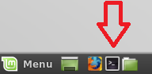
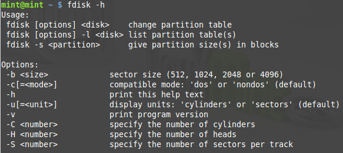
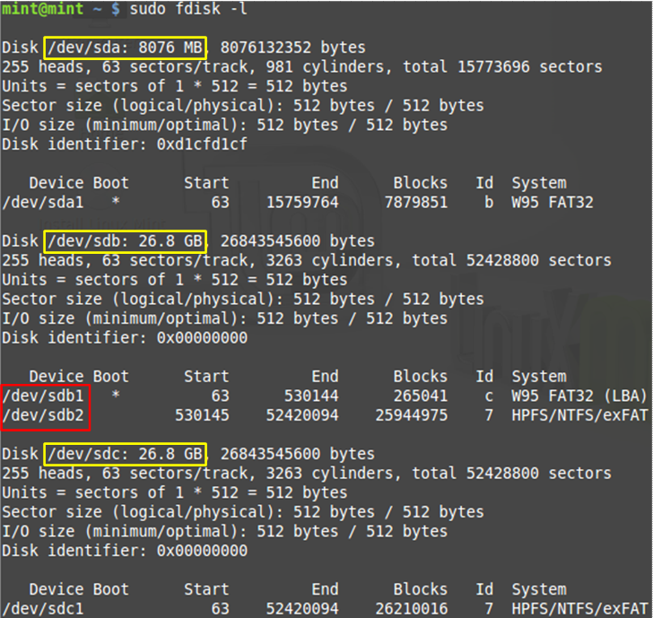
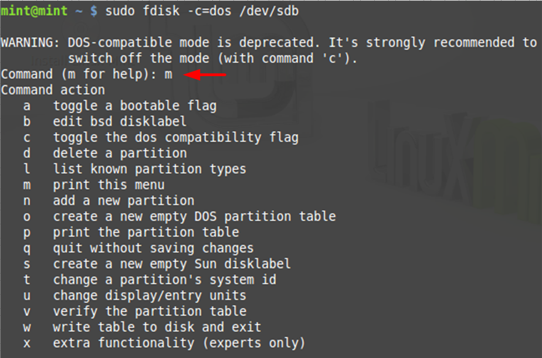
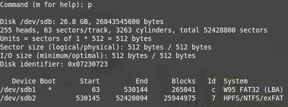
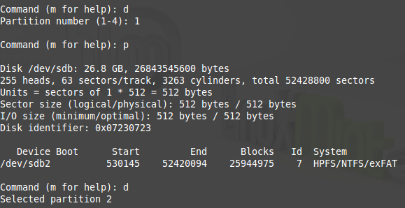
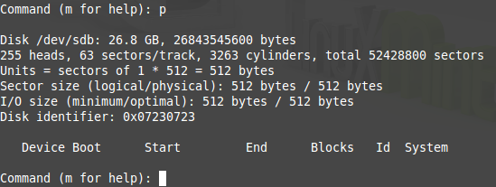
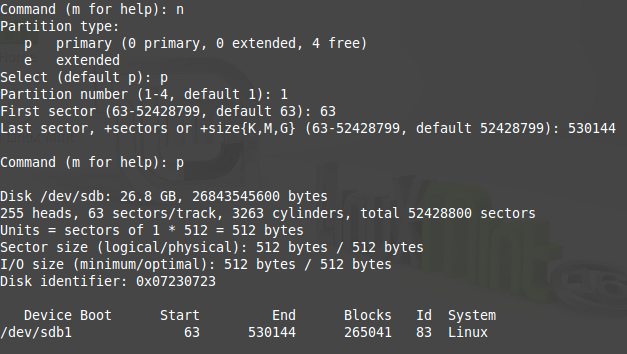
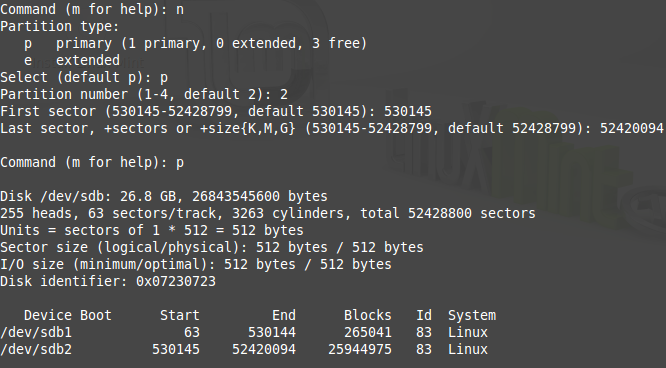
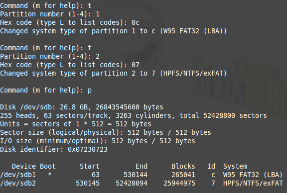
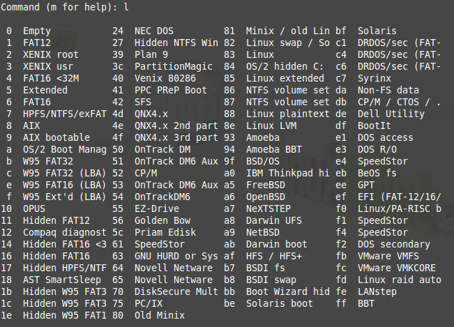
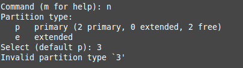
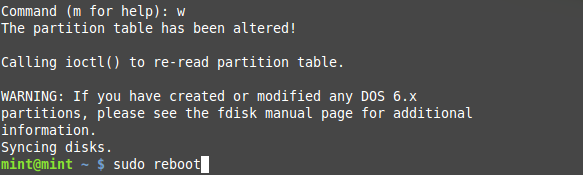
