Konfiguracija Windows 98 / Windows 7 dual boot sustava
======================================================

Za dodavanje slova WIN98 particije, potrebno je otići u Disk Management
konzolu, na jedan od tri predložena načina :

- Pritisnuti na tipku Start, te u Search prozor upisati "*diskmgmt*.msc"

- Pritisnuti na tipku Start , desni klik na Computer, te odabrati opciju
Manage. U konzoli odabrati opciju Disk Management ( kategorija Storage)

- Pritisnuti na tipku Start, te u Search prozor upisati "disk
management", te odabrati iz popisa "Create and format hard disk
partitions"

|image0|

Primijetiti kako u popisu particija (stupac sa imenom Volume, Volume
označava logički dio diska, odnosno particiju) WIN98 particija nema
pridruženo slovo.

|image1|

Desnom tipkom miša kliknuti na WIN98 particiju, te odabrati opciju
Change Drive Letter and Paths.

|image2|

Odabrati željeno slovo, no dovoljno je ostaviti preporučene vrijednosti,
i samo kliknuti OK.

|image3|

Nakon izvršenog postupka, uz ime WIN98 particije će se prikazati i
pridruženo slovo. U ovom trenutku će se pokrenuti i AutoPlay opcija (ako
nije isklučena) sa mogućnošću pristupa particiji, primijetiti promjenu u
Task Bar dijelu ekrana.

|image4|

Ponovno pokrenuti Windows Explorer aplikaciju, te ući u WIN98 particiju.
Primijetiti kako se nalazi samo jedna datoteka u popisu ( ako se u
jednom od prethodnih koraka nisu kopirale datoteke Volkov Commander
aplikacije, onda se neće prikazati niti jedna datoteka). Razlog tome je
što ostale datoteke imaju ili skriveni atribut (Hidden attribute) ili
predstavljaju sistemske datoteke (System attribute).

|image5|

Za prikaz svih datoteka, u prozoru Windows Explorer aplikacije odabrati
izbornik Organize, te opciju "Folder and search options".

|image6|

U otvorenom prozoru odabrati karticu View, te učiniti slijedeće radnje :

- **Uključiti** opciju "Show hidden files,folders, and drives"

- **Isključiti** opciju "Hide extensions for known file types"

- **Isključiti** opciju "Hide protected operating system files
(Recommended)" - Nakon odabira ove opcije, potrebno je još jednom
potvrditi odabir u novom prozoru. Primijetiti kako se zaštićenim
datotekama operacijskog sustava smatraju one datoteke koje imaju
aktivirane System i Hidden atribute.

|image7|

U prozoru kliknuti na tipke Apply te zatim OK, i pojaviti će se potpun
popis datoteka i direktorija koje se nalaze na WIN98 particiji.

|image8|

Datoteku BOOTSECT.BAK preimenovati u BOOTSECT.DOS, dakle samo zamijeniti
ekstenziju. U oba slijedeća prozora odgovoriti potvrdno ( jedan
upozorava na promjenu ekstenzije, dok drugi upozorava kako se mijenja
ime datoteke sa System atributom).

|image9|

|image10|

|image11|

Datoteku BOOT.INI preimenovati u BOOT.BAK2, a datoteku BOOT.BAK
preimenovati u BOOT.INI. Nakon izvršenih radnji, ponovno pokrenuti
računalo.

|image12|

U procesu pokretanja operacijskog sustava Windows 7, pojavljuje se
izbornik sa odabirom ( tzv. "Dual Boot" izbornik). U ovom koraku
odabrati "Earlier Version of Windows"

|image13|

Uvjeriti se kako se pojavila ljuska Windows 98 operacijskog sustava, što
znači da su uspješno obavljene radnje. U suprotnom, provjeriti točno
prethodne korake i ispraviti potrebno. Ponovno pokrenuti računalo (U
VirtualBox aplikaciji kombinacijom tipki CTRL + R), te odabrati Windows
7 u izborniku.

|image14|

Za posljednji skup radnji u postavkama Dual Boot procesa, potrebno je
izmijeniti naziv "Earlier Version of Windows" u izborniku u nešto
prepoznatljivije. Kliknuti na Start tipku, upisati **cmd,** te u popisu
kliknuti desnom tipkom miša na **cmd** ( Command Prompt) aplikaciju.
Odabrati opciju "Run as administrator".

|image15|

U slučaju da User Account Control (UAC) servis nije isključen, pojaviti
će se prozor u kojem je potrebno dodatno potvrditi željenu radnju.

|image16|

Postavke Boot Manager programa ( ugrađen od verzije Windows Vista
sustava) mijenjaju se standardno kroz aplikaciju **bcdedit** koja dolazi
sa operacijskim sustavom. Za početak samo pozvati aplikaciju naredbom
**bcdedit** bez dodatnih opcija, te proučiti prikazane informacije.

|image17|

Za promjenu imena prikazanog operacijskog sustava u Dual Boot izborniku,
potrebno je promijeniti objekt "**description**" (opis), i to u
**{ntldr}** (vitičaste zagrade) identifikatoru ( prisjetiti se što
**ntldr**, NT Loader, predstavlja). U opis upisati Razred ( bez točke
iza rednog broja) i Ime učenika-ce, kao što je prikazano u slijedećem
primjeru:

**Naredba** :

**bcdedit /set {ntldr} description "Razred\_Ime Windows 98"**

|image18|

Ovime je završena procedura instalacije i konfiguracije Dual Boot
sustava.

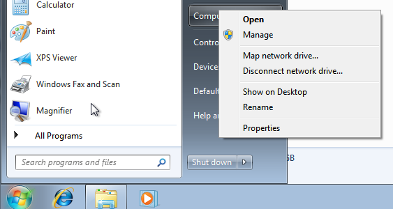
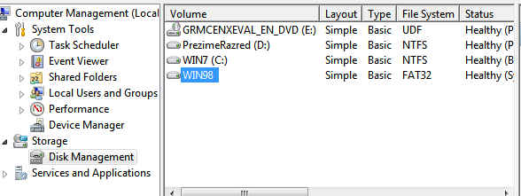
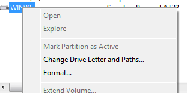
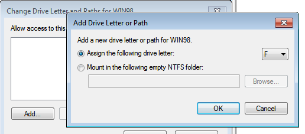
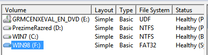
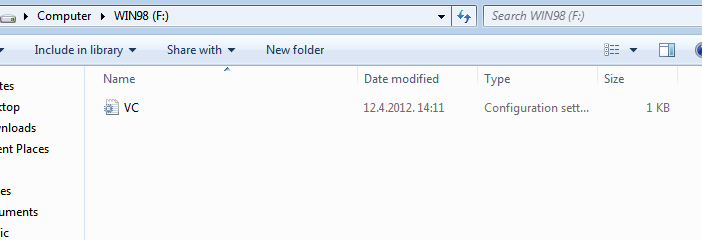
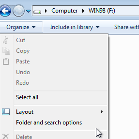
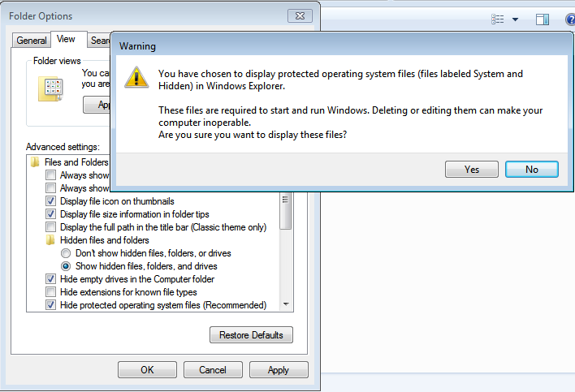
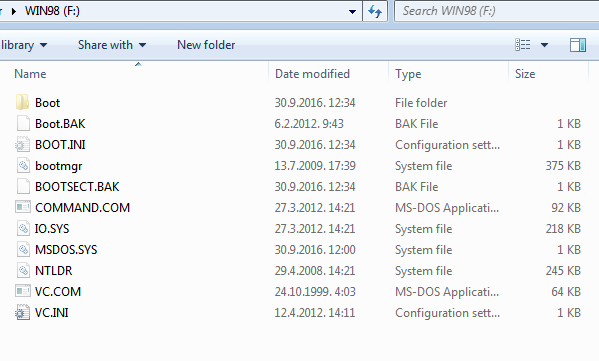
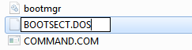
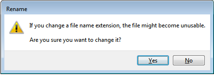
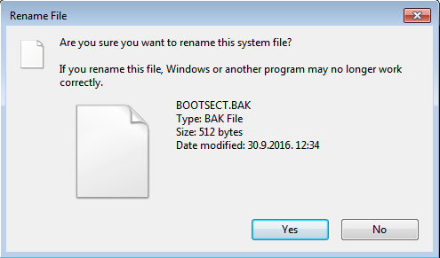
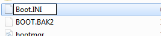
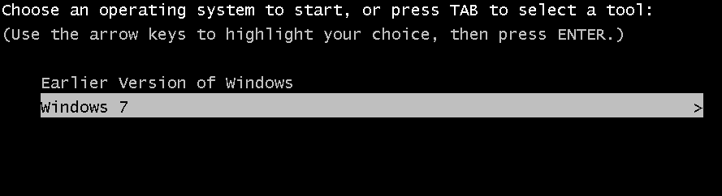
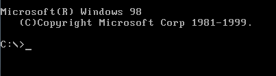
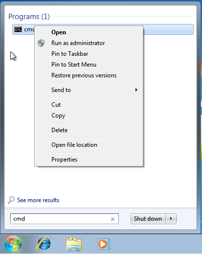
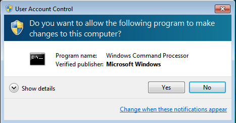
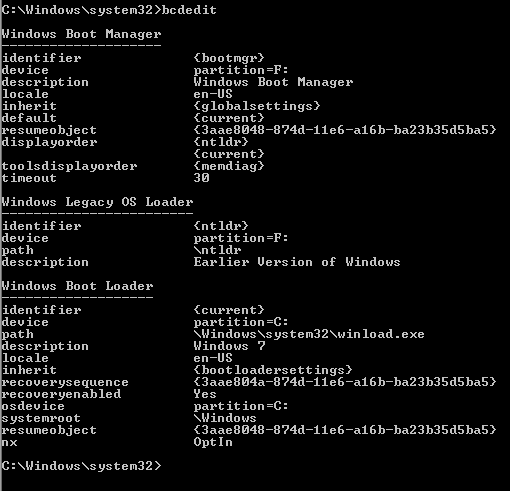
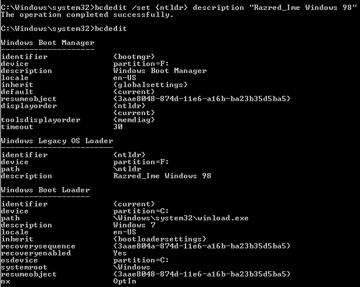
