11 - Instalacija Microsoft Windows 10 operacijskog sustava
===========================================================

Ugasiti virtualni stroj, te ponovno maknuti VMUDrive000.vmdk iz popisa.
Dodati ISO sliku Windows10 instalacije u virtualni CD-ROM uređaj
(Settings, kategorija Storage), na način da se odabere ikona CD-a sa
desne strane prozora, te kasnije opcija "Choose Virtual Optical Disk
File...". U otvorenom prozoru potrebno je navigirati do lokacije na
kojoj se nalazi ISO slika instalacijskog CD-a, te ju učitati.

|image0|

Pokrenuti virtualni stroj, te na samom početku pritisnuti tipku F12 i
odabrati podizanje sa CD-ROM uređaja (tipka **c**).

|image1|

Bilo kojom tipkom potvrditi pokretanje instalacije, kao odgovor na
slijedeću poruku:

|image2|

Pričekati završetak procesa učitavanja postupka za instalaciju.

|image3|

Nakon što se pojavilo grafičko sučelje instalacije, u prvom koraku je
potrebno odabrati jezik za instalaciju, postavku formata za prikaz
vremena, te odabir tipa tipkovnice. Odabrati opcije kao prema slijedećoj
slici:

|image4|

U slijedećem prozoru odabrati opciju "Install now".

|image5|

Potrebno je potvrditi uvjete licence za korištenje ovog operacijskog
sustava, te kliknuti na tipku Next za nastavak.

|image6|

U ovom prozoru se pojavljuju dvije mogućnosti:

-  "Upgrade" ako se na računalu nalazi neka prošla verzija Windows
   operacijskog sustava, te se želi instalirati novija verzija, no sa
   sačuvanim osobnim podacima i postavkama

-  Odabir "Custom" opcije ne čuva podatke na particiji, i instalira novu
   verziju operacijskog sustava

Odabrati **"Custom"** opciju.

|image7|

U slijedećem prozoru je potrebno odabrati lokaciju, odnosno particiju za
instalaciju Windowsa 10.

Potrebno je dobro obratiti pozornost na prikazane particije, te
usporediti informacije sa dokumentacijom. U laboratorijskim uvjetima je
slika nešto drugačija, i prikazana su "Unallocated" područja između
particija. Prisjetiti se kako se na računalima u laboratoriju nalazi
mnogo particija, te da "Unallocated" prostor samo znači da informacije o
particijama nisu unutar particijske tablice. U virtualnom računalu
potrebno je odabrati WIN10 particiju za instalaciju, a u laboratoriju onu
particiju koju zahtijeva zadatak laboratorijske vježbe.

|image8|

U slijedećem koraku je prikazan proces kopiranja datoteka operacijskog
sustava na tvrdi disk. Nakon završetka, operacijski sustav će biti
instaliran, i potrebno je konfigurirati par osnovnih postavki.

|image9|

Nakon ponovnog pokretanja računala, pojavljuje se prozor gdje je moguće
preskočiti provjeru integriteta podataka na disku. Ovdje se zapravo radi
o provjeri ispravnosti FAT32 particije. Potrebno je dopustiti provjeru
(ne preskočiti), jer će se poruka inače pojavljivati prilikom svakog
pokretanja operacijskog sustava.

|image10|

Zadnji korak same instalacije je pretraživanje uređaja u računalu, te
automatska instalacija upravljačkih programa za njih (ako je moguće).
Proces je automatski.

|image11|

Nakon završetka instalacijskog procesa, započinje proces osnovne
konfiguracije sustava. U ovom koraku se nude preporučene postavke
sustava (tipka "Express settings"), no potrebno je odabrati opciju gdje
će korisnik sam birati postavke koje želi, te je potrebno odabrati tipku
"Customize".

U kućnim uvjetima neke opcije je poželjno aktivirati (u svrhu
jednostavnijeg korištenja sustava), no za potrebe laboratorijskih
vježbi, sve opcije je potrebno isključiti. Razlog tomu je što se neke
opcije neće ni koristiti, a druge će korisnik sam aktivirati prema
potrebi. Na slijedećim slikama su prikazani svi koraci za isključivanje
opcija.

|image12|

|image13|

|image14|

|image15|

|image16|

Prijava na računalo je moguća na dva načina, koristeći online (nalazi se
u računalnom oblaku, eng. cloud, npr. Office365 račun) ili lokalni
korisnički račun (nalazi se ili lokalno na samom računalu, ili unutar
organizacije na lokalnom domenskom poslužitelju, kao centralizirani
pristup). Iako nije jasno naznačeno, za korištenje lokalno korisničkog
računa (koji će se nalaziti na samom računalu), potrebno je odabrati
opciju "Join a local Active Directory domain". U upisu je naznačeno kako
će se prvo stvoriti lokalni korisnički račun, te je zatim računalo
moguće povezati u domenu. Za potrebe ovih vježbi, računalo se neće
povezivati u domenu, već će se koristiti samo lokalni korisnički računi.

|image17|

U slijedećem prozoru, na virtualnom računalu potrebno je kao korisničko
ime upisati PrezimeIme učenika-ce, te lozinku korisnika (obvezno negdje
zapisati lozinku). Lozinku je potrebno zapamtiti jer bez nje neće biti
moguć pristup korisničkom računu.

|image18|

U slijedećem koraku nudi se aktivacija usluge Cortana. Sama usluga
imitira digitalnog osobnog asistenta kojem je moguće zadati naredbe za
postavljanje alarma, reproduciranje glazbe, dobivanje informacija o
vremenskoj prognozi. S obzirom da se naredbe uglavnom zadaju glasom, te
usluga zahtjeva pristup osobnim informacijama i navikama korisnika, neće
se koristiti za potrebe laboratorijskih vježbi te je potrebno isključiti
uslugu.

|image19|

Proces osnovne konfiguracije sustava je završio te će se prikazati
zasloni prijave korisnika, te automatske instalacije nadogradnji
sustava.

|image20|

|image21|

|image22| |image23|

Krajnji korak je dopustiti računalu da bude pronađeno unutar lokalne
računalne mreže.

|image24|

Za postizanje "dual boot" sustava između TinyCore linux distribucije i
Windows 10 sustava, potrebno je izvršiti dodatnje radnje. Pokrenuti
Windows Explorer aplikaciju ( WIN tipka + E kombinacija), te primijetiti
popis prikazanih particija. Particija sa Windows10 instalacijom će
uvijek biti C: particija. Uočiti da nije prikazana TinyCore Linux
particija. Windows 10 neće automatski podignuti ( i dodati joj slovo)
particiju na kojoj se nalazi FAT32 datotečni sustav, te je potrebno to
učiniti ručno.

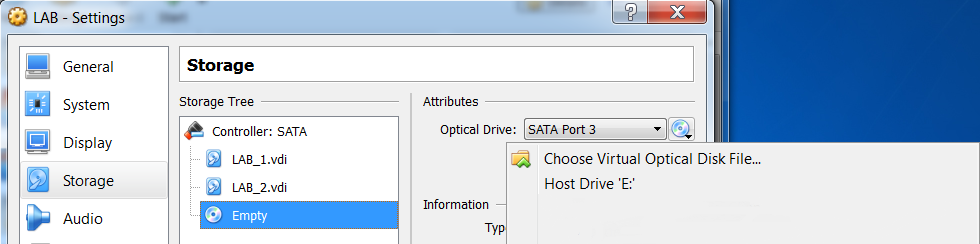
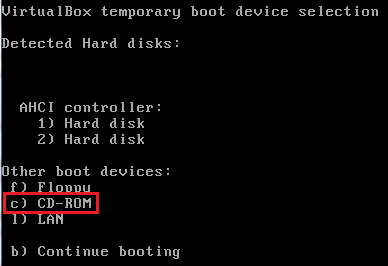
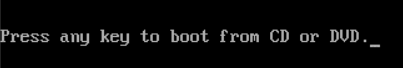
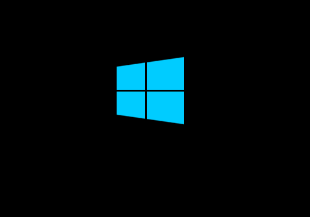
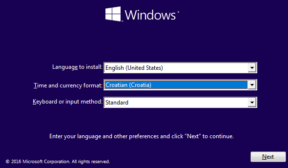
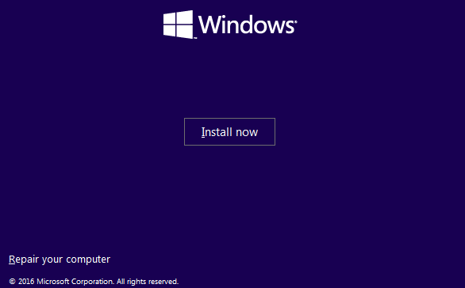
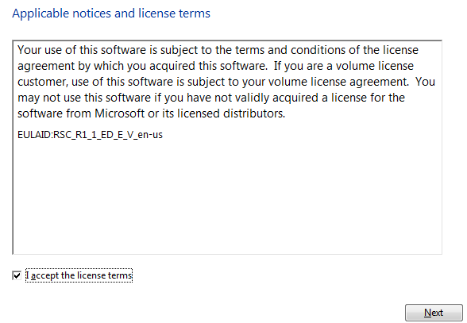
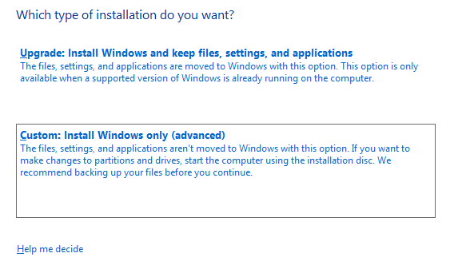
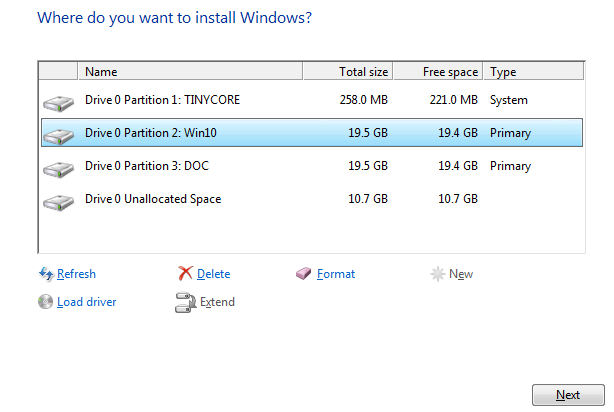
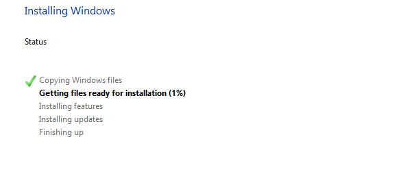
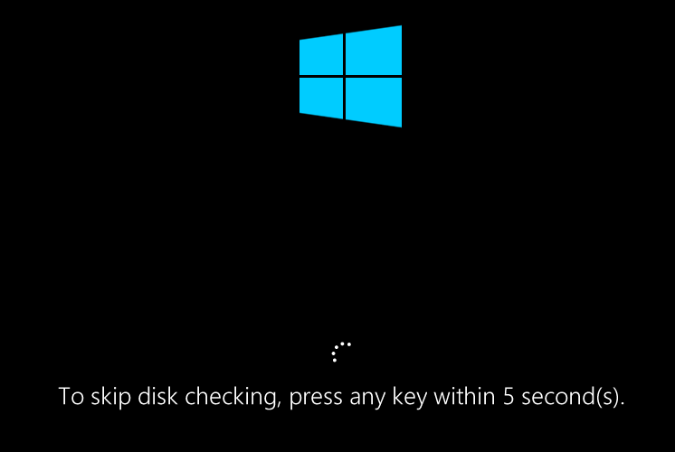
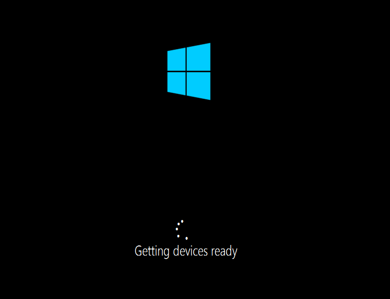
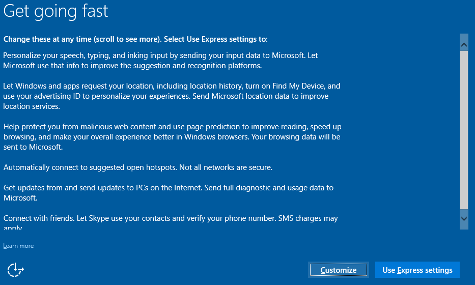
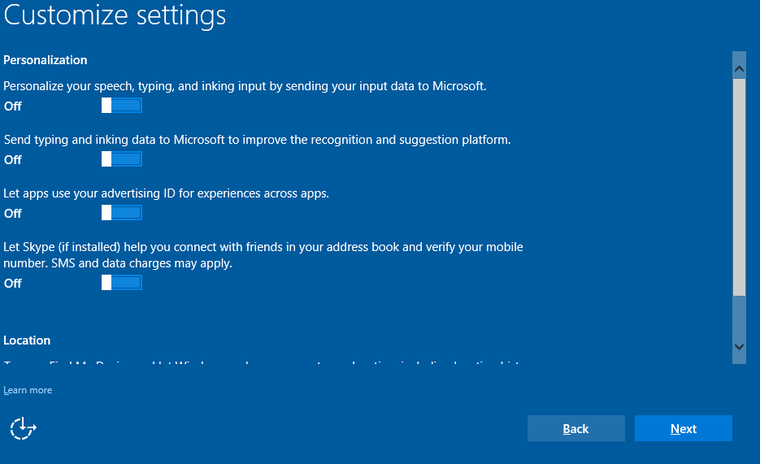
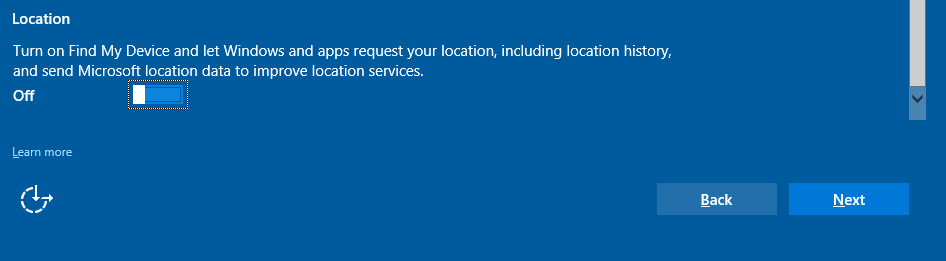
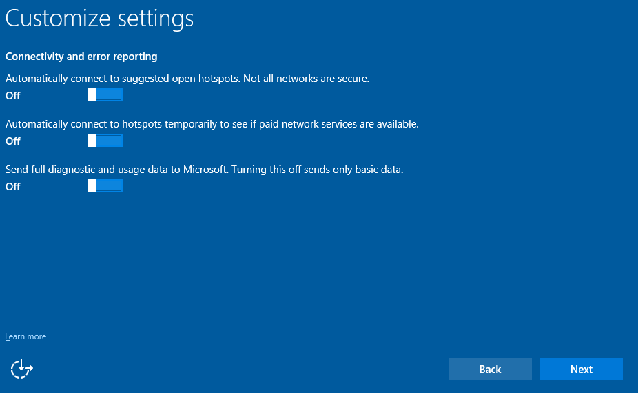
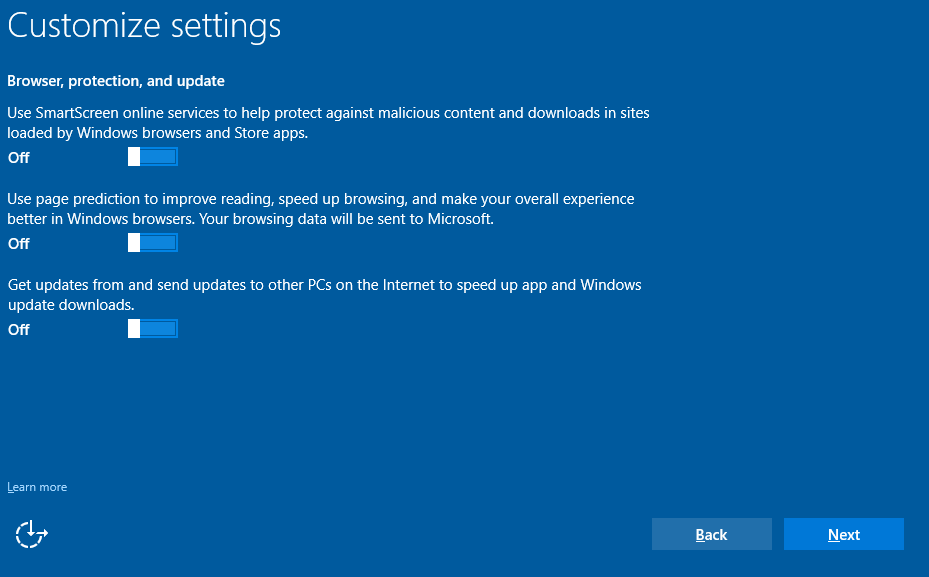
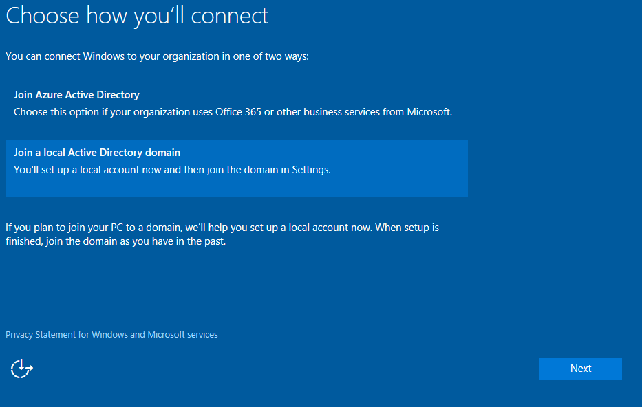
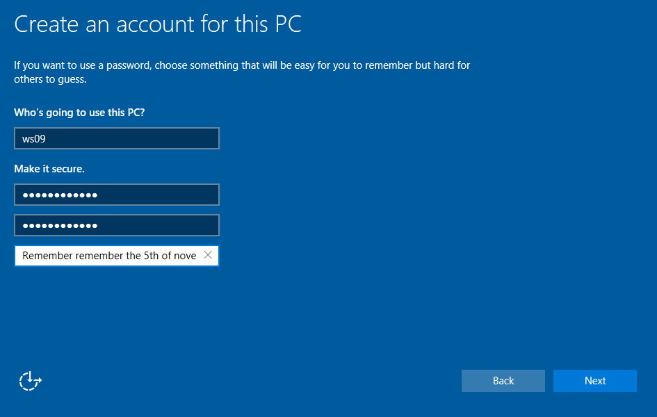
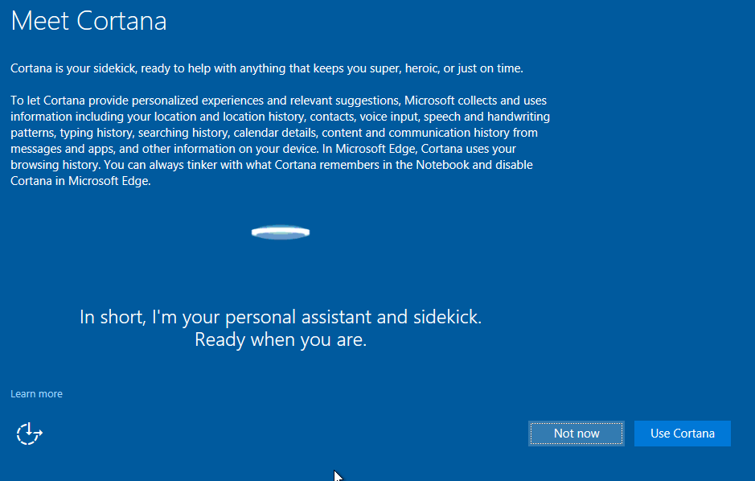
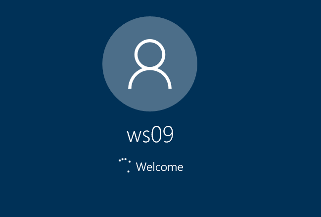

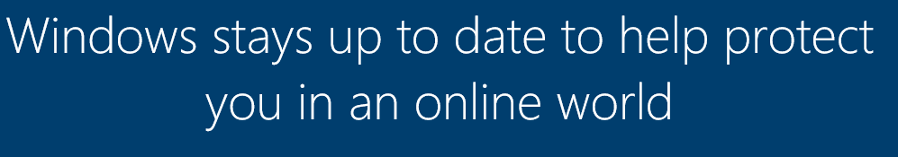

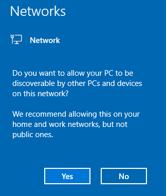
