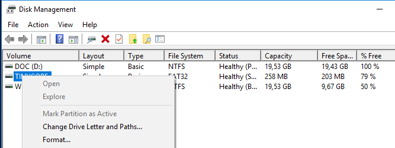

12 - Konfiguracija TinyCore Linux / Windows 10 dual boot sustava
=================================================================

Za dodavanje slova TinyCore particije, potrebno je otići u Disk
Management konzolu, na jedan od tri predložena načina :

    - Desnim klikom na Start tipku pojavljuje se izbornik sa raznim opcijama. Potrebno je odabrati opciju **Disk Management**

    - Pritisnuti na tipku Start, te u Search prozor upisati "*diskmgmt*.msc"

    - Pritisnuti na tipku Start, te u Search prozor upisati "disk management", te odabrati iz popisa "Create and format hard disk partitions"

|image0|

Primijetiti kako u popisu particija (stupac sa imenom Volume, Volume
označava logički dio diska, odnosno particiju) TinyCore particija nema
pridruženo slovo.

Desnom tipkom miša kliknuti na WIN98 particiju, te odabrati opciju
Change Drive Letter and Paths.

|image1|

Odabrati željeno slovo, no dovoljno je ostaviti preporučene vrijednosti,
i samo kliknuti OK.

|image2|

Nakon izvršenog postupka, uz ime TinyCore particije će se prikazati i
pridruženo slovo. U ovom trenutku će se pokrenuti i AutoPlay opcija (ako
nije isklučena) sa mogućnošću pristupa particiji, primijetiti promjenu u
Task Bar dijelu ekrana.

|image3|

Ponovno pokrenuti Windows Explorer aplikaciju, te ući u TinyCore
particiju. Primijetiti kako se nalazi mali broj datoteka i direktorija u
popisu. Razlog tome je što ostale datoteke imaju ili skriveni atribut
(Hidden attribute) ili predstavljaju sistemske datoteke (System
attribute).

Za prikaz svih datoteka, u prozoru Windows Explorer aplikacije odabrati
izbornik File, te opciju "Change folder and search options".

|image4|

U otvorenom prozoru odabrati karticu View, te učiniti slijedeće radnje :

- **Uključiti** opciju "Show hidden files,folders, and drives"

- **Isključiti** opciju "Hide extensions for known file types"

- **Isključiti** opciju "Hide protected operating system files
(Recommended)". Nakon odabira ove opcije, potrebno je još jednom
potvrditi odabir u novom prozoru. Primijetiti kako se zaštićenim
datotekama operacijskog sustava smatraju one datoteke koje imaju
aktivirane System i Hidden atribute.

|image5|

|image6|

U prozoru kliknuti na tipke Apply te zatim OK, i pojaviti će se potpun
popis datoteka i direktorija koje se nalaze na TinyCore particiji.

|image7|

Datoteku BOOTSECT.BAK preimenovati u linux.bst, kao pamtljivu oznaku da
se radi o Linux BootSectoru. U oba slijedeća prozora odgovoriti potvrdno
( jedan upozorava na promjenu ekstenzije, dok drugi upozorava kako se
mijenja ime datoteke sa System atributom).

|image8|

Za posljednji skup radnji u postavkama Dual Boot procesa, potrebno je
ručno dodati stavku u boot izborniku Windows10 operacijskog sustava.
Kliknuti na Start tipku, upisati **cmd,** te u popisu kliknuti desnom
tipkom miša na **cmd** ( Command Prompt) aplikaciju. Odabrati opciju
"Run as administrator".

|image9|

U slučaju da User Account Control (UAC) servis nije isključen, pojaviti
će se prozor u kojem je potrebno dodatno potvrditi željenu radnju.

Postavke Boot Manager programa ( ugrađen od verzije Windows Vista
sustava) mijenjaju se standardno kroz aplikaciju **bcdedit** koja dolazi
sa operacijskim sustavom. Za početak samo pozvati aplikaciju naredbom
**bcdedit** bez dodatnih opcija, te proučiti prikazane informacije.

|image10|

Prije bilo kakve promjene u postavkama, dobro je spremiti pričuvnu
kopiju BCD Store strukture. Na **Windows boot** particiji (uobičajeno se
u korijenskom direktoriju te particije nalaze direktorij **Boot** i
datoteka **bootmgr**). Potrebno je prvo u korijenskom direktoriju te
particije stvoriti neki direktorij (u ovom slučaju ime direktorija je
**bcdbackup** ). Zatim se kao u slijedećem primjeru upisuje naredba za
spremanje pričuvne kopije. U slučaju bilo kakve pogreške u daljnjim
koracima, uvijek postoji originalna konfiguracijska datoteka kojom se
može vratiti prvobitno stanje **boot** konfiguracije

|image11|

Za dodavanje nove stavke u Boot izborniku, potrebno je upisati slijedeći
niz naredbi i opcija:

|image12|

Objašnjenje svake opcije:

-  **/create** stvara novu stavku

-  **/d** je oznaka za "description" odnosno opis stavke, tj. prikaz u
   Boot izborniku

-  **/application** je metoda pokretanja sustava, odnosno ukazuje na to
   gdje će se nalaziti bootloader (mali program zadužen za učitavanje
   operacijskog sustava) operacijskog sustava. U ovom slučaju se radi o
   programu zapisanom u boot sector, koji je spremljen u datoteci
   preimenovanoj u prošlom koraku (linux.bst).

Rezultat naredbe će biti stvorena stavka u boot izborniku. Potrebno je
označiti i kopirati generirani niz znakova nakon izvršenja procesa.
Ponovnim pozivom naredbe **bcdedit** može se primijetiti kako stavka još
nije prikazana u strukturi. Razlog tomu je što još nisu definirani
objekti unutar nje, koji će se definirati u slijedećem koraku.

|image13|

U prva dva koraka se definira particija na kojoj će se nalaziti
**bootloader** željenog TinyCore Linux operacijskog sustava, te sama
putanja i ime datoteke. Preostaje još odabrati mjesto u boot izborniku
(u ovom slučaju bit će na posljednjem mjestu). Kao dodatak može se
definirati vrijeme koje će se čekati prije nego se počne pokretati
predodređeni (eng. default) operacijski sustav.

Nakon što su sve bitne stavke definirane, pozivom naredbe **bcdedit**
bit će prikazana i novostvorena stavka.

|image14|

Prilikom slijedećeg ponovnog pokretanja računala, pojavljuje se boot
izbornik sa dvije stavke. Primijetiti kako se TinyCore Linux stavka
nalazi na posljednjem mjestu.

|image15|

.. |image4| image:: SKmedia12a/image5.png
   :width: 6.30000in
   :height: 2.65316in

.. |image11| image:: SKmedia12a/image12.png
   :width: 4.27083in
   :height: 0.24533in
.. |image12| image:: SKmedia12a/image13.png
   :width: 5.33333in
   :height: 0.39583in

