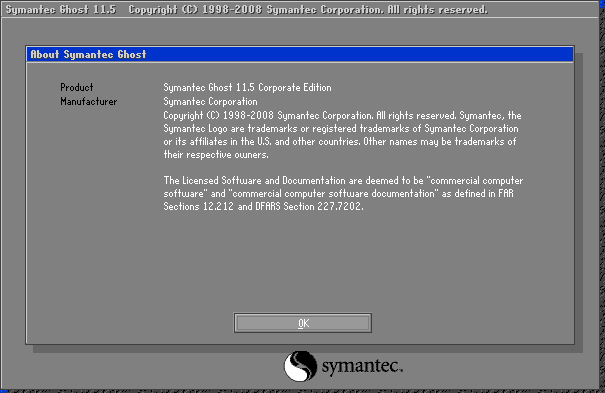
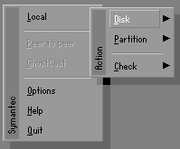

12 - Spremanje/Vraćanje pričuvne kopije Windows 10 sustava – Symantec Ghost
===========================================================================

Nakon instaliranih operacijskih sustava i konfiguriranog "**dual boot**"
sustava potrebno je spremiti pričuvne kopije podataka sa obje particije.
U tu svrhu će se koristiti **Symantec Ghost** aplikacija.

Potrebno je imati na umu strukturu particija na uređajima za pohranu
kako bi snalaženje u aplikaciji Ghost bilo lakše.

|image0|

U konfiguraciji virtualnog računala nalaze se dva tvrda diska. Prvi
tvrdi disk je podijeljen na dvije particije (**TinyCore + WIN10**
operacijski sustavi) dok se na drugom tvrdom disku nalazi jedna
particija (**PrezimeRazred**), i ona je namijenjena za pohranu pričuvnih
kopija i ostalih podataka.

Na trećoj particiji potrebno je stvoriti novi direktorij u kojem će biti
spremljene pričuvne kopije operacijskih sustava, te u njega kopirati
izvršne datoteke **Symantec Ghost** aplikacije (nalaze se u **GHOST**
direktoriju na USB pogonu).

Pokrenuti virtualno računalo sa priključenim USB pogonom (prema
prethodnim uputama). U **Multiboot** izborniku odabrati "**Other OS and
Tools**", te zatim "**Hiren's Boot CD**" stavku. Pojaviti će se
slijedeći izbornik te je u njemu potrebno odabrati "**Mini Windows XP**"
opciju. Radi se o "live" verziji Windows XP operacijskog sustava sa
integriranim raznim administrativnim alatima.

Nakon učitavanja "**Mini Windows XP**" sustava, pojaviti će se radna
površina. Pokrenuti aplikaciju Windows Explorer (ili preko ikone na
površini ili kombinacijom tipki WIN + E).

|image1|

Iz popisa prikazanih particija ponekad je teže zaključiti koja je
particija učitana pod kojim slovom (oznake particija pomažu ako se mogu
prepoznati) :

|image2|

Kao dodatnu pomoć za snalaženje, moguće je pokrenuti "**Disk
Management**" konzolu ( Tipka Start –> Programs –> Disk Management )

|image3|

U grafičkom prikazu, sad je moguće prepoznati 3 uređaja, od kojih je
prvi USB pogon.

Particija koja će služiti za spremanje pričuvnih kopija operacijskih
sustava učitana je pod slovom **E:** u ovom slučaju.

Stvoriti direktorij imena "**IMAGE**" u korijenskom direktoriju te
particije, te prekopirati izvršne datoteke Symantec Ghost paketa
aplikacija u stvoreni direktorij.

|image4|

Opis datoteka u direktoriju :

-  **GHOST.EXE** – Symantec Ghost aplikacija namijenjena za DOS
   okruženje

-  **GHOST32.EXE** – Symantec Ghost aplikacija namijenjena za Windows
   okruženje

-  **GHOSTEXP.EXE** – Aplikacija za pregled pričuvnih kopija u obliku
   strukture direktorija

**UVOD U SYMANTEC GHOST APLIKACIJU**

Pokrenuti **GHOST32.EXE** aplikaciju. U svim slijedećim koracima
poželjno je koristiti isključivo tipkovnicu jer je lakše izvršavati
postupke i manja mogućnost pogreške.

Prvi ekran koji će se prikazati nakon pokretanja aplikacije je prozor sa
osnovnim informacijama o proizvodu i verziji.

|image5|

Primijetiti kako je tipka "**OK**" označena sa bijelim slovima. To znači
kako je ta tipka trenutno aktivna ( informacija je bitna za kasnije
korake). Dovoljno je tipkom Enter potvrditi i prozor će se zatvoriti.

Prikazati će se osnovni izbornik (primijetiti koja je tipka označena sa
bijelim slovima) :

|image6|

Kretanje kroz izbornike se postiže navigacijskim tipkama, te je za
otvaranje podizbornika dovoljno pritisnuti tipku za navigaciju udesno (
u ovom slučaju tipke Enter ili razmaknica će postići isti rezultat)

Podizbornik je podijeljen na 3 osnovne kategorije : **Disk**,
**Partition** i **Check**.

|image7|

**DISK KATEGORIJA**

U **Disk** kategoriji nalaze se opcije za operacije koje se tiču
kompletnih tvrdih diskova. Jedna od popularnijih opcija koja danas ima
popularan termin "**Disk clonning**" ( kloniranje diskova) u ovom
kontekstu se zove "**Local Disk – To Disk**" ( obratiti pozornost na
način čitanja željenih funkcija). Radi se o postupku prebacivanja
sadržaja kompletnog tvrdog diska ( bez obzira na broj particija) na neki
drugi tvrdi disk.

S druge strane , postoje opcije "**Local Disk – To Image**" i "**Local
Disk – From Image**". U prvoj opciji, sadržaj kompletnog tvrdog diska se
sprema u neku odredišnu datoteku. U ovom postupku je bitno napomenuti
kako zadana ( eng. default) opcija spremanja u datoteku sprema samo
koristan sadržaj na disku, odnosno ne sprema se sektor-po-sektor.
Rezultat takvog načina spremanja znači kako će pričuvna kopija biti
velika onoliko koliko je koristan sadržaj na tvrdom disku. U suprotnoj
situaciju, operacija sektor-po-sektor će spremati ukupan broj sektora
koji se nalaze na tvrdom disku, odnosno pričuvna kopija će biti velika
onoliko kolika je ukupna veličina tvrdog diska.

|image8|

**Primjer:**

Kada bi se koristila sektor-po-sektor metoda spremanja pričuvne kopije
tvrdog diska na kojem se nalaze particije TinyCore i WIN10 (prisjetiti se
strukture), ukupna veličina te datoteke bi u ovom slučaju bila 25GB bez
obzira kolika je popunjenost prostora na tom tvrdom disku. Često se
takav način spremanja zove i "**sirov**" ( eng. **raw**) jer nije
implementirana nikakva inteligentna logika i prostor diska se kopira
doslovno bez obzira na količinu korisnog sadržaja.

Za razliku od prve metode, zadana postavka **Ghost** aplikacije će biti
spremanje pričuvne kopije tvrdog diska na inteligentan način, odnosno
veličina pričuvne kopije će ovisiti o popunjenosti tvrdog diska korisnim
podacima, i stupnju kompresije prilikom spremanja te pričuvne kopije. U
slijedećem primjeru su prikazane tri pričuvne kopije koje sadrže podatke
prvog tvrdog diska, na kojem se nalaze particije TinyCore i WIN10 sa
stvorenim datotečnim sustavima (FAT32 i NTFS), no u ovom trenutku
nijedan operacijski sustav na njima, niti se ne nalazi nijedna
datoteka/direktorij na njima, odnosno, mogu se smatrati praznima.
Datoteke se razlikuju u veličini, gdje se može jasno primijetiti utjecaj
na odabir razine kompresije prilikom stvaranja pričuvne kopije, odnosno
odabira "**sektor-po-sektor**" metode.

|image9|

**NAPOMENA: NIJEDNA OD OVIH OPCIJA NEĆE SE KORISTITI ZA POTREBE
LABORATORIJSKIH VJEŽBI, VEĆ SU OPISANE U SVRHU INFORMACIJA**

**PARTITION KATEGORIJA**

|image10|

U **Partition** kategoriji nalaze se opcije za operacije koje se tiču
individualnih particija koje se nalaze na tvrdim diskovima.

Opcija "**Local Partition – To Partition**" označava proces kloniranja
kompletnog sadržaja jedne particije na drugu particiju.

Opcija "**Local Partition – To Image**" označava proces spremanja
kompletnog sadržaja jedne particije u pričuvnu datoteku, odnosno izrada
pričuvne kopije. Popularan termin za ovaj proces naziva se u engleskom
jeziku "Backup image".

Opcija "**Local Partition – From Image**" označava proces vraćanja
sadržaja iz neke pričuvne datoteke na odredišnu particiju. Popularan
termin za ovaj proces naziva se u engleskom jeziku "**Restore image**".

**Zadnje dvije opcije ( "Local Partition – To Image" i "Local Partition
– From Image" ) su jedine dvije opcije potrebne poznavati za potrebe
laboratorijskih vježbi.**

**CHECK KATEGORIJA**

U Check kategoriji nalaze se opcije za provjeru integriteta sadržaja na
tvrdom disku ili pričuvnoj kopiji tvrdog diska/particije.

|image11|

**SPREMANJE PRIČUVNE KOPIJE PARTICIJA (BACKUP)**

Biti će opisani postupci za spremanje **TinyCore** i **WIN10** particija.

Iz **IMAGE** direktorija na trećoj particiji (**PrezimeRazred** u ovom
slučaju) pokrenuti **ghost32.exe** aplikaciju.

Preporuka je koristiti isključivo tipkovnicu za upravljanje aplikacijom.
Navigirati do izbornika **Local -> Partition -> To Image**, te potvrditi
odabranu opciju (tipka Enter).

Kao na slijedećoj slici, biti će prikazan popis svih prepoznatih uređaja
za pohranu, koji se sastoji od USB pogona ( **Drive1**, može se
prepoznati po veličini uređaja), dva tvrda diska ( **Drive2** i
**Drive3**), te na kraju opcija ukupnog zbroja svih prepoznatih
particija (one koje se nalaze u particijskim tablicama na uređajima) na
svim uređajima za pohranu (**OS Volumes**).

U ovom koraku je potrebno odabrati lokaciju particije čiji sadržaj se
želi spremiti (**izvor** ili na engleskom jeziku "**source**"). Od sve 4
opcije, samo **Drive2** ili **Drive3** ulaze u mogućnost na kojima se
nalazi particija. U ovom slučaju **Drive2** je tvrdi disk na kojem se
nalaze **TinyCore** i **WIN10** particije, te je potrebno i odabrati tu
opciju.

|image12|

U slijedećem koraku potrebno je odabrati željenu particiju iz popisa.
Primijetiti kako je opcija OK trenutno onemogućena. Pozicionirati se na
**TinyCore** particiju, te aktivirati odabir (tipka Enter). Opcija OK će se
u omogućiti, te je potrebno odabrati tu opciju ( jednom pritisnuti tipku
TAB).

|image13|

Na slijedećoj slici može se primijetiti kako je opcija OK aktivirana i
odabrana, te je dovoljno potvrditi odabir (tipka Enter).

|image14|

U slijedećem prozoru može se uočiti particija, i puna putanja na koju će
biti spremljena pričuvna kopija ( Current path na donjem dijelu
prozora). U ovom trenutku je dovoljno samo početi upisivati ime pričuvne
kopije particije **TinyCore** ( za ovaj primjer će biti upisano ime
**TinyCorecore**, u kojem oznaka "**core**" označava samo particiju na
kojoj je instaliran operacijski sustav, bez dodanih upravljačkih
programa ili aplikacija).

|image15|

U slijedećem koraku potrebno je odabrati razinu kompresije prilikom
stvaranja pričuvne kopije, odabrati opciju visoke kompresije (eng.
**High**). Ispod prozora može se još jednom provjeriti ispravnost
odabira:

**SOURCE PARTITION**

**Type:c [Fat32], 258MB, 1MB used, TinyCore from local drive [2], 25600MB**

Izvorišna particija se nalazi na drugom tvrdom disku (Local
Drive2,veličina disk 25600 MB), veličina particije 258MB (zauzeće
particije 1MB), tip datotečnog sustava particije FAT32 (oznaka u
heksadecimalnom obliku 0C), oznaka particije je TinyCore

**DESTINATION FILE**

**Local file E:\\IMAGE\\TinyCorecore**

Puna putanja i ime datoteke u koju će se spremiti pričuvna kopija
sadržaja izvorišne particije

|image16|

Potvrditi postupak stvaranja pričuvne kopije particije.

|image17|

Nakon stvaranja pričuvne kopije, pojavit će se poruka o uspješno
obavljenom postupku, te odabrati opciju **Continue**. Nakon odabira,
pojaviti će se početni izbornik **Symantec Ghost** aplikacije.

|image18|

Isti postupak ponoviti za spremanje **WIN10** particije ( ime datoteke
pričuvne kopije **WIN10core**).

|image19|

**VRAĆANJE PRIČUVNE KOPIJE PARTICIJA (RESTORE)**

Biti će opisani postupci za vraćanje sadržaja pričuvnih kopija na TinyCore
i WIN10 particije.

Iz **IMAGE** direktorija na trećoj particiji (**PrezimeRazred** u ovom
slučaju) pokrenuti **ghost32.exe** aplikaciju.

Preporuka je koristiti isključivo tipkovnicu za upravljanje aplikacijom.
Navigirati do izbornika **Local -> Partition -> From Image**, te
potvrditi odabranu opciju (tipka Enter).

Iz popisa svih pričuvnih kopija (u ovom slučaju **TinyCorecore.gho** i
**WINDOWS10core.gho**) prvo odabrati **TinyCorecore.gho** (U toj datoteci
nalazi se spremljen sadržaj **TinyCore** particije).

Prikazat će se informacije sadržaja **TinyCorecore.gho** pričuvne kopije.
Aplikacija je prepoznala kako se u datoteci nalazi particija oznake
**TinyCore**, veličine 258MB (zauzeće particije 1MB) te FAT32 datotečnog
sustava. Još jednom provjeriti radi li se o ispravnim podacima, i
potvrditi odabir (tipka Enter).

|image20|

Na slijedećoj slici je potrebno odabrati odredišni tvrdi disk na kojem
se nalazi particija koja će se obnoviti. Radi se o tvrdom disku iz
prošlog primjera spremanja pričuvne kopije particije (**Drive2**).

|image21|

Nakon odabira odredišnog tvrdog diska, potrebno je odabrati odredišnu
particiju koja se nalazi na tom disku, na koju će se vratiti sadržaj iz
pričuvne kopije. Odabrati **TinyCore** particiju i potvrditi odabir (tipka
Enter).

|image22|

Provjeriti još jednom informacije odabranih postupaka, i potvrditi
vraćanje sadržaja pričuvne kopije na particiju.

|image23|

Informacije će biti obrnutog redoslijeda u odnosu na spremanje pričuvne
kopije :

**SOURCE PARTITION**

**Type:c [FAT32], 258MB, 1MB used, TinyCore, from Local file
E:\\IMAGE\\TinyCorecore.GHO, 25600MB**

U pričuvnoj datoteci na punoj putanje E:\\IMAGE\\TinyCorecore.gho nalaze se
informacije o spremljenoj particiji : veličina particije 258MB (zauzeće
particije 1MB), tip datotečnog sustava particije FAT32 (oznaka u
heksadecimalnom obliku 0C), oznaka particije je TinyCore

**DESTINATION FILE**

**Type:b [FAT32], 258MB from Local drive [2], 25600MB**

Odredišna lokacija na koju će se raspakirati sadržaj pričuvne kopije
(TinyCorecore.gho) je particija na drugom tvrdom disku (Drive2 veličine
25600MB), veličina particije je 258MB, oznaka datotečnog sustava je
FAT32

Nakon vraćanja pričuvne kopije, pojavit će se poruka o uspješno
obavljenom postupku, te odabrati opciju Continue. Nakon odabira,
pojaviti će se početni izbornik Symantec Ghost aplikacije. Izaći iz
aplikacije.

|image24|

Ovime je završena procedura spremanja i vraćanja pričuvne kopije
particija na tvrdom disku.

.. |image2| image:: SKmedia12b/image3.png
   :width: 1.98681in
   :height: 1.42847in

.. |image6| image:: SKmedia12b/image7.png
   :width: 1.24653in
   :height: 1.68819in

.. |image9| image:: SKmedia12b/image10.png
   :width: 5.94792in
   :height: 1.11458in
.. |image10| image:: SKmedia12b/image11.png
   :width: 3.20833in
   :height: 1.73958in
.. |image11| image:: SKmedia12b/image12.png
   :width: 3.19792in
   :height: 1.78125in

.. |image13| image:: SKmedia12b/image14.png
   :width: 5.72917in
   :height: 2.25000in
.. |image14| image:: SKmedia12b/image15.png
   :width: 5.75000in
   :height: 2.25000in

.. |image17| image:: SKmedia12b/image18.png
   :width: 3.70833in
   :height: 1.44792in

.. |image19| image:: SKmedia12b/image20.png
   :width: 4.73958in
   :height: 2.94792in
.. |image20| image:: SKmedia12b/image21.png
   :width: 4.49250in
   :height: 1.57480in
.. |image21| image:: SKmedia12b/image22.png
   :width: 5.50764in
   :height: 2.11389in

.. |image23| image:: SKmedia12b/image24.png
   :width: 4.58333in
   :height: 2.77292in
.. |image24| image:: SKmedia12b/image25.png
   :width: 3.69722in
   :height: 1.46944in
