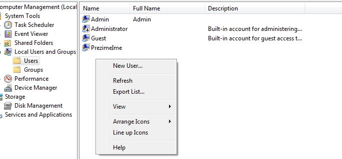

14 - Upravljanje korisničkim računima u Windows 10 operacijskom sustavu
=======================================================================

Korisnički račun je skup raznih postavki i informacija koje govore
operacijskom sustavu kojim datotekama i direktorijima smije taj korisnik
pristupiti, kojim mrežnim objektima ima pristup, kako izgleda okruženje
radne površine, itd. Pomoću korisničkog računa omogućen je pristup i rad
na operacijskom sustavu.

Osnovni atributi nekog korisničkog računa su:

-  Korisničko ime

-  Lozinka

-  Korisnička grupa kojoj pripada (može pripadati u više grupa odjednom)

-  Tip korisničkog računa ( Administrator, Standardni korisnik, Gost)

Prilikom stvaranja svakog korisničkog računa, stvara se i njegov
jedinstveni identifikacijski broj, **SID** (eng. **Security
IDentifier**), te se sve odluke o pravima pristupa nekom objektu
postavljaju prema tom broju, a ne prema korisničkom imenu (o pravima
korisnika nešto kasnije). Pravilo je da **SID** nekog sigurnosnog
objekta ( računalo, korisnik, grupa) mora biti jedinstven u mreži ili
domeni. Iznimku tog pravila predstavljaju računi koji imaju isti **SID**
na svim instalacijama Windows operacijskog sustava kao što su :
**Everyone**, **System** , **Builtin**, itd.

Prilikom svake nove instalacije operacijskog sustava stvara se
jedinstveni **SID**. Struktura **SIDa** je opisana u slijedeća 4
primjera:

-  standardni **Administrator** korisnički račun ( stvara se prilikom
   instalacije sustava , te je automatski onemogućen nakon stvaranja)

-  prvi korisnički račun stvoren od strane korisnika tokom instalacije
   (automatski nasljeđuje administratorska prava, dakle prvi
   administratorski račun u sustavu)

-  **SYSTEM** korisnički račun ( stvara se prilikom instalacije sustava
   , ima najviše privilegije od svih računa, no radi se o specijalnom
   računu, neće biti detaljno obrađen u ovom dokumentu)

-  **Everyone** korisnički račun (predstavlja svakog korisnika na
   sustavu, vrijedi globalno, SID je identičan na svim instalacijama na
   svijetu)

**Administrator**

**SID** : S-1-5-21-2642376952-1522586937-214818887-500

**Korisnik1 (samo primjer korisničkog imena)**

**SID** : S-1-5-21-2642376952-1522586937-214818887-1000

**SYSTEM**

**SID** : S-1-5-18

**Everyone**

**SID** : S-1-1-0

S - Slovo koje označava kako je slijedeći niz znakova zapravo SID

1 - Revizija (verzija) SIDa, zasad se uvijek radi o vrijednosti 1

5 - Autoritet koji ima prava stvaranja navedenog SIDa (neće biti
detaljno objašnjeno, vrijednost 5 označava NT Authority i vrijedi
uglavnom za sve stvorene korisničke račune i grupe)

21 - Uglavnom označava kako će slijedeći niz znakova biti stvoren za
lokalno računalo ili domenu

18 - U ovom slučaju broj označava RID ( eng. Relative IDentifier) za
SYSTEM korisnički račun

2642376952-1522586937-214818887 - Jedinstveno generiran broj koji
označava računalo u nekoj mreži, ili identificira domenu

500- Označava RID sigurnosnog objekta. Brojevi od <1000 stvoreni su
prilikom instalacije operacijskog sustava, odnosno, nije ih stvorio
korisnik. Broj 500 će uvijek označavati korisnički račun sa imenom
**Administrator**

1000- Označava RID sigurnosnog objekta. Brojevi >1000 stvoreni su
prilikom stvaranja bilo kojeg korisničkog računa ili grupe od strane
korisnika nakon instalacije operacijskog sustava.

Iako je sama struktura SIDa nekog objekta prilično komplicirana,
dovoljno je znati samo slijedeće :

- **SID se uglavnom sastoji od slijedeće 3 komponente :**

- **S-1-5-21-2642376952-1522586937-214818887-1000**

Informacije uglavnom vezane uz ovlasti onog tko je generirao SID

Nasumice stvoren jedinstveni broj koji označava neko računalo u mreži,
ili domenu

RID objekta, broj iznad 1000 vrijedi za sve objekte stvorene od strane
nekog korisnika, nakon instalacije operacijskog sustava

- **Sigurnosna prava na neki objekt se primjenjuju prema SID vrijednosti, a ne prema korisničkom imenu ili imenu računala**

- **Kada se obriše korisnički račun iz sustava i stvori novi račun sa istim imenom, SID neće biti isti**

- **Ako se promijeni naziv nekog korisničkog računa (ili bilo koji drugi atributi), SID će ostati nepromijenjen**

Prilikom instalacije Windows 7 operacijskog sustava stvara se
administratorski korisnički račun imena **Administrator** (**RID** ovog
računa je uvijek **500**). No, nakon stvaranja, račun se postavlja kao
onemogućen iz sigurnosnih razloga. Iz tog razloga, prvi korisnički
profil koji se stvara od strane korisnika (postavke nakon instalacije)
dobiva administratorska prava, odnosno postaje dio **Administrators**
grupe. Taj korisnički profil će imati **RID** vrijednost od **1000** i
za svakog slijedećeg stvorenog korisnika ili grupe će se **RID**
vrijednost povećati za **1**.

Upravljanje korisničkim računala moguće je na 4 načina :

-  **Control Panel izbornik**

-  **Computer Management konzola**

-  **Command Prompt sučelje**

-  **PowerShell sučelje (neće biti obrađen u ovom dijelu dokumenta)**

Neke od ovih metoda omogućavaju samo osnovnu konfiguraciju korisničkih
profila.

**Upravljanje korisničkim računima iz Control Panel izbornika**

Potrebno je pokrenuti **Control Panel** izbornik, te odabrati "**User
Accounts and Family Safety**" (u slučaju da je uključen pregled prema
kategoriji) ili "**User Accounts**" (u slučaju da je uključen pregled
samo ikona). Mogućnosti su prikazane na slijedeće dvije slike.

|image0|

|image1|

U otvorenom prozoru je standardno prikazan izbornik za promjenu opcija
trenutno prijavljenog korisnika, te je potrebno odabrati "**Manage
another account**" opciju.

|image2|

U slijedećem prozoru za stvaranje novog korisnika potrebno je odabrati
"**Create a new account**" opciju.

|image3|

Potrebno je upisati željeno korisničko ime računa, tip korisničkog
računa i zatim potvrditi stvaranje odabirom opcije "Create Account". Kod
odabira tipa računa, moguće je odabrati **standardnog** korisnika ili
**administratora**. Razlika je u tome što će administrator imati dodatnu
pripadnost **Administrators** grupe uz standardnu **Users** grupu. Na
ovo je potrebno obratiti pažnju kod upravljanja pravima korisnika ili
grupa, pogotovo kod korištenja **eksplicitnih** zabrana (kasnije u
dokumentu).

|image4|

U popisu korisnika je moguće vidjeti o kojem se tipu korisnika radi. Za
primjer su stvorena dva korisnika : **PrimjerA** ( kao
**administrator**) i **PrimjerS** (kao **standardni** korisnik).

|image5|

Iz **Control** **Panel** izbornika nije moguće vidjeti kojoj grupi
pripada korisnik, te je potrebno pokrenuti **Computer** **Management**
konzolu, "**Local Users and Groups**" izbornik. U "**Users**" izborniku
je moguće vidjeti kojim grupama pripada svaki specifični korisnik, dok
se u "**Groups**" izborniku može vidjeti koji sve korisnici pripadaju
odabranoj grupi. Sa prikaz kojim grupama pripada korisnik, potrebno je
odabrati "**User**" izbornik, desni klik na željeni korisnički profil i
odabrati **Properties**. U otvorenom prozoru, potrebno je odabrati
karticu "**Member of**" za prikaz pripadnosti grupama. Na slijedećem
primjeru jasno je prikazana pripadnost grupama korisnika stvorenih u
prošlom koraku. Korisnik "**PrimjerA**" pripada u dvije grupe, **Users**
i **Administrators**.

Više o ugrađenim korisničkim grupama i standardnim pravima te
namijenjenim ulogama može se pročitati na slijedećoj poveznici :

https://technet.microsoft.com/en-us/library/cc770756(v=ws.11).aspx

|image6|

U prošlom primjeru prilikom stvaranja novih korisničkih profila nisu
dodane lozinke za zaštitu prilikom prijave u operacijski sustav. Za
stvaranje nove lozinke, u popisu korisnika (**Control Panel** izbornik),
potrebno je odabrati željeni korisnički profil te zatim "**Create a
password**" opciju.

|image7|

U novom prozoru je potrebno dvaput upisati lozinku (drugi put za potvrdu
ispravno upisane lozinke) te u zadnjem prozoru pomoć u slučaju da se
korisnik ne može sjetiti lozinke (eng. **Hint**). Upisane lozinke su
osjetljive na velika i mala slova, te je potrebno obratiti pozornost na
to.

Pomoć za lozinku ne bi smjela jasno upućivati na postavljenu lozinku,
već samo kao savjet kako bi se samo taj korisnik lakše sjetio. U
laboratorijskim vježbama , lozinke će uvijek morati biti jednake
korisničkom imenu.

|image8|

U slučaju brisanja korisničkog računa, potrebno je odabrati željeni
račun, te opciju "**Delete the account**".

|image9|

U slijedećem prozoru postoji mogućnost kopiranja korisničkih datoteka na
radnu površinu u svrhu stvaranja pričuvne kopije.

NAPOMENA: Korisnički profil se stvara tek prilikom prve prijave u
sustav. Struktura direktorija se kopira iz "**\\Users\\Default**"
direktorija na particiji sa Windows operacijskim sustavom. Tek kad je
profil stvoren, može se spremiti kopija u slučaju brisanja korisničkog
računa.

|image10|

**Upravljanje korisničkim računima iz Computer Management konzole**

U pokrenutoj konzoli potrebno je odabrati izbornik "**Local Users and
Groups**". U podizborniku "**Users**" prikazani su svi stvoreni
korisnički računi. Za razliku od prikaza u **Control Panel** izborniku,
ovdje će biti prikazani i onemogućeni korisnički računi (npr.
**Administrator** je stvoren i onemogućen automatski tokom instalacije
sustava). Onemogućeni računi su označeni sa strelicom prema dolje u
prikazu ikone.

|image11|

U podizborniku "**Groups**" prikazane su sve korisničke grupe. Mnoge
korisničke grupe su automatski stvorene prilikom instalacije
operacijskog sustava , i gledaju se kao ugrađene u sustav (eng.
**BuiltIn** groups). Dodatno se mogu primijetiti dvije naknadno stvorene
grupe "**Gosti**" i "**Korisnici**". Pojednostavljeno, grupe su jedna
vrsta kontejnera u kojem se nalaze članovi, te postavljanje određenih
prava ili zabrana na neku datoteku ili direktorij automatski vrijedi za
sve članove te grupe, te je u tu svrhu olakšana administracija. U
sustavima sa puno korisnika, grupe su jedna od metoda stvaranja određene
logičke hijerarhije korisnika i njihovih prava.

|image12|

Za stvaranje novog korisnika, potrebno je odabrati podizbornik
"**Users**" te u padajućem izborniku prozora odabrati opciju
"**Action->New User..."**. Drugi način je desnim klikom miša kliknuti na
praznu površinu sa popisom korisnika, i zatim odabrati opciju "**New
User**".

|image13|

U otvorenom prozoru potrebno je navesti podatke o novom korisniku, kao
što je prikazano u slijedećem primjeru:

|image14|

Opis stavki u prozoru :

-  User name - Prikaz korisničkog imena (ovo je polje obvezno!)

-  Full name - Puno ime korisnika (prikazuje se prilikom prijave
   korisnika u sustav)

-  Description - Opisne informacije korisnika

-  Password - Zaštita korisničkog profila lozinkom

-  Confirm password - Sadržaj polja mora biti jednako gornjem

-  User must change password at next logon - Korisnik ima obvezu
   promjene lozinke prilikom slijedeće prijave na sustav

-  User cannot change password - Korisnik nema pravo promijeniti
   pridodanu lozinku

-  Password never expires - Lozinka nema vijek trajanja

-  Account is disabled - Korisnički račun je onemogućen, korisnik se ne
   može prijaviti u sustav

U stvarnim sustavima se često za korisnička imena profila koriste
kombinacije imena i prezimena korisnika (jedan primjer je prikazan u
gornjoj slici), te se rijetko koriste neki općeniti nazivi (tipa
Korisnik1). Za potrebe laboratorijskih vježbi uglavnom će se koristiti
općeniti nazivi.

Opcija obvezne promjene lozinke prilikom slijedeće prijave korisnika se
obično primjenjuje u situacijama kada je korisnik zaboravio svoju
lozinku, te ju je potrebno resetirati (samo korisnici sa
administratorskim ovlastima mogu to napraviti). Nakon što je stara
lozinka resetirana, administrator upisuje neku novu koja je poznata i
administratoru i tom korisniku. U toj situaciji se uključuje opcija
obveze promjene lozinke, kako bi novu lozinku poznavao samo taj
korisnik.

Onemogućavanje računa je opcija koja se koristi ,za primjer, u
situacijama gdje korisnik samo privremeno svake godine treba imati
mogućnost pristupa sustavu. Kada bi se svaki put brisao korisnički
račun, i stvarao novi (čak i sa identičnim korisničkim imenom) , treba
se sjetiti kako svaki put stvara novi **SID** broj, te je potrebno svaki
puta konfigurirati prava za tog korisnika, što je administracijsko
opterećenje. U tu svrhu je kvalitetnije rješenje samo privremeno
onemogućiti prijavu korisnika u sustav. Nakon uključivanja navedene
opcije, korisničko ime više neće biti prikazano u popisu prilikom
prijave u sustav.

Za stvaranje nove korisničke grupe, potrebno je odabrati podizbornik
"**Groups**" te u padajućem izborniku prozora odabrati opciju
"**Action->New Group..."**. Drugi način je desnim klikom miša kliknuti
na praznu površinu sa popisom korisnika, i zatim odabrati opciju "**New
Group**".

|image15|

U otvorenom prozoru potrebno je navesti podatke o novoj grupi, te
eventualno dodati željene članove u grupu (opcija **Add**). Prilikom
dodavanja članova, potrebno je upisati korisničko ime računa

|image16|

Iz **Computer Management** konzole (u prošlom poglavlju) moguće je
vidjeti popis grupa, no ne može se primijetiti koje su grupe stvorene
prilikom instalacije sustava, a koje su naknadno dodane od strane
korisnika nakon instalacije.

Kao što je navedeno , svaki sigurnosni objekt (korisnički račun,
korisnička grupa...) ima vezan uz sebe sigurnosni identifikator **SID**.
Popis svih objekata (korisnici, korisničke grupe, specijalni objekti kao
što su sustavski računi) moguće je prikazati u komandnoj liniji (eng.
**Command prompt**). U slijedećem primjeru prikazan je popis svih grupa
i njihov pripadajući sigurnosni identifikator.

|image17|

Iz slike se jasno može primijetiti kako su grupe "**Gosti**" i
"**Korisnici**" naknadno dodane jer se u **SID** oznaci nalazi i
identifikacijski broj računala ( broj
**3052370195-1277775261-3487442991**), te je njihov **RID** veći od
**1000**. Ostale grupe imaju drukčiji **SID** broj te je potrebno
identificirati pripadnost i tip navedenih grupa. Za to je potrebno
ispisati popis svih sustavskih računa, kao u slijedećem primjeru :

|image18|

Na dnu liste moguće je uočiti poseban tip objekta naziva "**BUILTIN**".
Radi se o posebnom tipu objekta čiji se članovi stvaraju tokom same
instalacije operacijskog sustava i njihov opseg identifikacije vrijedi
isključivo za taj operacijski sustav.

To je moguće opisati na slijedećem primjeru. Pretpostavka je kako se na
nekom računalu nalaze dva Microsoft Windows operacijska sustava (**XP**,
**Vista**, **7**, **8**, **10**...). Svaki operacijski sustav će imati
već ugrađene grupe istog imena, za primjer Administrators grupa, sa
identičnim **SID** brojem (za **Administrators** grupu **SID** je
**S-1-5-32-544**). No s druge strane, naknadno stvorene grupe (npr.
Korisnici) na oba operacijska sustava će imati različite **SID**
brojeve.

Iz gornjih slika može se primijetiti kako sve grupe stvorene prilikom
instalacije sustava spadaju u "**BUILTIN**" domenu (opseg te domene je
isključivo vezan za taj operacijski sustav). Iz tog razloga, njihov
**SID** broj ne sadrži dodatan identifikacijski broj računala.

Za brisanje korisničkih računa kroz Computer Management konzolu potrebno
je desnim klikom miša odabrati korisnika (Local Users and Groups->Users
izbornik), te odabrati opciju "Delete", kao što je prikazano u
slijedećem primjeru:

|image19|

Nakon odabira te opcije, za razliku od Control Panel izbornika (gdje se
pojavljuje upit žele li se spremiti,odnosno zadržati, datoteke i
direktoriji korisnika koji se briše sa sustava), ovdje se ne pojavljuje
mogućnost spremanja strukture korisničkog profila, već upozorenje vezano
uz **SID** broj. Ta problematika opisana je nedavno u tekstu kroz
područje onemogućavanja korisnika.

|image20|

Bitno je napomenuti kako se ovom metodom brisanja korisnika ne brišu i
podaci, odnosno struktura korisničkog profila (u C:\\Users\\
direktoriju), te je taj postupak potrebno obaviti ručno. U slučaju
provjere postavki direktorija obrisanog korisnika, moguće je vidjeti
kako sve ovlasti ima nepoznati korisnik (bez korisničkog imena). U
popisu je prikazan samo **SID** tog nepoznatog korisnika, no radi se
zapravo o **SID**\ u obrisanog korisničkog računa. Iz tog razloga, novi
korisnici ne mogu preuzeti već postojeće **SID** brojeve na sustavu,
odnosno **SID** brojevi se ne mogu ponovno koristiti za nove korisničke
račune.

|image21|

**Upravljanje korisničkim računima iz Command Prompt sučelja**

Jedan od fleksibilnijih načina upravljanja sustavom je korištenjem
komandne ljuske operacijskog sustava. Iako je učenje korištenja
kombinacija naredbi u početku kompleksniji od istog zadatka grafičkom
sučelju, mogućnosti su veće. Isto tako, proces je moguće jednostavno
automatizirati kroz skripte, te kasnije (uz eventualne modifikacije)
iste skripte ponovno koristiti, što u grafičkom sučelju nije moguće
postići.

U ovom poglavlju, cijeli proces je i dalje usmjeren na upravljanje
korisničkim računima, te se za to koriste dva osnovna seta naredbi :
**net** i **wmic**.

**NET** naredba je u osnovi namijenjena za upravljanje mrežnim resursima
kao što je mrežno dijeljenje datoteka i direktorija, upravljanje mrežnim
poslovima ispisa (mrežni pisači), dodavanje/brisanje računala u domeni,
itd. No korisnički računi i grupe su isto tako zapravo mrežni objekti,
iako su često ograničeni na lokalna računala. U kontekstu ovog područja
značajne su slijedeće naredbe:

**- Net accounts**

**- Net user**

**- Net group (vrijedi samo za domensku infrastrukturu)**

**- Net localgroup**

**WMIC** je konzolna verzija **WMI** (eng. **Windows Management
Instrumentation**) infrastrukture. Radi se o određenom skupu funkcija
uglavnom stvorenih za pregled informacija o mnogim dijelovima
operacijskog sustava, no često i za konfiguraciju. U kontekstu ovog
područja značajne su slijedeće naredbe:

**- Wmic Useraccount**

**- Wmic Group**

**- Wmic Sysaccount**

NAPOMENA : Svaka od gorenavedenih naredbi ima opcije specifične za tu
naredbu, te je njih moguće saznati standardnom metodom poziva pomoći
(npr. "**net /?**", "**net user /?**", "**wmic useraccount get /?**"). U
principu je moguće za svaku stavku pozvati pomoć kako bi se proučila
upotreba i smisao naredbe.

**Stvaranje i brisanje korisničkih računa iz Command Prompt sučelja**

Za stvaranje novog korisničkog računa , koristi se naredba "**net
user**" sa slijedećim mogućnostima:

Stvaranje novog korisnika bez lozinke

**net user korisnik1 /ADD**

Stvaranje novog korisnika sa lozinkom (jednaka korisničkom imenu)

**net user korisnik2 korisnik2 /ADD**

Stvaranje novog korisnika sa lozinkom, no uz obvezan unos lozinke nakon
stvaranja (sigurnija opcija od prošle jer se lozinka ne prikazuje na
zaslonu)

**net user korisnik3 \* /ADD**

Stvaranje novog korisnika sa slučajnom lozinkom koja je prikazana nakon
stvaranja korisničkog računa

**net user korisnik4 /ADD /RANDOM**

Pregled postojećih korisnika u sustavu

**net user**

Brisanje korisnika

**net user korisnik1 /DELETE**

Za stvaranje nove korisničke grupe , koristi se naredba "**net
localgroup**" sa slijedećim mogućnostima:

Stvaranje nove korisničke grupe

**net localgroup Korisnici /ADD**

Stvaranje nove korisničke grupa sa opisom

**net localgroup Gosti /add /comment:"Gosti tvrtke"**

Brisanje korisničke grupe

**net localgroup Gost /DELETE**

**Izmjena postavki korisničkih računa iz Command Prompt sučelja**

Za izmjenu postavki korisničkih računa , koristi se naredba "**net
accounts**" te izmjene vrijede za sve korisnike u sustavu.

Ispis mogućih postavki za izmjenu:

**net accounts**

Force user logoff how long after time expires?: Never

Minimum password age (days): 0

Maximum password age (days): 42

Minimum password length: 0

Length of password history maintained: None

Lockout threshold: Never

Lockout duration (minutes): 30

Lockout observation window (minutes): 30

Computer role: WORKSTATION

Izmjena minimalne potrebne dužine lozinke na 8 znakova:

**net accounts /minpwlen:8**

Izmjena broja mogućih upisanih netočnih lozinki prije zaključavanja
korisničkog računa

**net accounts /lockoutthreshold:5**

Za izmjenu postavki specifičnih korisničkih računa, koristi se naredba
"**wmic useraccount**".

Pregled postojećih korisnika u sustavu

**wmic useraccount** (rezultati su grupirani u mnoge stupce, od kojih
svaki stupac predstavlja jedan mogući objekt pretraživanja, što je
prikazano u slijedećem primjeru)

Pregled postojećih korisnika u sustavu, no prikaz isključivo korisničkih
imena

**wmic useraccount get name**

Pregled postojećih korisnika u sustavu, no prikaz isključivo korisničkih
imena i **SID** broja

**wmic useraccount get name,sid** (uočiti **RID** vrijednosti u **SID**
broju u primjeru dolje)

C:\\Windows\\system32>\ **wmic useraccount get name,sid**

Name SID

Administrator S-1-5-21-3303623748-671368537-3114359584-500

Guest S-1-5-21-3303623748-671368537-3114359584-501

korisnik1 S-1-5-21-3303623748-671368537-3114359584-12147

korisnik2 S-1-5-21-3303623748-671368537-3114359584-12148

korisnik3 S-1-5-21-3303623748-671368537-3114359584-12149

mirko S-1-5-21-3303623748-671368537-3114359584-12146

TEST S-1-5-21-3303623748-671368537-3114359584-1000

Prikaz mogućih opcija za izmjenu postavki korisničkog računa:

C:\\Windows\\system32>\ **wmic useraccount set /?**

Property set operations.

USAGE:

SET <assign list>

NOTE: <assign list> can be more than one property name separated by
commas

Each property name should be followed by '=' and its value.

The following writeable properties are available:

**Property Type Operation**

**Disabled boolean Read/Write**

**FullName string Read/Write**

**Lockout boolean Read/Write**

**PasswordChangeable boolean Read/Write**

**PasswordExpires boolean Read/Write**

**PasswordRequired boolean Read/Write**

NAPOMENA: BOOLEAN tip varijable očekuje TRUE/FALSE tip unosa.

Zaključavanje korisničkog računa (mora se upisati "where
name="ime\_racuna" ")

**wmic useraccount where name="korisnik1" set disabled=true**

Izmjena više opcija odjednom za istog korisnika

**wmic useraccount where name="korisnik1" set
disabled=false,fullname=Korisnik1,passwordrequired=true**

Izmjena više opcija odjednom za korisničke račune koji počinju sa imenom
"korisnik"

**wmic useraccount where (name like "korisnik%") set
disabled=true,passwordrequired=false**

-U ovoj situaciji upit za korisnike je potrebno unijeti između zagrada

**Kompleksniji primjeri izmjena postavki korisničkih računa iz Command
Prompt sučelja**

Stvaranje više korisnika odjednom korištenjem **FOR** petlje

**FOR** petlja kaže da se za svaku varijablu (u ovom slučaju **%i**)
unutar nekih uvjeta (u ovom slučaju brojevi **1,2** i **3**) izvrši
(naredba **do**) određeni skup naredbi.

**for %i in (1 2 3) do net user korisnik%i /add**

Stvaranje više korisnika odjednom korištenjem **FOR** petlje, ovaj puta
10 izvršenja.

**for /L %i in (1,1,10) do net user korisnik%i /add**

U zagradi su definirani početni broj (**1**), visina pomaka koraka
(**1**), te ukupni broj izvršenja petlje (**10**).

Prikaz specifičnog korisnika uz korištenje preusmjeravanje izlaznih
rezultata kao ulazne argumente u slijdeću naredbu (eng. **piping**,
koristi se znak cijevi \| - "**ALT GR**"+"**Q**"). Slijedeća naredba
pretražuje zadani filter u svakoj liniji teksta te ispisuje cijele
linije sa pogođenim filterom.

**wmic useraccount list brief \| findstr "korisnik2"**

.. |image2| image:: SKmedia14/image3.png
   :width: 6.65625in
   :height: 2.58333in
.. |image3| image:: SKmedia14/image4.png
   :width: 5.02083in
   :height: 3.08333in
.. |image4| image:: SKmedia14/image5.png
   :width: 6.53125in
   :height: 3.84375in

.. |image6| image:: SKmedia14/image7.png
   :width: 4.87194in
   :height: 3.93701in

.. |image8| image:: SKmedia14/image9.png
   :width: 4.61220in
   :height: 3.14961in

.. |image10| image:: SKmedia14/image11.png
   :width: 5.03125in
   :height: 0.97917in

.. |image16| image:: SKmedia14/image17.png
   :width: 4.75751in
   :height: 2.75591in
.. |image17| image:: SKmedia14/image18.png
   :width: 7.08611in
   :height: 2.31865in

