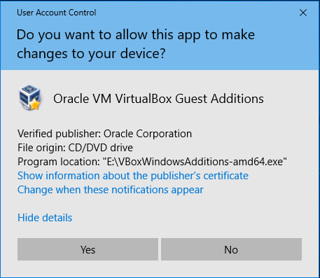
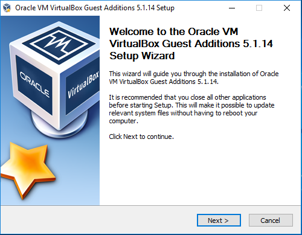

Upute za instalaciju VirtualBox Guest Tools paketa
==================================================

U ovom dokumentu bit će navedeni koraci za instalaciju Virtualbox Guest
Additions paketa. Radi se o paketu upravljačkih programa i sistemskih
aplikacija koje optimiziraju virtualni operacijski sustav u svrhu većih
performansi i boljeg korisničkog iskustva.

Neke od dodatnih značajki su:

-  automatska promjena veličine prozora aplikacije (i prilagodba
   rezolucije)

-  dijeljeni međuspremnik između domaćina i gosta (prijenos teksta i
   datoteka)

-  „drag'n'drop“ opcija

Za instalaciju Guest Additions paketa, potrebno je pokrenuti virtualni
stroj i pričekati da se učita operacijski sustav. Zatim u izborniku
Devices odabrati opciju „Insert Guest Additions CD image“.

|image0|

Ako je uključena **autoplay** opcija, trebao bi se pojaviti skočni
prozor u kutu ekrana. Potrebno je kliknuti na njega i zatim odabrati
opciju „Run VBoxWindowsAdditions.exe“

|image1|

|image2|

U slučaju da je uključena sigurnosna opcija „User Account Control“,
potrebno je dozvoliti izvršavanje instalacije navedenog paketa.

|image3|

U procesu instalacije dovoljno je prihvatiti već preporučene postavke i
samo prolaziti kroz postupak.

|image4|

|image5|

|image6|

Prilikom instalacije pojaviti će se upit dozvoljava li korisnik
instalaciju upravljačkog programa. Uključiti opciju „Always trust
software from Oracle Corporation“ (opcija nije nužna, no olakšava
eventualne kasnije nadogradnje aplikacije), te potvrdno odgovoriti na
upit.

|image7|

Kako bi instalirani paketi bili aktivirani, potrebno je ponovno
pokrenuti računalo. Potvrdno odgovoriti na upit.

|image8|

Za provjeru ispravnosti instalacije, nakon što se učitao operacijski
sustav, prvo pokušati ručno promijeniti veličinu prozora i uočiti
rezultat. U slučaju da se veličina i rezolucija virtualnog sustava nisu
automatski prilagodile, provjeriti opciju „Auto-Resize Guest Display“
unutar **View** izbornika. Opcija mora biti aktivna (prikazana je
kvačica uz opciju).

|image9|

Slijedeći korak je pokušati neki kratak niz znakova zapisati u
međuspremnik unutar domaćinskog operacijskog sustava (odabrati tekst i
kopirati ga). Unutar virtualnog operacijskog sustava pokrenuti
tekstualni editor (npr. Notepad za Windows operacijske sustave), te
pokušati zalijepiti tekst. U slučaju da se ništa nije dogodilo,
provjeriti je li opcija **Bidirectional Shared Clipboard** unutar
izbornika **Devices** aktivna. Po potrebi aktivirati opciju.

|image10|

Opcija „Drag'n'Drop“ u kombinaciji Windows domaćina i Windows gosta je
problematična i nestabilna, te nije poželjno premještati datoteke
koristeći tu metodu. Za takvu potrebu, dovoljno dobro rješenje je
koristiti dijeljeni direktorij između virtualnog stroja i domaćina.

U postavkama željenog virtualnog stroja potrebno je odabrati izbornik
„Shared folders“, te kliknuti na opciju „Adds a new shared folder“.

|image11|

U slijedećem koraku je potrebno na domaćinu stvoriti novi direktorij,
ili koristiti neki postojeći. U ovom slučaju će se koristiti Desktop
direktorij trenutno prijavljenog korisnika. U novom prozoru je potrebno
odabrati direktorij za dijeljenje, te odabrati neke od dodatnih opcija:

-  Read-only (korisnik unutar virtualnog računala neće moći raditi
   izmjene na direktoriju)

-  Auto-mount (direktorij će se automatski povezati i prikazati u
   Windows exploreru)

-  Make permanent (direktorij će ostati dijeljen i nakon gašenja te
   ponovnog paljenja virtualnog stroja)

|image12|

Ovisno o odabranim opcijama, dijeljeni direktorij će se prikazati u
kategoriji Machine Folders ili Transient folders, odnosno ne radi se o
nikakvim posebnim kategorijama, već različitim setom opcija.
Pojednostavljeno, Machine folder će ostati trajno dijeljen sa virtualnim
strojem (opcija Make Permanent), dok će Transient folder prestati biti
dijeljen nakon gašenja virtualnog stroja.

.. |image10| image:: UP03/image11.png
   :width: 4.61042in
   :height: 2.75347in

