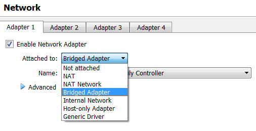
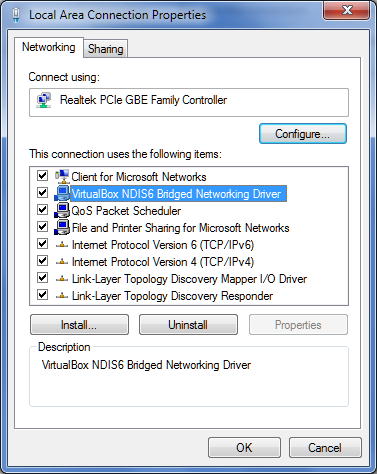
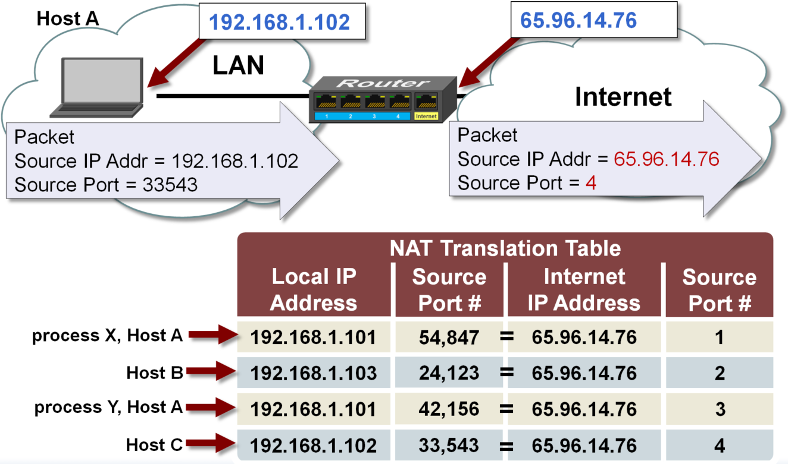
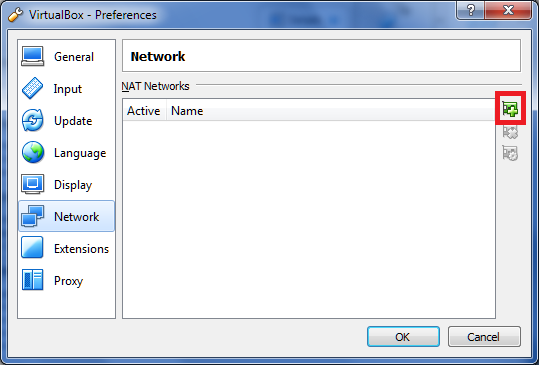
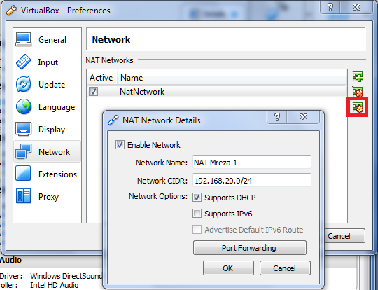
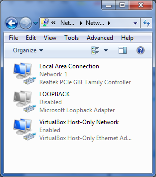
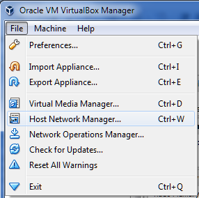
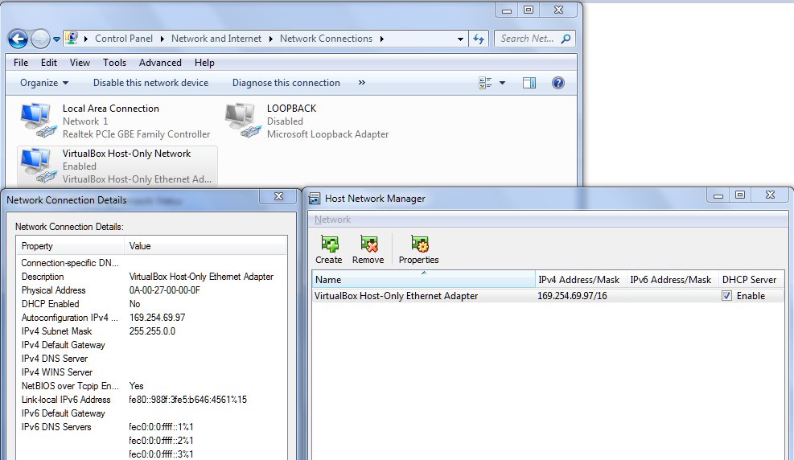
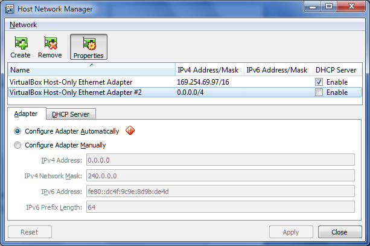
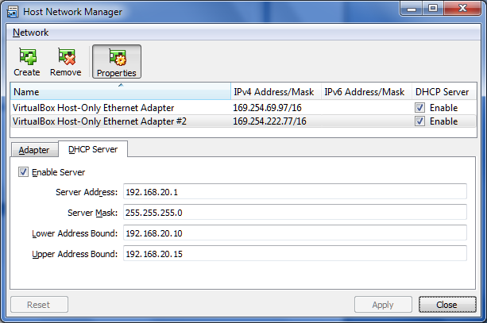

Upute za tipove virtualnih mreža u VirtualBox sustavu
=====================================================

Virtualbox nudi podršku za razne načine mrežnog povezivanja virtualnih
strojeva sa ostatkom infrastrukture. Za svako virtualno računalo nudi se
do 8 mrežnih priključaka, od kojih se 4 može konfigurirati direktno kroz
grafičko sučelje, a ostale uz pomoć komandne linije. To znači da svako
računalo može biti povezano sa 8 različitih mreža. Za potrebe tzv. "home
lab" (kućni laboratorij) infrastrukture, rijetko je potrebno koristiti
više od 4 priključaka. Najčešće su situacije gdje je virtualni stroj
povezan na samo jednu mrežu, ili 2-4 ako taj stroj ima funkciju
usmjernika.

Prije opisa različitih načina mrežnog povezivanja, potrebno je objasniti
osnovnu strukturu vizualizacije slijedećih primjera. Unutar plavog
okvira nalaze se sve hardverske i softverske komponente koje tvore
računalo sa podrškom za virtualizaciju. To računalo je mrežnom karticom
povezano na neki oblik mreže (ili direktno na kućni usmjernik, ili
unutar neke kompleksnije mrežne infrastrukture). Unutar crvenog okvira
nalaze se operacijski sustav domaćina (eng. Host OS, onaj operacijski
sustav koji se instalira direktno na hardver računala), neka aplikacija
za podršku virtualizacije (npr. Oracle VirtualBox ili VMWare
Player/Workstation), te na kraju sami virtualni strojevi. Jako je bitno
zapamtiti kako su svi virtualni strojevi, iako djeluju kao nezavisna
računala, zapravo pokrenuti kao procesi unutar domaćinskog operacijskog
sustava. Svu komunikaciju sa hardverom fizičkog računala ili vanjskim
svijetom održavaju isključivo preko tog domaćinskog sustava.

Na slijedećoj slici nalazi se popis svih načina mrežnog povezivanja:

-  Not attached

-  NAT

-  NAT Network

-  Bridged Adapter

-  Internal Network

-  Host-only Adapter

-  Generic Driver

|image0|

Dva su načina koja neće biti detaljnije objašnjena: Not Attached i
Generic Driver. "Not Attached" je stanje gdje je instalirana virtualna
mrežna kartica na stroj, no simulira se stanje u kojem nije "priključen"
mrežni kabel na tu karticu.

Generic Driver, odnosno Generic Networking, je rijetko korištena opcija
koja omogućava povezivanje virtualnih strojeva na različitim domaćinima
(eng. Host computer). Veze je moguće ostvariti ili preko UDP tunela ili
koristeći VDE (eng. Virtual Distributed Ethernet) distribuiranu mrežu
preko ethernet protokola. Ovaj način povezivanja neće biti objašnjen jer
je slabo dokumentiran, nalazi se samo u izvornom kodu aplikacije
(potrebno je posebno kompilirati kod), te je predviđen samo za Linux ili
Unix sustave.

Bridged Adapter

U ovom načinu povezivanja, mrežne kartice (virtualne) virtualnih
strojeva povezane su na virtualni preklopnik, koji je pak povezan na
odabranu fizičku mrežnu karticu računala. Virtualni preklopnik nije
moguće konfigurirati (nema podršku za različite VLAN mreže), te se
automatski stvara po potrebi prilikom konfiguracije nekog zasebnog
mrežnog segmenta (npr. stvaranje većeg broja internih mreža, opisana
kasnije u dokumentu). Naziv Bridged dolazi od asocijacije stvaranja neke
vrste mosta između virtualnih strojeva i fizičke mrežne infrastrukture.
Virtualni strojevi su u ovakvom načinu rada, gledajući sa aspekta mrežne
topologije, **jednaki kao i sva ostala fizička računala u mreži**, nema
nikakve razlike. Ako postoji neki poslužitelj koji dodjeljuje adrese,
njima će se isto dodijeliti neka adresa iz te mreže. Isto tako može biti
obrnuta situacija, na virtualnim strojevima može biti takav poslužitelj
koji će dodijeljivati IP adrese svima povezanima u tu mrežu.

Naravno, veza između virtualnog preklopnika i fizičke mrežne nije u
obliku žice koja je nekako priključena na fizički sklop, već se radi o
softverskoj implementaciji gdje se preklopnik „zakači“ (eng. hooks) na
upravljački program (eng. driver) mrežne kartice. Ako se pogledaju
postavke upravljačkog programa mrežne kartice domaćina, može se uočiti
dodatno instaliran modul „VirtualBox NDIS6 Bridged Networking driver“ .

|image1|

NAT

Ovaj tip povezivanja je najlakše opisati primjerom u svakodnevnom
životu. Visok postotak korisnika koji koriste kućni internet su na njega
povezani preko usmjernika (eng. Router) koji im je dodijeljen od strane
pružatelja usluga. Takvi uređaji uglavnom u sebi imaju integriranu
podršku za WiFi (podrška za bežično povezivanje), mini preklopnik
(uglavnom 4 ethernet utičnica). No, ono što je bitno je način na koji
taj usmjernik omogućava korisniku korištenje interneta. Ne ulazeći
previše u tehničke detalje, NAT (eng. Network Address Translation)
tehnologija omogućava da jedno ili više računala ima pristup internetu
koristeći jednu javnu IPv4 adresu (koju daje pružatelj usluga). Time se
rješavaju dva problema:

-  Usporava se proces nedostatka javnih IPv4 adresa

-  Identitet računala je zaštićen iza usmjernika

Zadnji problem je riješen na način da se u usmjerniku nalazi tablica
koja povezuje zasebnu unutarnju/privatnu adresu računala (u kombinaciji
sa brojem porta koji ostvaruje vezu) sa jednom vanjskom adresom (i
brojem porta). Takva tablica se zove NAT tablica (točnije , radi se o
PAT tablici, no ovo područje nije tema dokumenta). Na slijedećoj slici
nalazi se primjer sa objašnjenjem jedne NAT tablice:

|image2|

Izvor :
https://microchip.wdfiles.com/local--files/tcpip:nat-translation-table/nat_table.png

Jasno se može vidjeti kako računalo iza usmjernika pokušava ostvariti
vezu sa npr. nekim WWW poslužiteljem (recimo pristup web stranici), te
je izvorišna adresa 192.168.1.102 (kombinacija adresa/port se naziva
socket, te se obično zapisuje u obliku 192.168.1.102:33543 ). Usmjernik
u svoju lokalnu tablicu zapisuje te informacije, te ih prevodi u jednu
vanjsku adresu sa slučajno generiranim brojem porta, 65.96.14.76:4. U
ovom trenutku može biti jasno otkuda naziv Network Address Translation.
Usmjernik zapravo modificira paket, te se sa stajališta već spomenutog
WWW poslužitelja čini kao da promet generira usmjernik. Originalno
računalo je zaštićeno i anonimno prema poslužitelju.

Prednost NAT tipa povezivanja je što računala imaju sigurniji pristup
prema Internetu, što je idealno za kućne potrebe. No s druge strane,
nije moguće ostvariti vezu sa tim računalom sa strane Interneta, odnosno
općenito iz druge mreže. Recimo da se na tom računalo nalazi neki servis
kojem se želi pristupiti iz druge mreže (npr. SSH poslužitelj, Remote
desktop, FTP poslužitelj...), u normalnim postavkama to nije moguće.

U tu svrhu koristi se nešto što se naziva Proslijeđivanje portova (eng.
Port forwarding). U tablici usmjernika je moguće rezervirati jedan port
, te ga povezati sa portom servisa na računalu. Za primjer, SSH servis
uobičajeno koristi port 22, a RDP koristi 3389. Vezano uz primjer sa
gornje slike, jednostavna tablica za proslijeđivanje portova će
izgledati ovako:

+--------------------+------------------+------------------+----------------+
| Unutarnja adresa   | Unutarnji port   | Vanjska adresa   | Vanjski port   |
+====================+==================+==================+================+
| 192.168.1.102      | 22               | 65.96.14.76      | 1022           |
+--------------------+------------------+------------------+----------------+
| 192.168.1.102      | 3389             | 65.96.14.76      | 9087           |
+--------------------+------------------+------------------+----------------+

Nakon detaljnijeg objašnjenja, vrijeme je za prikaz mrežne topologije
kada se koristi NAT u Virtualbox okruženju. **Ono što je bitno zapamtiti
je da će svaki virtualni stroj koji se nalazi iza NAT usluge uvijek
dobiti istu IP adresu : 10.0.2.15.** Isto tako, adresa default gatewaya
će uvijek biti **10.0.2.2.**, a NAT servis će dijeliti adresu sa
domaćinom (na ovom primjeru adresa je 192.168.10.10). Bez obzira što
virtualni strojevi imaju istu IP adresu, Virtualbox NAT engine ih drži
izoliranima jedne od drugih. Zapravo, dobro se podsjetiti da je sve iza
NATa zaštićeno i da jednake IP adrese uopće nisu problem.

NAT Network

Vezano na prošli tip povezivanja, NAT Network tip je zapravo samo
određena nadogradnja. Umjesto jednog virtualnog stroja po NAT segmentu,
u ovoj situaciji je moguće povezati više računala u mrežu koja su
zaštićena iza usmjernika sa NAT funkcijom. Ovakva topologija je zapravo
najbliža onime što većina kućanstava ima, više uređaja povezanih na
jednog usmjernika sa NAT funkcijom, sa mogućnošću povezivanja na
Internet. Računala koja su spojena u jednu NAT mrežu mogu međusobno
komunicirati.

Razlika je samo u implementaciji i konfiguraciji. NAT Network segment se
neće stvoriti automatski, već ga je potrebno ručno konfigurirati. Za
takvu radnju, potrebno je odabrati općenite postavke Virtualbox
aplikacije, te unutar prozora odabrati izbornik Network. Pritiskom na
označenu tipku (prva slika ispod), stvorit će nova NAT mreža. Zatim je
potrebno odabrati tipku za izmjenu postavki te mreže (druga slika
ispod), te upisati željeni adresni rang i ostale detalje.

|image3|

|image4|

Internal network

Virtualni strojevi su u ovoj topologiji povezani međusobno sa virtualnim
preklopnikom. S obzirom da preklopnik nije povezan ni na koji način sa
domaćinom, ta virtualna računala se nalaze u izoliranoj mreži, bez
mogućnosti pristupa na Internet ili neku drugu vanjsku mrežu. Isto tako
nije moguće ni pristupiti tim računalima sa strane Interneta ili
domaćina. U ovakvoj situaciji ne postoji neki standardni DHCP
poslužitelj (od strane Virtualbox aplikacije) koji će dodijeljivati
adrese, već ih je potrebno ručno konfigurirati, ili na neki drugi način
(primjer je instalirati neki poslužitelj sa DHCP rolom).

Host-only network

Virtualni strojevi kojima je konfiguriran ovaj način mrežne povezanosti
ostvaruju vezu isključivo sa domaćinom. Veza je obostrana, no ograničena
je samo na gost-domaćin. Strojevi nemaju pristup internetu, niti prema
ostatku mreže. Za svaku vezu između gosta (virtualnog stroja) i domaćina
se stvara zaseban mrežni priključak na domaćinu, te se konfiguriraju
mrežne postavke. Svaka veza će se nalaziti u nezavisnoj mreži sa samo ta
dva uređaja.

Uz svaku instalaciju Virtualbox aplikacije će se instalirati standardno
jedan mrežni priključak specijalne namjene, za Host-Only tip mreže, što
je moguće vidjeti na slijedećoj slici.

|image5|

Postavke za Host-Only tip mreže se nalaze unutar Virtualbox aplikacije,
File izbornik -> Host Network manager.

|image6|

Na slici ispod se nalaze preporučene postavke za već stvoren Host-Only
mrežni priključak.

|image7|

Za stvaranje dodatnog Host-Only mrežnog priključka, unutar Host Network
Manager prozora, potrebno je odabrati tipku Create. Nakon što je
priključak stvoren, odabrati opciju Properties za konfiguraciju samog
priključka. Mrežna konfiguracija može biti ručna ili automatska. U prvoj
situaciji, potrebno je konfigurirati željenu IP adresu. Adresa koja se
konfigurira u ovom prozoru je zapravo adresa Host-Only priključka
instaliranog na operacijski sustav domaćina. Virtualni stroj koji se
povezuje na taj Host-Only priključak je potrebno zasebno konfigurirati
unutar gost operacijskog sustava. Sve je prikazano na prvoj slici ispod.

U drugom slučaju, kod automatske konfiguracije, potrebno je
konfigurirati ugrađeni VirtualBox DHCP poslužitelj sa osnovnim
postavkama (IP adresa DHCP poslužitelja, adresu podmreže, te početnu i
završnu adresu dodijeljivanja).

|image8|

|image9|

Za kraj, svaki opisani tip mreže ima svoju namjenu, te je prije odabira
potrebno razmisliti i točno definirati mrežnu topologiju virtualne
infrastrukture, te prema tome prilagoditi i konfigurirati tipove mrežnih
priključaka.

