Razne greške i rješenja za Virtualbox
=====================================

U ovom dokumentu bit će navedene razne moguće greške prilikom rada sa Virtualbox aplikacijom, te ponuđena rješenja. Prije kontaktiranja       
nastavnika za pomoć, svakako je potrebno proći kroz ovaj popis te pokušati samostalno riješiti problem.

U slučaju da se Vaš problem ne nalazi na popisu, kontaktirati nastavnika sa detaljnim opisom problema i priloženom informativnom slikom       
(dakle, **jasan** prikaz problema, i prikazani detalji greške).

Prije samog popisa grešaka, uvjerite se da Virtualbox sustav (za laboratorijske vježbe) koristite na ispravan način i to:

A) Ako se želi koristiti Multiboot USB, obvezno pokrenuti virtualni stroj sa Virtual Machine USB Boot aplikacijom. Virtualbox aplikacija mora biti ugašena prije toga.

|

B) Ako se virtualni stroj želi pokrenuti bez Multiboot USB, nego podići sustav sa virtualnog diska, mora se maknuti VMUBDrive000.vmdk sa popisa u Storage kategoriji (Settings od virtualnog stroja).

Popis grešaka: 

**Error1**

|image0|

Na poveznici1_ se nalazi rješenje

.. _poveznici1: https://forums.virtualbox.org/viewtopic.php?f=6&t=98775

**Errori 2,3 i 4**

|image1|

|image2|

|image3|

Potrebno je zamijeniti Filesystem ID na particiji USB sticka iz 0B u 0C, javiti se nastavniku.

**Error 5**

|image4|

Virtualni stroj koji je prethodno uvezen (imported) je samo izbrisan iz inventara Virtualboxa.
Ili otići na Machine->Add te odabrati ``*.vbox`` datoteku (iz tog direktorija) ili obrisati cijeli direktorij tog virtualnog stroja i ponovno proći proces uvoženja (import).

**Error6**

|image5|

Vrlo vjerojatno virtualni stroj nije pokrenut preko VMUB (za USB multiboot), nego iz Virtualboxa.
Pokrenuti stroj preko VMUB prema uputama.

**Errori 7 i 8**

|image6|

|image7|

U BIOS/UEFI nije aktivirana opcija za nativnu podršku virtualizacije (uvjet za 64bitne virtualne strojeve te Virtualbox od 6.1 verzije), AMD-V za AMD procesore, VT-x za Intel procesore. Ako je moguće, u BIOS/UEFI aktivirati te opcije. Ako iz nekog razloga to nije moguće napraviti, instalirati stariju verziju Virtualboxa (recimo 6.0.x) i koristiti 32bitne virtualne strojeve.

**Errori 9, 10 i 11**

|image8|

|image9|

|image10|

Jedan modul se nije uspio učitati. Pratiti poruku te u komandnoj liniji upisati "sc.exe query vboxdrv".
Ako je STATE: 3 STOP_PENDING, pokušati ručno instalirati modul:

- ``C:\Program Files\Oracle\VirtualBox\drivers\vboxdrv\``    (Ili gdje je već instaliran Virtualbox, 
  no svakako je poželjno instalirati ga na defaultnu aplikaciju za početak)

- Desni klik na VBoxDrv.inf i odabrati Install

- U komandnoj liniji upisati "sc start vboxdrv"

- U slučaju greške "An instance of the service is already running", ponovno pokrenuti računalo i 
  otvoriti komandnu liniju te upisati "sc.exe query vboxdrv". 
  Odgovor bi trebao biti "STATE: 4 RUNNING".

**Error 12**

|image11|

Ovaj error je dosta općenit i različiti su razlozi, no uglavnom je vezano za to da neke aplikacije 
pokušavaju pristupiti modulima od Virtualboxa ( npr. Antivirusi). Na slijedećim linkovima se nalaze savjeti za pristup dijagnostici , te moguća rješenja.

https://forums.virtualbox.org/viewtopic.php?f=25&t=82106

https://windowsreport.com/virtualbox-error-supr3hardenedwinrespawn/

**Error 13**

|image12|

Opis problema i rješenja se nalaze na slijedećem linku.

https://github.com/DavidBrenner3/VMUB/issues/6

**Error 14**

|image13|

SATA0 port virtualnog stroja mora biti prazan prije pokretanja preko VMUB aplikacije. Virtualbox-

>Settings->Storage, te razmjestiti uređaje tako da SATA0 bude prazan.

**Error 15**

|image14|

Vrlo vjerojatno datoteka nije ispravno preuzeta. Pokušati ponovno preuzeti datoteku i uvesti (import) ju.

**Error 16**

|image15|

Virtualni stroj se pokreće iz Virtualboxa, dok je prethodno već bio pokretan preko VMUB aplikacije (sa priključenim USBom). Pokrenuti virtualni stroj preko VMUB sa priključenim USBom.

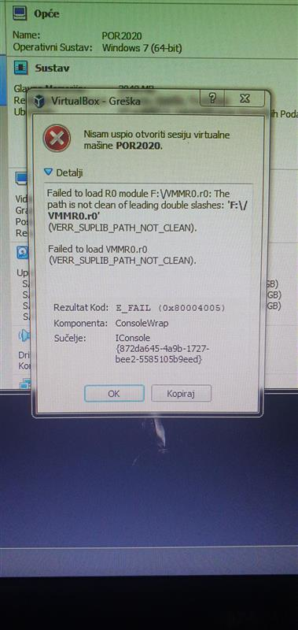
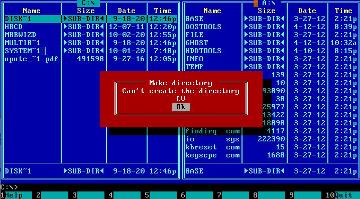
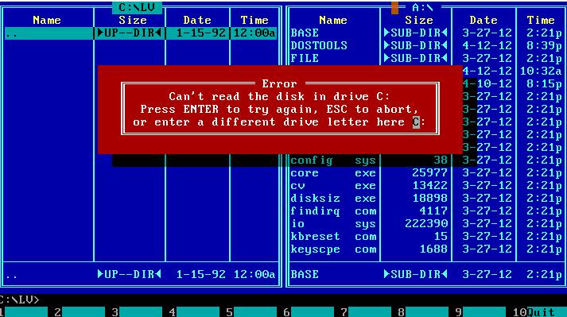
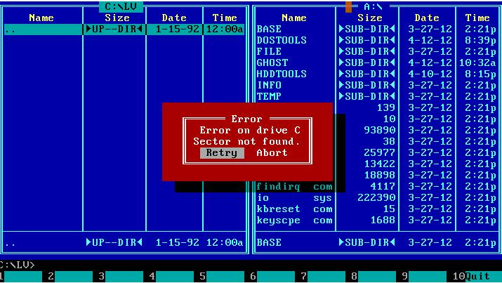
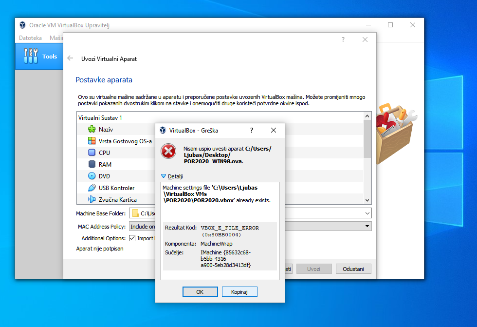
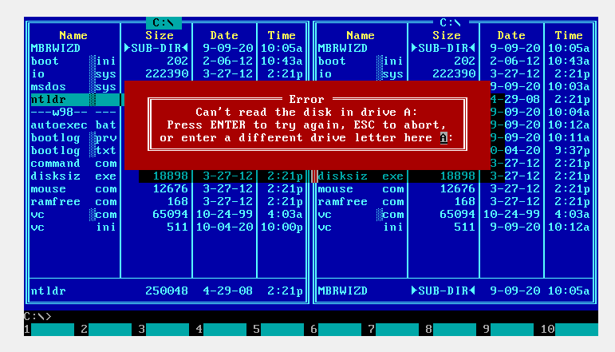
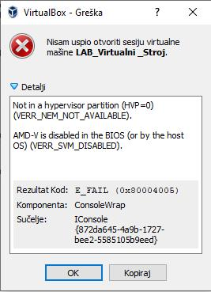
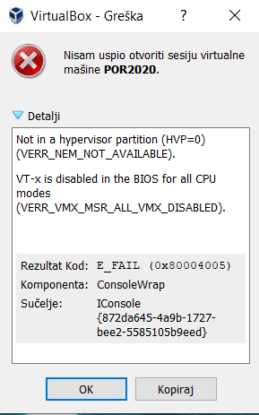
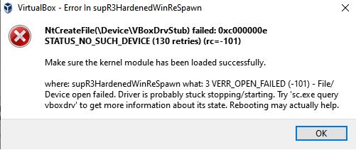
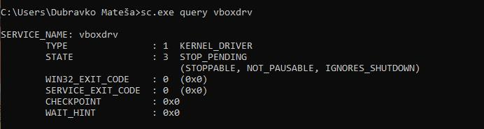
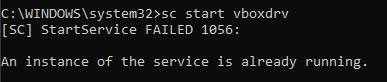
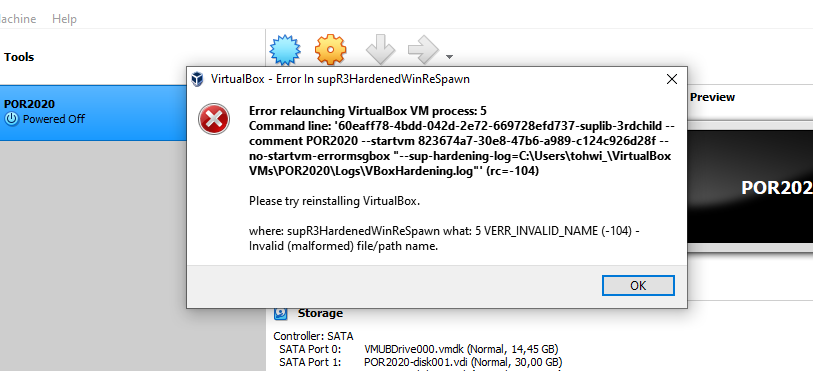
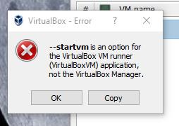
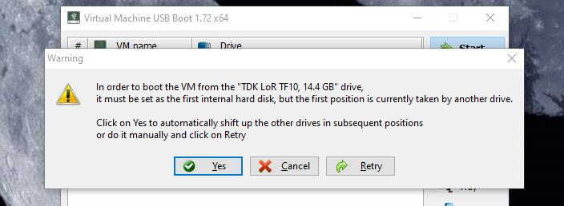
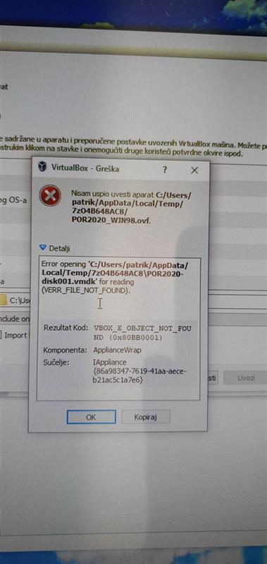
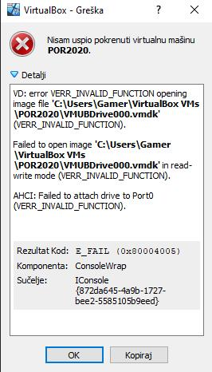

