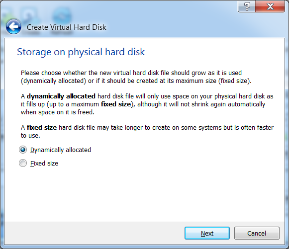
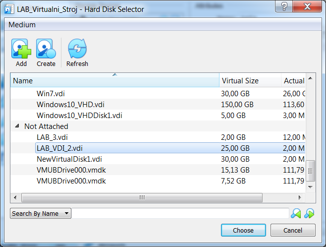
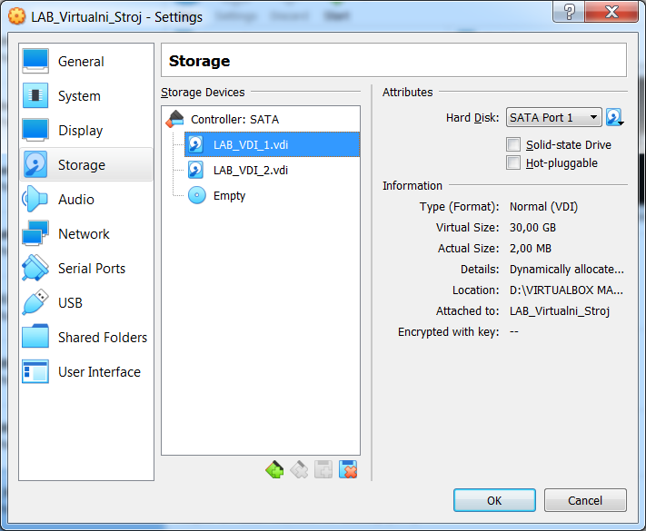
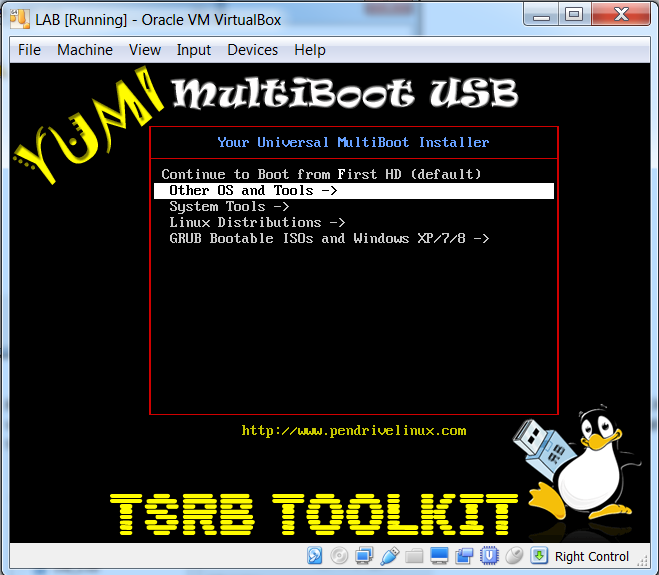
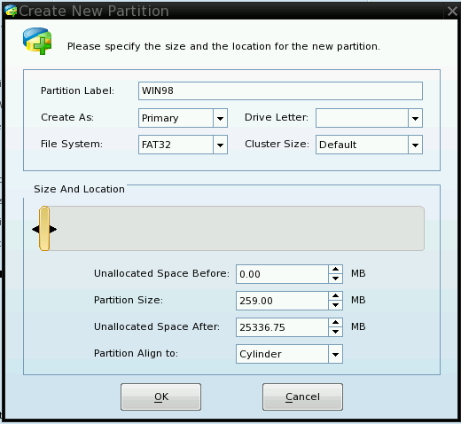
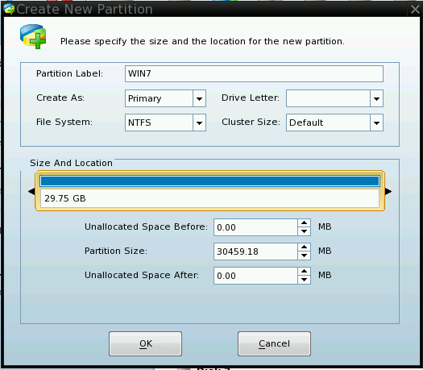

Upute za kućno korištenje laboratorijskih vježbi
================================================

**Potrebni programski alati i ostalo:**

VirtualBox (https://www.virtualbox.org/wiki/Downloads)

Virtual Machine USB Boot
(https://github.com/DavidBrenner3/VMUB/releases)

Ispravan i konfiguriran Multiboot USB pogon prema uputama (tema **Stvaranje Multiboot USB pogona**)

Potrebno je sa službene stranice skinuti posljednju verziju aplikacije VirtualBox, te ju instalirati na računalo. Mogu se potvrditi preporučene opcije za vrijeme instalacije.
Zatim je potrebno skinuti posljednju verziju VMUSB aplikacije sa navedene poveznice. Poželjno je skinuti x64 verziju (ako je kućni operacijski sustav 64bit), no ovisno o želji korisnika,
može se skinuti Portable ili Setup verzija aplikacije. Portable verziju nije potrebno instalirati na računalo, već se može samo pokrenuti. Preporuka je skinuti Setup verziju, te
ju instalirati.

Nakon što je VirtualBox aplikacije uspješno instalirana, provjeriti ispravnost pokretanja aplikacije (aplikacija će možda tražiti administratorske ovlasti, dozvoliti zahtjev).

Prije korištenja USB pogona za podizanje sustava, treba stvoriti novi
virtualni stroj.

#. Unutar VirtualBox aplikacije, odabrati opciju NEW :

   |image2|

#. Upisati ime novog virtualnog stroja, te pod tip i verziju operacijskog sustava 
   ostaviti  predloženu vrijednost (kao prema slici). Postaviti minimalno 512MB 
   radne memorije, dok je preporučeno staviti barem 2048MB. Imati na umu ukupnu 
   i raspoloživu količinu radne memorije. Odabrati opciju stvaranja novog 
   virtualnog tvrdog diska, te kliknuti **Create**.

   |image3|

#. U slijedećem prozoru upisati ime virtualnog tvrdog diska, gdje je poželjno 
   označiti prvim rednim brojem na kraju (kao na slici), s obzirom da će se 
   kasnije stvarati dodatni diskovi. Odabrati veličinu virtualnog diska od **30GB**, 
   te ostaviti preporučene opcije od **VDI** tip diska i **Dynamically allocated**. 
   Na kraju kliknuti na tipku **Create**.

   |image4|

#. Virtualni stroj će u ovom trenutku biti stvoren. Poželjno je dodati
   još jedan virtualni tvrdi disk te je za to potrebno odabrati postavke
   stvorenog stroja. Desnim klikom miša na ime stroja, i odabrati
   Settings:

   |image5|

#. Odabrati kategoriju Storage, odabrati opciju „Adds hard disk“, te
   zatim „Create“ (Create disk image) :

   |image6|

   |image7|

#. Odabrati **VDI** tip diska i kliknuti na **Next** tipku.

   |image8|

#. Pročitati razlike između dinamičke i fiksne alokacije virtualnog tvrdog diska, 
   te odabrati opciju **Dynamically allocated** . 
   Dinamička alokacija je uglavnom dovoljna i predstavlja optimalan omjer zauzetosti 
   prostora i performansi. Kliknuti na **Next** tipku.

   |image9|

#. Upisati ime i veličinu diska kao prema slici, te kliknuti na tipku **Create**.

   |image10|
#. U popisu, pod grupom **Not Attached**, odabrati novostvoreni disk **LAB_VDI_2.vdi**, te
   kliknuti na tipku **Choose**.

   |image11|

#. U otvorenom prozoru posložiti poredak diskova na slijedeći način:

   * SATA0 port mora biti prazan
   * SATA1 - LAB_VDI_1.vdi
   * SATA2 - LAB_VDI_2.vdi
   * SATA3 - Optički disk (Empty)

   |

   |image12|

#. **Ugasiti VirtualBox aplikaciju**. Pripremljeni USB pogon povezati na računalo, 
   te pokrenuti Virtual Machine USB Boot aplikaciju. Kliknuti na tipku **Options**, te zatim
   na karticu **VirtualBox**. Kao prema slici dodati **VM** u putanji i kliknuti na **OK**.

   |image13|

#. Odabrati opciju Add te izvršiti konfiguraciju sa odabranim imenom stvorenog 
   virtualnog stroja odabirom USB pogona. Potvrditi sa **OK**.

   |image14|

#. U glavnom prozoru kliknuti na **Start**. Nakon pokretanja virtualnog stroja trebao bi se
   pojaviti MultiBoot izbornik. 

   |image15|

Nakon što se Multiboot izbornik pojavio, odabrati podizbornik "System Tools" i zatim "Partition Wizard". Pričekati pokretanje Partition Wizard aplikacije.

U aplikaciji se prikazuju 3 tvrda diska sa standardnim (Basic)
particijskim tablicama, od koji je jedan USB pogon, dok su ostala dva
prethodno stvorena prilikom konfiguracije virtualnog stroja (ako su
prethodno praćene upute, diskovi bi se trebali razlikovati u veličini).

Za početak potrebno je stvoriti nove particije za daljnje korištenje sa
slijedećom namjenom :

-  Disk1 za operacijske sustave (Dual boot)

-  Disk2 za podatke korisnika

Na prvi disk desnom tipkom miša kliknuti na nealocirani prostor te
odabrati opciju Create. Na slijedećoj slici prikazane su sve mogućnosti
odabira opcije Create, no zbog jednostavnosti korištenja, poželjno je
odabrati jednu metodu i koristiti samo nju.

|image16|

U slijedećem koraku odabrati tip particije kao primarnu, FAT32 datotečni
sustav, oznaku particije, te veličinu od 259MB. Sve ostale opcije
ostaviti kao zadane i potvrditi na OK tipku.

|image17|

Isti proces učiniti za drugu particiju na tom disku (WIN7 oznaka), i
treću (jedinu na disku) particiju sa slijedećim napomenama:

-  Odabrati NTFS datotečne sustave

-  Koristiti zadane vrijednosti veličine particije (ne mijenjati
   vrijednosti)

-  Trećoj particiji kao oznaku upisati prezime učenika i pripadajući
   razred (bez točke iza broja razreda)

Primjer postavki prikazan je u slijedeće dvije slike:

|image18|\ |image19|

Nakon izvršenog procesa trebala bi se pokazati slijedeća struktura
particija na diskovima

|image20|

Iako su se odabrale postavke, proces stvaranja particija još nije
započeo već se samo postavio kao zadatak čije je izvršavanje potrebno
potvrditi sa opcijom Apply.

Još jednom provjeriti postavke i usporediti sa prethodnom dokumentacijom prije
potvrde izvršavanja zadataka!

|image21|

Nakon što su stvorene particije i postavljeni datotečni sustavi na njih,
kako bi se operacijski sustav nakon instalacije mogao podići, bitno je
označiti jednu particiju kao aktivnu (dodatni termini su Bootable,
Active Bootflag partition). Radi se o izmjeni jednog bajta podataka u
stavci particijske tablice, koji označava status zastavice. Poznat je
pod terminom Bootflag (Bootable Flag). Potrebno je kliknuti desnom
tipkom miša na WIN98 particiju, odabrati izbornik Modify, te Set Active
opciju.

|image22|

Dodatno na istoj particiji, potrebno je izmijeniti tip FAT32 particije,
koji mijenja metodu na koji način će operacijski sustav adresirati tu
particiju (CHS ili LBA metoda, proučiti detaljnije na Internetu).
Ukratko, CHS metoda se prva koristila u starijim operacijskim sustavima
kako bi se adresirala neka particija, no ima ograničenje gdje se
particijama iznad 8-og gigabajta na disku neće moći pristupiti.

U tu svrhu je osmišljen LBA način adresiranja, no bitno je koristiti i
operacijski sustav koji podržava tu metodu (MS-DOS do verzije 6.22 i
osnovna verzija Windows95 nemaju podršku za LBA). S obzirom da se u ovim
primjerima koriste operacijski sustavi sa podrškom za LBA, dobro je
prilagoditi postavke u informacijama o particiji.

Potrebno je kliknuti desnom tipkom miša na WIN98 particiju, odabrati
izbornik Modify, te Change Partition Type ID opciju. U otvorenom prozoru
iz padajućeg izbornika odabrati opciju prikazanu na slici:

|image23|

Još jednom potvrditi izvršavanje zadataka sa Apply opcijom.

U slučaju potrebe generiranja novog čistog datotečnog sustava na
definiranoj particiji, koristi se opcija Format. Potrebno je kliknuti
desnom tipkom miša na ciljanu particiju, odabrati opciju Format, te u
prozoru upisati novu oznaku particije, datotečni sustav te veličinu
klastera (koju je uglavnom dovoljno ostaviti kao zadanu vrijednost).

|image24|

Do osnovnih informacija o particiji može se doći desnim klikom na
željenu particiju, opcija Properties, te na kraju kartica Partition
Info. Na slici je je prikazan primjer informacija o stvorenoj WIN7
particiji:

|image25|

Može se primijetiti Partition Type ID sa vrijednošću 0x07 (primijetiti
način heksadecimalnog zapisa, često se ispred vrijednosti dodaje 0x),
što označava kako bi se trebao nalaziti NTFS datotečni sustav na njoj.
Dodatno se mogu primijetiti početni sektor particije (Start LBA sektor,
objašnjen kasnije u dokumentu), te njen završni sektor na tvrdom disku.

Za vježbu provjeriti osnovne informacije WIN98 particije, te uočiti vezu
između završnog sektora WIN98 particije i početnog sektora WIN7
particije. Koji zaključak se može dovesti?

Kad je završen rad sa aplikacijom Partition Wizard, može se iz izbornika
General odabrati opcija Exit, ili jednostavno kliknuti na X ikonu u
gornjem desnom dijelu ekrana. Aplikacija će se ugasiti i računalo
ponovno pokrenuti.

.. |image2| image:: UP01/image02.png
   :width: 1.57480in
   :height: 0.63653in

.. |image5| image:: UP01/image05.png
   :width: 3.14961in
   :height: 0.85090in

.. |image10| image:: UP01/image10.png
   :width: 3.93701in
   :height: 1.64281in

