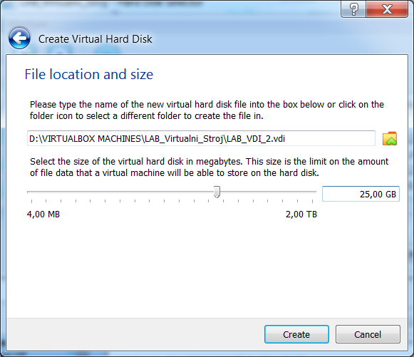

Upute za kućno korištenje laboratorijskih vježbi
================================================

U aplikaciji se prikazuju 3 tvrda diska sa standardnim (Basic)
particijskim tablicama, od koji je jedan USB pogon, dok su ostala dva
prethodno stvorena prilikom konfiguracije virtualnog stroja (ako su
prethodno praćene upute, diskovi bi se trebali razlikovati u veličini).

Za početak potrebno je stvoriti nove particije za daljnje korištenje sa
slijedećom namjenom :

-  Disk1 za operacijski sustav (Dual boot)

-  Disk2 za podatke korisnika

Na prvi disk desnom tipkom miša kliknuti na nealocirani prostor te
odabrati opciju Create. Na slijedećoj slici prikazane su sve mogućnosti
odabira opcije Create, no zbog jednostavnosti korištenja, poželjno je
odabrati jednu metodu i koristiti samo nju.

|image0|

U slijedećem koraku odabrati tip particije kao primarnu, FAT32 datotečni
sustav, oznaku particije, te veličinu od 259MB. Sve ostale opcije
ostaviti kao zadane i potvrditi na OK tipku.

|image1|

Isti proces učiniti za drugu particiju na tom disku (WIN7 oznaka), i
treću (jedinu na disku) particiju sa slijedećim napomenama:

-  Odabrati NTFS datotečne sustave

-  Koristiti zadane vrijednosti veličine particije (ne mijenjati
   vrijednosti)

-  Trećoj particiji kao oznaku upisati prezime učenika i pripadajući
   razred (bez točke iza broja razreda)

Primjer postavki prikazan je u slijedeće dvije slike:

|image2|\ |image3|

Nakon izvršenog procesa trebala bi se pokazati slijedeća struktura
particija na diskovima

|image4|

Iako su se odabrale postavke, proces stvaranja particija još nije
započeo već se samo postavio kao zadatak čije je izvršavanje potrebno
potvrditi sa opcijom Apply.

Još jednom provjeriti postavke i usporediti sa dokumentacijom prije
potvrde izvršavanja zadataka!

|image5|

Nakon što su stvorene particije i postavljeni datotečni sustavi na njih,
kako bi se operacijski sustav nakon instalacije mogao podići, bitno je
označiti jednu particiju kao aktivnu (dodatni termini su Bootable,
Active Bootflag partition). Radi se o izmjeni jednog bajta podataka u
stavci particijske tablice, koji označava status zastavice. Poznat je
pod terminom Bootflag (Bootable Flag). Potrebno je kliknuti desnom
tipkom miša na WIN98 particiju, odabrati izbornik Modify, te Set Active
opciju.

|image6|

Dodatno na istoj particiji, potrebno je izmijeniti tip FAT32 particije,
koji mijenja metodu na koji način će operacijski sustav adresirati tu
particiju (CHS ili LBA metoda, proučiti detaljnije na Internetu).
Ukratko, CHS metoda se prva koristila u starijim operacijskim sustavima
kako bi se adresirala neka particija, no ima ograničenje gdje se
particijama iznad 8-og gigabajta na disku neće moći pristupiti.

U tu svrhu je osmišljen LBA način adresiranja, no bitno je koristiti i
operacijski sustav koji podržava tu metodu (MS-DOS do verzije 6.22 i
osnovna verzija Windows95 nemaju podršku za LBA). S obzirom da se u ovim
primjerima koriste operacijski sustavi sa podrškom za LBA, dobro je
prilagoditi postavke u informacijama o particiji.

Potrebno je kliknuti desnom tipkom miša na WIN98 particiju, odabrati
izbornik Modify, te Change Partition Type ID opciju. U otvorenom prozoru
iz padajućeg izbornika odabrati opciju prikazanu na slici:

|image7|

Još jednom potvrditi izvršavanje zadataka sa Apply opcijom.

U slučaju potrebe generiranja novog čistog datotečnog sustava na
definiranoj particiji, koristi se opcija Format. Potrebno je kliknuti
desnom tipkom miša na ciljanu particiju, odabrati opciju Format, te u
prozoru upisati novu oznaku particije, datotečni sustav te veličinu
klastera (koju je uglavnom dovoljno ostaviti kao zadanu vrijednost).

|image8|

Do osnovnih informacija o particiji može se doći desnim klikom na
željenu particiju, opcija Properties, te na kraju kartica Partition
Info. Na slici je je prikazan primjer informacija o stvorenoj WIN7
particiji:

|image9|

Može se primijetiti Partition Type ID sa vrijednošću 0x07 (primijetiti
način heksadecimalnog zapisa, često se ispred vrijednosti dodaje 0x),
što označava kako bi se trebao nalaziti NTFS datotečni sustav na njoj.
Dodatno se mogu primijetiti početni sektor particije (Start LBA sektor,
objašnjen kasnije u dokumentu), te njen završni sektor na tvrdom disku.

Za vježbu provjeriti osnovne informacije WIN98 particije, te uočiti vezu
između završnog sektora WIN98 particije i početnog sektora WIN7
particije. Koji zaključak se može dovesti?

Kad je završen rad sa aplikacijom Partition Wizard, može se iz izbornika
General odabrati opcija Exit, ili jednostavno kliknuti na X ikonu u
gornjem desnom dijelu ekrana. Aplikacija će se ugasiti i računalo
ponovno pokrenuti.

.. |image2| image:: UP01/image3.png
   :width: 3.34646in
   :height: 3.06886in
.. |image3| image:: UP01/image4.png
   :width: 3.34646in
   :height: 3.07313in
.. |image4| image:: UP01/image5.png
   :width: 4.33071in
   :height: 1.28610in
.. |image5| image:: UP01/image6.png
   :width: 4.72441in
   :height: 3.53746in
.. |image6| image:: UP01/image7.png
   :width: 3.93701in
   :height: 2.04103in

.. |image8| image:: UP01/image9.png
   :width: 3.54331in
   :height: 1.93822in

